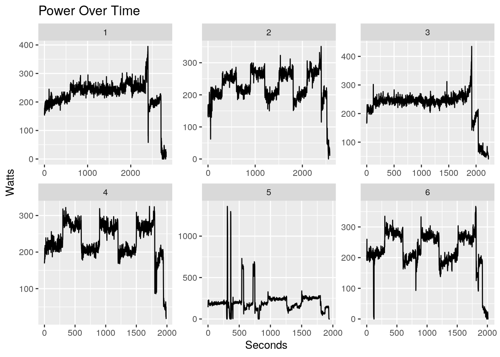
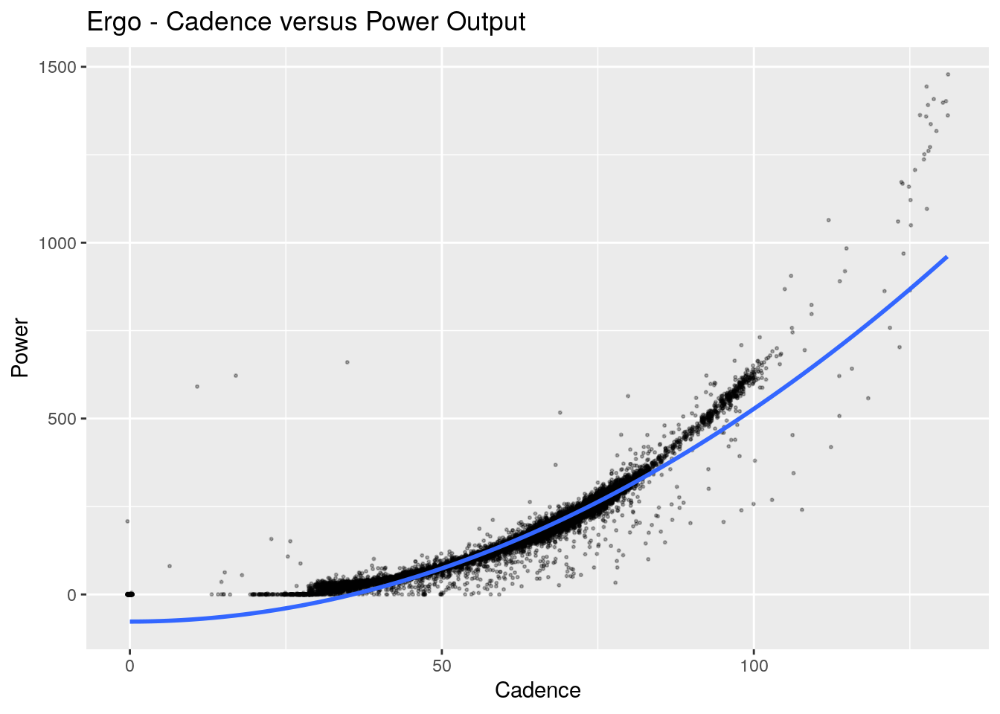
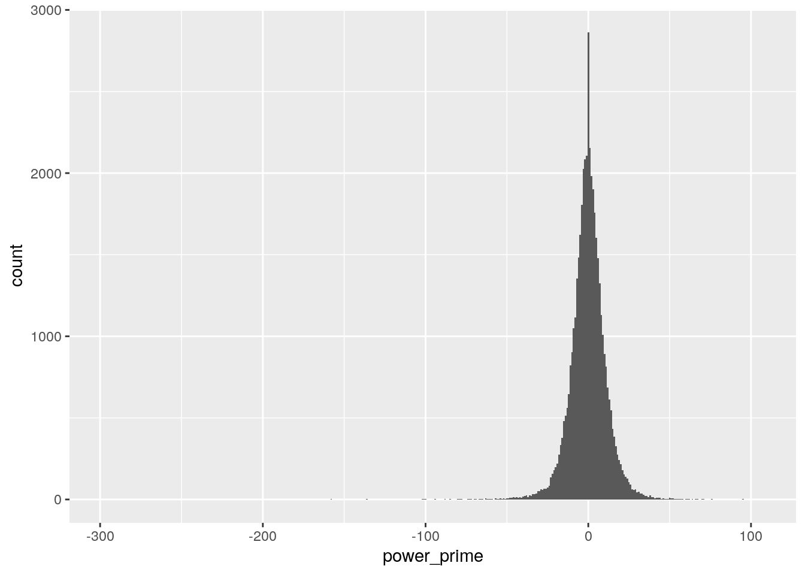
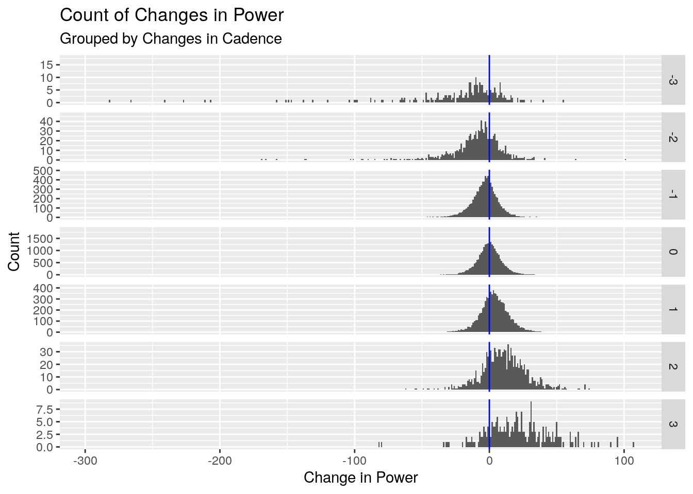
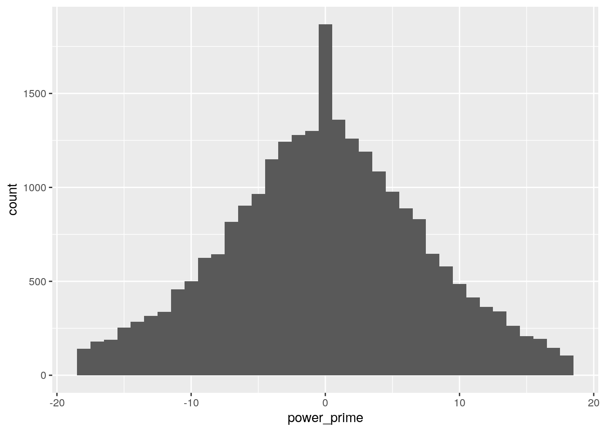
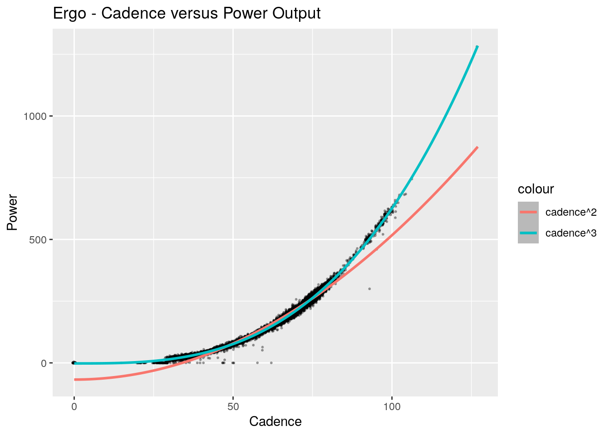
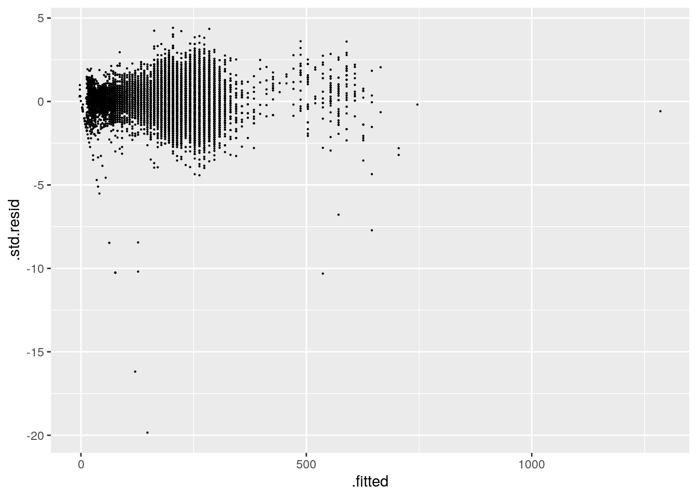
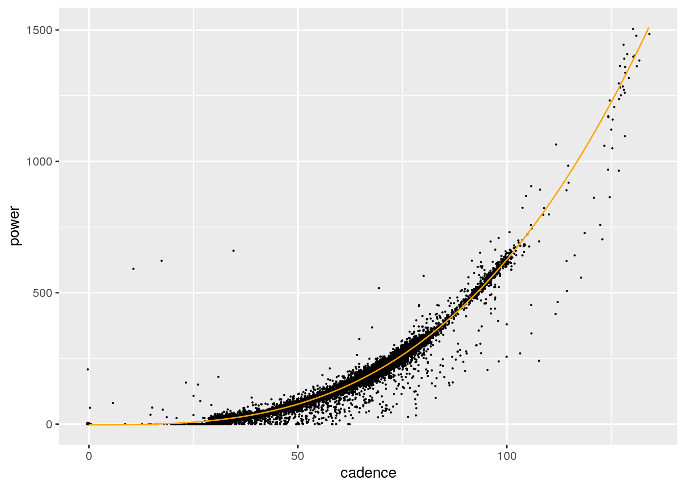

# Reading in the Data


```r
library(tidyverse)
```

```
## ── Attaching packages ─────────────────────────────────────── tidyverse 1.3.0 ──
```

```
## ✓ ggplot2 3.3.2     ✓ purrr   0.3.4
## ✓ tibble  3.0.4     ✓ dplyr   1.0.2
## ✓ tidyr   1.1.2     ✓ stringr 1.4.0
## ✓ readr   1.4.0     ✓ forcats 0.5.0
```

```
## ── Conflicts ────────────────────────────────────────── tidyverse_conflicts() ──
## x dplyr::filter() masks stats::filter()
## x dplyr::lag()    masks stats::lag()
```

```r
library(lubridate)
```

```
## 
## Attaching package: 'lubridate'
```

```
## The following objects are masked from 'package:base':
## 
##     date, intersect, setdiff, union
```

```r
library(xml2)
library(here)
```

```
## here() starts at /home/puglet/Documents/Projects/articles.foletta.org
```


```r
# Read in the XML files
tcx <-
    tibble(
        files = list.files(
            path = here('static', 'post', 'ergo_bike'),
            pattern = '*.tcx',
            full.names = TRUE
        )
    ) %>%
    transmute(xml = map(files, ~read_xml(.x))) %>% 
    mutate(.id = 1:n())

print(tcx)
```

```
## # A tibble: 20 x 2
##    xml          .id
##    <list>     <int>
##  1 <xml_dcmn>     1
##  2 <xml_dcmn>     2
##  3 <xml_dcmn>     3
##  4 <xml_dcmn>     4
##  5 <xml_dcmn>     5
##  6 <xml_dcmn>     6
##  7 <xml_dcmn>     7
##  8 <xml_dcmn>     8
##  9 <xml_dcmn>     9
## 10 <xml_dcmn>    10
## 11 <xml_dcmn>    11
## 12 <xml_dcmn>    12
## 13 <xml_dcmn>    13
## 14 <xml_dcmn>    14
## 15 <xml_dcmn>    15
## 16 <xml_dcmn>    16
## 17 <xml_dcmn>    17
## 18 <xml_dcmn>    18
## 19 <xml_dcmn>    19
## 20 <xml_dcmn>    20
```


```r
pull_tcx_data <- function(tcx) {
    # Strip out the namespace and 
    # pull out each trackpoint
    trackpoints <- 
        tcx %>% 
        xml_ns_strip() %>% 
        xml_find_all('.//Trackpoint')
    
    # Timestamp for each trackpoint
    time <-
        trackpoints %>% 
        xml_find_all('./Time') %>% 
        xml_text() %>% 
        ymd_hms()
        
    # Cadence at each trackpoint
    cadence <-
        trackpoints %>%
        xml_find_all('./Cadence') %>% 
        xml_text() %>% 
        as.integer()
   
    # There is sometimes a leading timestamp with no data.
    # If so, we strip the first timestamp out
    if (length(time) == length(cadence) + 1) {
        time <- time[-1]
    }
    
    # Power at each trackpoint
    power <-
        trackpoints %>% 
        xml_find_all('./Extensions/TPX/Watts') %>% 
        xml_text() %>% 
        as.integer()
    
    # Create the data frame 
    tibble(datetime = time, cadence = cadence, power = power)
}
```


```r
ergo_data <-
    tcx %>% 
    mutate(tcx = map(xml, ~pull_tcx_data(.x))) %>% 
    unnest(cols = 'tcx') %>% 
    select(-xml)
print(ergo_data)
```

```
## # A tibble: 46,338 x 4
##      .id datetime            cadence power
##    <int> <dttm>                <int> <int>
##  1     1 2020-06-14 04:21:00      64   156
##  2     1 2020-06-14 04:21:01      64   162
##  3     1 2020-06-14 04:21:02      63   154
##  4     1 2020-06-14 04:21:03      65   178
##  5     1 2020-06-14 04:21:04      66   178
##  6     1 2020-06-14 04:21:05      67   175
##  7     1 2020-06-14 04:21:06      67   173
##  8     1 2020-06-14 04:21:07      66   181
##  9     1 2020-06-14 04:21:08      66   184
## 10     1 2020-06-14 04:21:09      66   183
## # … with 46,328 more rows
```


```r
ergo_data <-
    ergo_data %>% 
    group_by(.id) %>% 
    mutate(second = as.integer(datetime - first(datetime)))

ergo_data %>% 
    filter(.id <= 6) %>% 
    ggplot() +
    geom_line(aes(second, power)) +
    facet_wrap(~.id, scales = 'free') +
    labs(
        title = 'Power Over Time',
        x = 'Seconds',
        y = 'Watts'
    )
```




# Some Theory First

Drag equation:

$$ F = \frac{1}{2} \rho v^2 C_D A $$
We're going bundle up the coefficients into a single value `\(\alpha = \frac{1}{2} \rho C_D A\)`

# Initial Look and a Small Mistake


```r
library(tidymodels)
```

```
## ── Attaching packages ────────────────────────────────────── tidymodels 0.1.1 ──
```

```
## ✓ broom     0.7.2      ✓ recipes   0.1.14
## ✓ dials     0.0.9      ✓ rsample   0.0.8 
## ✓ infer     0.5.3      ✓ tune      0.1.1 
## ✓ modeldata 0.1.0      ✓ workflows 0.2.1 
## ✓ parsnip   0.1.3      ✓ yardstick 0.0.7
```

```
## ── Conflicts ───────────────────────────────────────── tidymodels_conflicts() ──
## x scales::discard() masks purrr::discard()
## x dplyr::filter()   masks stats::filter()
## x recipes::fixed()  masks stringr::fixed()
## x dplyr::lag()      masks stats::lag()
## x yardstick::spec() masks readr::spec()
## x recipes::step()   masks stats::step()
```

```r
# Split the data
ergo_split <-
    ergo_data %>% 
    initial_split()

# Viewing the data
training(ergo_split) %>% 
    ggplot() +
    geom_jitter(aes(cadence, power), alpha = .3, size = .4) +
    geom_smooth(aes(cadence, power), formula = y ~ I(x^2)) +
    labs(
        x = 'Cadence',
        y = 'Power',
        title = 'Ergo - Cadence versus Power Output'
    )
```

```
## `geom_smooth()` using method = 'gam'
```

```
## Warning in attr(pterms[tind[j]], "term.label"): partial match of 'term.label' to
## 'term.labels'
```



# Tidying the Data


```r
ergo_data <-
    ergo_data %>% 
    group_by(.id) %>%
    mutate(
        cadence_prime = cadence - lag(cadence),
        power_prime = power - lag(power)
    ) %>% 
    ungroup()

ergo_data %>% 
    filter(cadence_prime %in% c(-3:3)) %>% 
    ggplot() +
    geom_histogram(aes(power_prime), binwidth = 1)
```



```r
ergo_data %>% 
    filter(cadence_prime %in% c(-3:3)) %>% 
    ggplot() +
    geom_histogram(aes(power_prime), binwidth = 1) +
    geom_vline(aes(xintercept = 0), colour = 'blue') +
    facet_grid(rows = vars(cadence_prime), scales = 'free_y') +
    labs(
        title = 'Count of Changes in Power',
        subtitle = 'Grouped by Changes in Cadence',
        x = 'Change in Power',
        y = 'Count'
    )
```




```r
ergo_filtered <-
    ergo_data %>% 
    filter(
        cadence_prime > -1,
        cadence_prime < 1
    ) %>% 
    mutate(
        power_prime_scaled = scale(power_prime),
        outside_alpha = ifelse(
            power_prime_scaled < -1.96 | power_prime_scaled > 1.96, 
            TRUE, 
            FALSE
        )
    ) %>%
    filter(!outside_alpha) 

ergo_filtered %>% 
    ggplot() +
    geom_histogram(aes(power_prime), binwidth = 1)
```




```r
ergo_filtered %>% 
    ggplot() +
    geom_jitter(aes(cadence, power), alpha = .3, size = .4) +
    geom_smooth(aes(cadence, power, colour = 'cadence^2'), formula = y ~ I(x^2)) +
    geom_smooth(aes(cadence, power, colour = 'cadence^3'), formula = y ~ I(x^3)) +
    labs(
        x = 'Cadence',
        y = 'Power',
        title = 'Ergo - Cadence versus Power Output'
    )
```

```
## `geom_smooth()` using method = 'gam'
```

```
## Warning in attr(pterms[tind[j]], "term.label"): partial match of 'term.label' to
## 'term.labels'
```

```
## `geom_smooth()` using method = 'gam'
```

```
## Warning in attr(pterms[tind[j]], "term.label"): partial match of 'term.label' to
## 'term.labels'
```


# Theory Revisited

# Modelling


```r
#####################
# Need to update this with the filtered data, not just the original data
# This line is a repeat of the one up top.
###################
###################
ergo_split <- initial_split(ergo_filtered)

# Model the data
ergo_model <-
    linear_reg() %>% 
    set_engine('lm') %>% 
    fit(power ~ I(cadence^3), data = training(ergo_split))

glance(ergo_model)
```

```
## # A tibble: 1 x 12
##   r.squared adj.r.squared sigma statistic p.value    df  logLik    AIC    BIC
##       <dbl>         <dbl> <dbl>     <dbl>   <dbl> <dbl>   <dbl>  <dbl>  <dbl>
## 1     0.992         0.992  7.43  2263322.       0     1 -63674. 1.27e5 1.27e5
## # … with 3 more variables: deviance <dbl>, df.residual <int>, nobs <int>
```


```r
ergo_model %>% 
    pluck('fit') %>% 
    augment() %>% 
    ggplot() +
    geom_point(aes(.fitted, .std.resid), size = .1)
```




```r
ergo_model %>% 
    predict(testing(ergo_split)) %>% 
    bind_cols(testing(ergo_split)) %>%
    metrics(power, .pred)
```

```
## # A tibble: 3 x 3
##   .metric .estimator .estimate
##   <chr>   <chr>          <dbl>
## 1 rmse    standard       7.77 
## 2 rsq     standard       0.991
## 3 mae     standard       5.70
```

```r
predict_data <- 
    tibble(cadence = 0:max(ergo_data$cadence)) %>% 
    mutate(power = predict(ergo_model, new_data = .) %>% pull(.pred))

ergo_data %>% 
    ggplot() +
    geom_jitter(aes(cadence, power), size = .1) +
    geom_line(aes(cadence, power), colour = 'orange', data = predict_data)
```




# Inference


```r
tidy(ergo_model)
```

```
## # A tibble: 2 x 5
##   term          estimate   std.error statistic  p.value
##   <chr>            <dbl>       <dbl>     <dbl>    <dbl>
## 1 (Intercept)  -2.33     0.148           -15.7 5.11e-55
## 2 I(cadence^3)  0.000629 0.000000418    1504.  0.
```

So if our formula is `\(P = \alpha v^3\)`, then `\(\alpha = 0.000616\)`, and thus:

$$
P = \alpha v^3 \\
\alpha =  \frac{1}{2} \rho C_D A \\
\frac{1}{2} \rho C_D A = 0.000616 \\
C_D = \frac{2 \times 0.000616}{\rho A} \\
C_D = \frac{0.001232}{\rho A}
$$

My house sits on around 20°C, and looking up the density of air at sea level is approximately `\(1.2041 \text{ kg/m^3}\)`. Cross section area

$$
C_D = \frac{0.001232}{1.2041 \times .5} \\
C_D = 
$$
