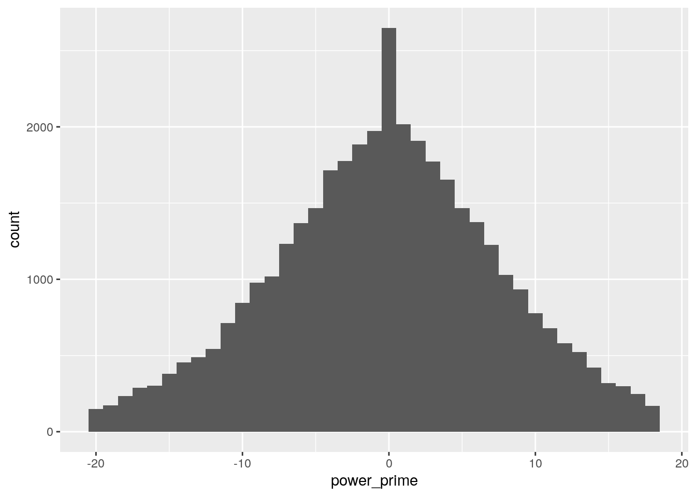

A few years ago I decided it was time to get fit. I'd loved cycling ever since I raced as a junior, so I jumped on to eBay and managed to get my hands on an old 1980s style ergo bike. 'Old Bessy' as I call her is heavy, ugly, and rusty, but despite all of that it successfully fulfils its main purpose: allowing me to inflict all kinds of pain on myself.

In contrast to the ergo bike I've got a set of [Powertap pedals](https://www.sram.com/en/quarq/models/pd-pwtp-p2-a1) which provide power, cadence, pedal balance, and a few other metrics.

One day in-between intervals, as the pain in my legs and lungs slowly subsided, I wondered what kind of analytics I could do with the power and cadence data. I came up with the following questions, which I'll attempt to answer in this article:

> Can I determine the aerodynamic properties of the ergo bike using the power and cadence data generated by  the pedals?

More specifically, we want to determine the drag coefficient for the ergo, which we will get into further down.

# How the Ergo Works

Here's a picture of the ergo bike:


The ergo bike is very simple. Like a standard bike, the cranks have a large cog which a chain linking it to a smaller cog. Unlike a standard bike this cog isn't connected to a wheel, but passes through to another small cog which then links up to a wheel. The wheel itself is a standard spoked bike wheel, with the addition of metal plates which provide the resistance necessary for a decent workout.

# Reading in the Data

Before we do anything, we need to ingest the data. During an ergo session, the data generated by the pedals is read by an app on my iPhone, which in turn uploads it to the 'the cloud'. The details of the session are available to peruse on a portal.

The portal allows you to download the session data as a *TCX* file, which is Garmin's "Training Center XML" frormat. I've downloaded a number of these files, and after loading in our libraries, a single column dataframe is created with the paths to these files. Each of these files is then read in as an XML document, and an identifier is assigned.


```r
library(tidyverse)
library(tidymodels)
library(lubridate)
library(patchwork)
library(xml2)
library(here)
library(gt)
library(glue)
```


```r
# Read in the XML files
tcx <-
    tibble(
        files = list.files(
            path = here('data'),
            pattern = '*.tcx',
            full.names = TRUE
        )
    ) %>%
    transmute(xml = map(files, ~read_xml(.x))) %>% 
    mutate(.id = 1:n())

print(tcx)
```

```
## # A tibble: 29 x 2
##    xml          .id
##    <list>     <int>
##  1 <xml_dcmn>     1
##  2 <xml_dcmn>     2
##  3 <xml_dcmn>     3
##  4 <xml_dcmn>     4
##  5 <xml_dcmn>     5
##  6 <xml_dcmn>     6
##  7 <xml_dcmn>     7
##  8 <xml_dcmn>     8
##  9 <xml_dcmn>     9
## 10 <xml_dcmn>    10
## # … with 19 more rows
```

The next step is to pull out the time, cadence and power data out of the XML file. The XML file is structured into *Activities*, *Laps*, and *Tracks*. Within each track are *Trackpoints*, which represent each polling interval, and contain the values for all of the data sources polled in the interval. Here's an example:

```xml
<Trackpoint>
  <Time>2020-06-14T04:21:01Z</Time>
    <HeartRateBpm xsi:type="HeartRateInBeatsPerMinute_t">                                                                               
      <Value>0</Value>
    </HeartRateBpm>
    <Cadence>64</Cadence>
    <Extensions>
      <TPX xmlns="http://www.garmin.com/xmlschemas/ActivityExtension/v2">
        <Watts>162</Watts>
      </TPX>
    </Extensions>
</Trackpoint>
```

I'll define a `pull_tcx_data()` function which takes a TCX XML document and uses XPaths to extract out the values we need. The initial version first searched for all trackpoints, but I found that there were some that had child `<time>` elements, but no `<cadence>` or `<Watts>`. The version below finds all trackpoints that are the parent of a *cadence* element. It then extracts out the *time*, *cadence*, and *power* values. It then combines and returns all of these into a tibble. Admittedly, the function in its current form is fragile and could do with more error checking. For the purposes of this article it does what it needs to do.


```r
pull_tcx_data <- function(tcx) {
    # Strip out the namespace and 
    # pull out each trackpoint based on
    # being the parent of a cadence node
    tp <- 
        tcx %>% 
        xml_ns_strip() %>% 
        xml_find_all('.//Trackpoint/Cadence') %>%
        xml_parents()
    
    tibble(
      # Timestamp for each trackpoint
        datetime = tp %>% 
          xml_find_all('./Time') %>% 
          xml_text() %>% 
          ymd_hms(),
        # Cadence at each trackpoint
        cadence = tp %>% 
          xml_find_all('./Cadence') %>% 
          xml_text() %>% 
          as.integer(),
      # Power at each trackpoint
        power = tp %>% 
          xml_find_all('./Extensions/TPX/Watts') %>% 
          xml_text() %>% 
          as.integer()
    )
}
```

We map this function across each of our XML documents, unnest the returned tibble, and remove the XML document column. We add `second` column which is the number of seconds since the beginning of each ride.

We end up with a tibble where each row is a polling interval of a ride on the ergo containing polled datetime, cadence, and power. Each differing ride is identified by the id column.


```r
ergo_data <-
    tcx %>% 
    mutate(tcx = map(xml, ~pull_tcx_data(.x))) %>% 
    unnest(cols = 'tcx') %>% 
    select(-xml) %>% 
    group_by(.id) %>% 
    mutate(second = as.integer(datetime - first(datetime))) %>% 
    ungroup()

ergo_data %>% 
  head() %>% 
  gt()
```

<!--html_preserve--><style>html {
  font-family: -apple-system, BlinkMacSystemFont, 'Segoe UI', Roboto, Oxygen, Ubuntu, Cantarell, 'Helvetica Neue', 'Fira Sans', 'Droid Sans', Arial, sans-serif;
}

#bcdyrbvshc .gt_table {
  display: table;
  border-collapse: collapse;
  margin-left: auto;
  margin-right: auto;
  color: #333333;
  font-size: 16px;
  font-weight: normal;
  font-style: normal;
  background-color: #FFFFFF;
  width: auto;
  border-top-style: solid;
  border-top-width: 2px;
  border-top-color: #A8A8A8;
  border-right-style: none;
  border-right-width: 2px;
  border-right-color: #D3D3D3;
  border-bottom-style: solid;
  border-bottom-width: 2px;
  border-bottom-color: #A8A8A8;
  border-left-style: none;
  border-left-width: 2px;
  border-left-color: #D3D3D3;
}

#bcdyrbvshc .gt_heading {
  background-color: #FFFFFF;
  text-align: center;
  border-bottom-color: #FFFFFF;
  border-left-style: none;
  border-left-width: 1px;
  border-left-color: #D3D3D3;
  border-right-style: none;
  border-right-width: 1px;
  border-right-color: #D3D3D3;
}

#bcdyrbvshc .gt_title {
  color: #333333;
  font-size: 125%;
  font-weight: initial;
  padding-top: 4px;
  padding-bottom: 4px;
  border-bottom-color: #FFFFFF;
  border-bottom-width: 0;
}

#bcdyrbvshc .gt_subtitle {
  color: #333333;
  font-size: 85%;
  font-weight: initial;
  padding-top: 0;
  padding-bottom: 4px;
  border-top-color: #FFFFFF;
  border-top-width: 0;
}

#bcdyrbvshc .gt_bottom_border {
  border-bottom-style: solid;
  border-bottom-width: 2px;
  border-bottom-color: #D3D3D3;
}

#bcdyrbvshc .gt_col_headings {
  border-top-style: solid;
  border-top-width: 2px;
  border-top-color: #D3D3D3;
  border-bottom-style: solid;
  border-bottom-width: 2px;
  border-bottom-color: #D3D3D3;
  border-left-style: none;
  border-left-width: 1px;
  border-left-color: #D3D3D3;
  border-right-style: none;
  border-right-width: 1px;
  border-right-color: #D3D3D3;
}

#bcdyrbvshc .gt_col_heading {
  color: #333333;
  background-color: #FFFFFF;
  font-size: 100%;
  font-weight: normal;
  text-transform: inherit;
  border-left-style: none;
  border-left-width: 1px;
  border-left-color: #D3D3D3;
  border-right-style: none;
  border-right-width: 1px;
  border-right-color: #D3D3D3;
  vertical-align: bottom;
  padding-top: 5px;
  padding-bottom: 6px;
  padding-left: 5px;
  padding-right: 5px;
  overflow-x: hidden;
}

#bcdyrbvshc .gt_column_spanner_outer {
  color: #333333;
  background-color: #FFFFFF;
  font-size: 100%;
  font-weight: normal;
  text-transform: inherit;
  padding-top: 0;
  padding-bottom: 0;
  padding-left: 4px;
  padding-right: 4px;
}

#bcdyrbvshc .gt_column_spanner_outer:first-child {
  padding-left: 0;
}

#bcdyrbvshc .gt_column_spanner_outer:last-child {
  padding-right: 0;
}

#bcdyrbvshc .gt_column_spanner {
  border-bottom-style: solid;
  border-bottom-width: 2px;
  border-bottom-color: #D3D3D3;
  vertical-align: bottom;
  padding-top: 5px;
  padding-bottom: 6px;
  overflow-x: hidden;
  display: inline-block;
  width: 100%;
}

#bcdyrbvshc .gt_group_heading {
  padding: 8px;
  color: #333333;
  background-color: #FFFFFF;
  font-size: 100%;
  font-weight: initial;
  text-transform: inherit;
  border-top-style: solid;
  border-top-width: 2px;
  border-top-color: #D3D3D3;
  border-bottom-style: solid;
  border-bottom-width: 2px;
  border-bottom-color: #D3D3D3;
  border-left-style: none;
  border-left-width: 1px;
  border-left-color: #D3D3D3;
  border-right-style: none;
  border-right-width: 1px;
  border-right-color: #D3D3D3;
  vertical-align: middle;
}

#bcdyrbvshc .gt_empty_group_heading {
  padding: 0.5px;
  color: #333333;
  background-color: #FFFFFF;
  font-size: 100%;
  font-weight: initial;
  border-top-style: solid;
  border-top-width: 2px;
  border-top-color: #D3D3D3;
  border-bottom-style: solid;
  border-bottom-width: 2px;
  border-bottom-color: #D3D3D3;
  vertical-align: middle;
}

#bcdyrbvshc .gt_from_md > :first-child {
  margin-top: 0;
}

#bcdyrbvshc .gt_from_md > :last-child {
  margin-bottom: 0;
}

#bcdyrbvshc .gt_row {
  padding-top: 8px;
  padding-bottom: 8px;
  padding-left: 5px;
  padding-right: 5px;
  margin: 10px;
  border-top-style: solid;
  border-top-width: 1px;
  border-top-color: #D3D3D3;
  border-left-style: none;
  border-left-width: 1px;
  border-left-color: #D3D3D3;
  border-right-style: none;
  border-right-width: 1px;
  border-right-color: #D3D3D3;
  vertical-align: middle;
  overflow-x: hidden;
}

#bcdyrbvshc .gt_stub {
  color: #333333;
  background-color: #FFFFFF;
  font-size: 100%;
  font-weight: initial;
  text-transform: inherit;
  border-right-style: solid;
  border-right-width: 2px;
  border-right-color: #D3D3D3;
  padding-left: 12px;
}

#bcdyrbvshc .gt_summary_row {
  color: #333333;
  background-color: #FFFFFF;
  text-transform: inherit;
  padding-top: 8px;
  padding-bottom: 8px;
  padding-left: 5px;
  padding-right: 5px;
}

#bcdyrbvshc .gt_first_summary_row {
  padding-top: 8px;
  padding-bottom: 8px;
  padding-left: 5px;
  padding-right: 5px;
  border-top-style: solid;
  border-top-width: 2px;
  border-top-color: #D3D3D3;
}

#bcdyrbvshc .gt_grand_summary_row {
  color: #333333;
  background-color: #FFFFFF;
  text-transform: inherit;
  padding-top: 8px;
  padding-bottom: 8px;
  padding-left: 5px;
  padding-right: 5px;
}

#bcdyrbvshc .gt_first_grand_summary_row {
  padding-top: 8px;
  padding-bottom: 8px;
  padding-left: 5px;
  padding-right: 5px;
  border-top-style: double;
  border-top-width: 6px;
  border-top-color: #D3D3D3;
}

#bcdyrbvshc .gt_striped {
  background-color: rgba(128, 128, 128, 0.05);
}

#bcdyrbvshc .gt_table_body {
  border-top-style: solid;
  border-top-width: 2px;
  border-top-color: #D3D3D3;
  border-bottom-style: solid;
  border-bottom-width: 2px;
  border-bottom-color: #D3D3D3;
}

#bcdyrbvshc .gt_footnotes {
  color: #333333;
  background-color: #FFFFFF;
  border-bottom-style: none;
  border-bottom-width: 2px;
  border-bottom-color: #D3D3D3;
  border-left-style: none;
  border-left-width: 2px;
  border-left-color: #D3D3D3;
  border-right-style: none;
  border-right-width: 2px;
  border-right-color: #D3D3D3;
}

#bcdyrbvshc .gt_footnote {
  margin: 0px;
  font-size: 90%;
  padding: 4px;
}

#bcdyrbvshc .gt_sourcenotes {
  color: #333333;
  background-color: #FFFFFF;
  border-bottom-style: none;
  border-bottom-width: 2px;
  border-bottom-color: #D3D3D3;
  border-left-style: none;
  border-left-width: 2px;
  border-left-color: #D3D3D3;
  border-right-style: none;
  border-right-width: 2px;
  border-right-color: #D3D3D3;
}

#bcdyrbvshc .gt_sourcenote {
  font-size: 90%;
  padding: 4px;
}

#bcdyrbvshc .gt_left {
  text-align: left;
}

#bcdyrbvshc .gt_center {
  text-align: center;
}

#bcdyrbvshc .gt_right {
  text-align: right;
  font-variant-numeric: tabular-nums;
}

#bcdyrbvshc .gt_font_normal {
  font-weight: normal;
}

#bcdyrbvshc .gt_font_bold {
  font-weight: bold;
}

#bcdyrbvshc .gt_font_italic {
  font-style: italic;
}

#bcdyrbvshc .gt_super {
  font-size: 65%;
}

#bcdyrbvshc .gt_footnote_marks {
  font-style: italic;
  font-size: 65%;
}
</style>
<div id="bcdyrbvshc" style="overflow-x:auto;overflow-y:auto;width:auto;height:auto;"><table class="gt_table">
  
  <thead class="gt_col_headings">
    <tr>
      <th class="gt_col_heading gt_columns_bottom_border gt_center" rowspan="1" colspan="1">.id</th>
      <th class="gt_col_heading gt_columns_bottom_border gt_left" rowspan="1" colspan="1">datetime</th>
      <th class="gt_col_heading gt_columns_bottom_border gt_center" rowspan="1" colspan="1">cadence</th>
      <th class="gt_col_heading gt_columns_bottom_border gt_center" rowspan="1" colspan="1">power</th>
      <th class="gt_col_heading gt_columns_bottom_border gt_center" rowspan="1" colspan="1">second</th>
    </tr>
  </thead>
  <tbody class="gt_table_body">
    <tr>
      <td class="gt_row gt_center">1</td>
      <td class="gt_row gt_left">2020-05-01 02:35:00</td>
      <td class="gt_row gt_center">62</td>
      <td class="gt_row gt_center">161</td>
      <td class="gt_row gt_center">0</td>
    </tr>
    <tr>
      <td class="gt_row gt_center">1</td>
      <td class="gt_row gt_left">2020-05-01 02:35:01</td>
      <td class="gt_row gt_center">63</td>
      <td class="gt_row gt_center">173</td>
      <td class="gt_row gt_center">1</td>
    </tr>
    <tr>
      <td class="gt_row gt_center">1</td>
      <td class="gt_row gt_left">2020-05-01 02:35:02</td>
      <td class="gt_row gt_center">63</td>
      <td class="gt_row gt_center">150</td>
      <td class="gt_row gt_center">2</td>
    </tr>
    <tr>
      <td class="gt_row gt_center">1</td>
      <td class="gt_row gt_left">2020-05-01 02:35:03</td>
      <td class="gt_row gt_center">63</td>
      <td class="gt_row gt_center">160</td>
      <td class="gt_row gt_center">3</td>
    </tr>
    <tr>
      <td class="gt_row gt_center">1</td>
      <td class="gt_row gt_left">2020-05-01 02:35:04</td>
      <td class="gt_row gt_center">64</td>
      <td class="gt_row gt_center">155</td>
      <td class="gt_row gt_center">4</td>
    </tr>
    <tr>
      <td class="gt_row gt_center">1</td>
      <td class="gt_row gt_left">2020-05-01 02:35:05</td>
      <td class="gt_row gt_center">62</td>
      <td class="gt_row gt_center">163</td>
      <td class="gt_row gt_center">5</td>
    </tr>
  </tbody>
  
  
</table></div><!--/html_preserve-->

Let's take a look at the first six rides: 


```r
ergo_data %>% 
    filter(.id %in% c(1:6)) %>%  
    ggplot() +
    geom_line(aes(second, power)) +
    facet_wrap(~.id, scales = 'free') +
    labs(
        title = 'Ergo Bike Power Data',
        subtitle = 'Six Random Rides',
        x = 'Seconds',
        y = 'Watts'
    )
```


That looks about right; there are rides that are 30 minute efforts, some that are multiple 5 minute efforts, and some which are sets of shorter 30 second efforts.

We've got the data in and tidied it, let's move on to trying to answer the question.

# Some Theory and a Mistake

There are many different kinds of analysis that we can perform on data. Sometimes it's *exploratory* analysis, trying to discover connections between the different variables in the data. Other times it's *inferential* analysis, using a sample of data to make inferences about the population at large. Or it could be *predictive* analysis, using historical data to make predictions about the future.

In this instance we're performing *mechanistic* analysis: we already know there's a relationship between our cadence and power, and we have the equation. What we want are the parameters for this equation.

So with the over-confidence of someone who did first year physics at university, we jump into Wikipedia and find the equation that confirms our assumptions: the drag equation.

$$ F = \frac{1}{2} \rho v^2 C_D A $$

Great, a quadratic relationship. Let's bundle all of the constants together, leaving us with:

$$\begin{gathered}
\text{Let } \alpha = \frac{1}{2} \rho C_D A \text{,} \\
F = \alpha v^2
\end{gathered}$$

So we'll perform a regression of the square of our cadence variable on to power, and the coefficient will be our \\(\alpha\\). Great!

Some of you have probably seen the mistake I've made here. It's akin to not reading the questions as closely as you should on an exam. For the moment I'll stick with it, as this particular mistake lead me in a direction that, in the end, made the end result better.

# Velocity Conversion

As it currently stands, our 'velocity' is in RPM. We could stick with this, but things will be easier if we move to metres per second.

The ergo has four gears and two chains: a \\(46 \to 14\\), passing through to a \\(46 \to 17\\). We multiply the gear ratios together to calculate the RPM of the wheel. Let \\(c_w\\) and \\(c_p\\) be the cadence of the wheel and pedals: 

$$\begin{gathered}
c_w = \bigg(\frac{46}{14} \times \frac{46}{17}\bigg)c_p \\
= 8.89c_p
\end{gathered}$$

So for every pedal revolution, the wheel will rotate 8.89 times.

Now for a challenge: the blades that provide the wind resistance are placed along the spokes. This  means that each different part of the blade travels a different distance and therefore has a different velocity. Which point should we choose?

An imperfect solution is to use the distance from the hub to the centre of gravity or centroid of the blade. By doing this, there is an equal amount of blade area above and 

We'll use the outside of the wheel for our calculations. The distance from the hub to the wheel is .325 metres, making the circumference \\(2 \times \pi \times .325 = 2.04\\).

Putting this all together:

$$ 
v_w = \frac{2.04 \times 8.89}{60}c_p \\
= .302c_p
$$

A new velocity variable is added based on these calculations:


```r
ergo_data <-
  ergo_data %>% mutate(velocity = .302 * cadence)
```

# An Initial View and Fit 

Before diving into the paramters of the model, I wanted to take a first look at the velocity/power relationship and the fit. I split the data into a training and test set and the variables are mapped, with a quadratic fit overlayed on top:


```r
# Split the data
ergo_split <-
    ergo_data %>% 
    initial_split()

# Viewing the data
training(ergo_split) %>% 
    ggplot() +
    geom_jitter(aes(velocity, power), alpha = .3, size = .4) +
    geom_smooth(aes(velocity, power), method = 'lm', formula = y ~ I(x^2)) +
    labs(
        title = 'Ergo - Velocity versus Power Output',
        subtitle = 'with a quadratic overlay',
        x = 'Velocity (m/s)',
        y = 'Power (Watts)'
    )
```


OK... that's not I was expecting. I was expecting a nice fit and a wrap up of the article early! Instead I'm going to have to actually *think* about the data.

Of course the reason this isn't fitting is due to a mistake earlier. But what this mistake did was force me to do something I should done earlier: think about the data.

# Diving Into the Data 

Rather than taking the data as is, let's think about the mechanics of the system and *rates of change* of cadence, rather than absolute values.

I'll add two columns, `cadence_prime` and `power_prime`, which are the rates of change of the two variables within each ride:


```r
ergo_data <-
    ergo_data %>% 
    group_by(.id) %>%
    mutate(
        cadence_prime = cadence - lag(cadence),
        power_prime = power - lag(power)
    ) %>% 
    ungroup()
```

Let's take a look at the distribution of power changes split by cadence changes from -4 rpm/s to 4 rpm/s. Not that both the x and y axis below are 'free'.


```r
ergo_data %>% 
  filter(cadence_prime %in% -4:4) %>% 
  ggplot() +
  geom_histogram(aes(power_prime), binwidth = 1) +
  facet_wrap(~cadence_prime, scales = 'free') +
  labs(
    x = 'Delta Watts',
    y = 'Count',
    title = 'Count of changes in Watts',
    subtitle = 'Split by change in cadence from -4 to 4'
  
  )
```


Looking at this, there are two key takeaways:

- For positive cadence change the distribution looks similar and the mean shifts right, but the data gets noisier and less Gaussian. These qualities are in the ball park of what we would expect.
- For zero and negative changes there is a big long tail towards negative power values, this is a marked difference between the positive cadence changes.

The reason for the long tails: momentum. When we remove power from the pedals, the cadence does not drop by a similar amount. In the most extreme example we can remove all of the power on the pedals, but the cadence will only slowly decrease.

What we need to do is to filter out the noise and extract out the signal. Normally filtering out data in other types of analysis (inferential and predictive) is frowned upon, as we may be unknowingly filtering out the signal. In our instance it's different as I have a pretty good idea where the signal is. A reasonable approach is to: 

1. Filter out everything except the points where the cadence is constant, i.e. the rate of change of the cadence is 0.
1. Filter out power values that are greater than two standard deviations from 0.


```r
ergo_filtered <- 
  ergo_data %>%
  drop_na() %>% 
  filter(cadence_prime == 0) %>% 
  filter(
    between(
      power_prime, 
      quantile(power_prime, .025), 
      quantile(power_prime, .975)
    )
  )

ergo_filtered %>% 
  ggplot() +
  geom_histogram(aes(power_prime), binwidth = 1)
```



That's reasonably bell shaped and unbiased in each direction. Thinking I've solved the problem, I graph the quadratic fit again, but am disappointed that it's essentially the same as before. Playing around I fit a cubic and this is the result:


```r
ergo_filtered_split <- initial_split(ergo_filtered)

training(ergo_filtered_split) %>% 
    ggplot() +
    geom_jitter(aes(velocity, power), alpha = .3, size = .4) +
    geom_smooth(aes(velocity, power, colour = 'v^2'), method = 'lm', formula = y ~ I(x^2)) +
    geom_smooth(aes(velocity, power, colour = 'v^3'), method = 'lm', formula = y ~ I(x^3)) +
    labs(
        title = 'Ergo - Velocity versus Power Output',
        subtitle = 'with a quadratic overlay',
        x = 'Velocity (m/s)',
        y = 'Power (Watts)',
        colour = 'Regression Fit'
    )
```


The relationship is cubic?! Going back to the Wikipedia page I scroll down a few lines to find:

$$ P = \frac{1}{2} \rho v^3 A C_d $$
The mistake I'd made previously is not paying proper attention to the left hand side of the equation, assuming the relationship would be the same for power and force. But of course:

- Power is work over time
- Work is force times distance, and
- Velocity is distance over time

$$ 
P = W/t \\
W = Fd \\
P = Fd/t \\
P = Fv
$$
Multiplying the \\(v\\) through the other side changes our \\(v^2\\) to a \\(v^3\\).

Now that I've come to my senses and we've got the proper relationship, let's model the relationship:

# Modelling

We create a model using the training data and look at the \\(R^2\\) metric:


```r
# Model the data
ergo_model <-
    linear_reg() %>% 
    set_engine('lm') %>% 
    fit(power ~ I(velocity^3), data = training(ergo_filtered_split))

glance(ergo_model) %>%
  select(r.squared, adj.r.squared)
```

```
## # A tibble: 1 x 2
##   r.squared adj.r.squared
##       <dbl>         <dbl>
## 1     0.990         0.990
```
The model accounts for 98.99% of the variation in the training data, which is great. Although we would be rightly concerned if the \\(R^2\\) wasn't in the high 90s.

What about the residuals?


```r
ergo_augment <-
ergo_model %>% 
  pluck('fit') %>% 
  augment()

fvr <-
  ergo_augment %>% 
  ggplot() +
  geom_jitter(aes(.fitted, .std.resid), size = .1) +
  labs(
    title = 'Fitted versus Standardised Residuals',
    x = 'Fitted Value',
    y = 'Standardised Residual'
  )

fh <-
  ergo_augment %>% 
  ggplot() +
  geom_histogram(aes(.std.resid), binwidth = .2) +
  labs(
    title = 'Standardised Residuals',
    subtitle = 'Histogram',
    x = 'Fitted Value',
    y = 'Count'
  )

fvr | fh
```


This also looks pretty good. There's a an interesting hard cut-off at lower power levels, and some oscillation in the variance, but there's reasonable consistency in the variance across the fitted values. We're not going to worry about confidence intervals as part of this article, so looking at these residuals is most out of interest.

Finally, the model is run against the test data and the \\(R^2\\) is calculated:


```r
ergo_model %>% 
  predict(testing(ergo_split)) %>% 
  bind_cols(testing(ergo_split)) %>%
  metrics(power, .pred) %>% 
  filter(.metric == 'rsq')
```

```
## # A tibble: 1 x 3
##   .metric .estimator .estimate
##   <chr>   <chr>          <dbl>
## 1 rsq     standard       0.970
```

The model accounts for 96% of the variation in the test set, which I would say is really good.

# The Drag Coefficient


Recall that we'd collected all of the constants in the drag equation into \\(\alpha\\), which is the parameter we found in our model. This gave us \\(P = \alpha v^3\\). Let's unpack and rearrange:

$$
`\begin{gather}
\alpha =  \frac{1}{2} \rho C_D A \\
C_D = 2 \frac{\alpha}{\rho A} \\
\end{gather}`
$$
My house sits on around 20°C, and looking up the density of air at sea level we have \\(\rho = 1.2041 \text{ kg/m^3}\\). There are six blades, each of which are have an area of \\(0.00675m^2\\), so we have \\(A = 6 \times 0.00675 = 0.0405m^2\\).

What's our \\(\alpha\\)? We pull this from the model:


```r
tidy(ergo_model) %>%
  select(term, estimate)
```

```
## # A tibble: 2 x 2
##   term          estimate
##   <chr>            <dbl>
## 1 (Intercept)    -1.74  
## 2 I(velocity^3)   0.0227
```

Our model has given us an estimate of \\(\alpha = 0.0227247\\). 

Plugging this all in we get:

$$
`\begin{gather}
C_D = 2\frac{0.0232}{1.2041 \times 0.0405} \\
= 0.95
\end{gather}`
$$


Our drag coefficient of the wheel system is 0.9319897. Looking at a table of drag coefficients 
