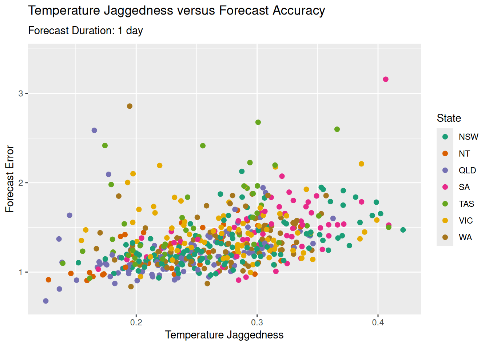
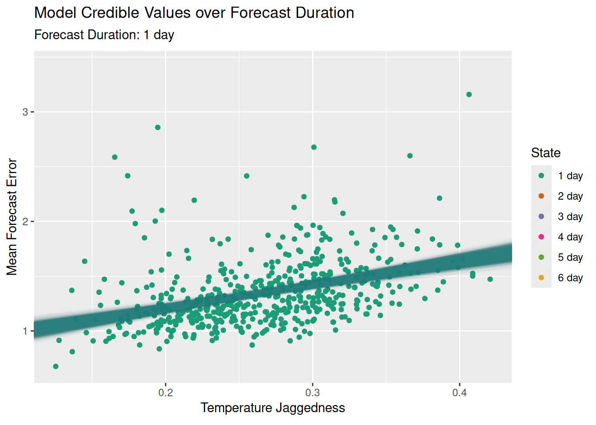

<link href="index_files/htmltools-fill/fill.css" rel="stylesheet" />

<link href="index_files/crosstalk/css/crosstalk.min.css" rel="stylesheet" />

<link href="index_files/plotly-htmlwidgets-css/plotly-htmlwidgets.css" rel="stylesheet" />

In this article we’re going to be taking a look at the forecast accuracy of Australia’s Bureau of Metorology (BOM), but before starting a quick preface.

I had trepidation writing this article, and it almost didn’t get off the ground. I’m not a meteorologist, and I’m also a data science dilettante. Wading into this particular field without foundational knowledge felt very arrogant, and to be frank I was worried I’d make a fool out of myself. But after having a chat with one of my great friends who has a Phd in meteorology, she assuaged some of my apprehensions, so here we are.

This post came about after searching and being unable to find historical information on the BOM’s forecasting performance. It may be that I just missed it somewhere, so if someone knows where this may be, please reach out.

# TL;DR

This is a hefty article, so here’s a quick rundown of what we’ll cover before diving in:

- The building temperature and 1-6 day temperature forecast datasets from 526 locations around Australia.
- Determining and visualising the accuracy of these forecasts.
- Creating a ‘jaggedness’ metric per site.
- Using Bayesian methods to build a model for predicting forecast accuracy.
- Assessing the model’s performance on in-sample and out-of-sample data.

Let’s go…

# Weather Stations

In previous articles I’ve gone into detail about the data acquisition process, I think because it’s quite a an enjoyable process. This time however I’m going to keep it brief and give you a quick overview about how I got the data, and what the data is.

I needed three pieces of data:

1.  A list of BOM weather stations
2.  The temperature at those weather stations over a period of time
3.  The temperature forecasts at each of those stations

Number one was easy, as the BOM provides a [list of weather stattions](http://www.bom.gov.au/climate/data/lists_by_element/stations.txt), including their name, latitude, longitude. This list get’s filtered down from ~6,500 total active weather stations to 526 that have a world meteorological organisation (WMO) ID. Here’s their locations around Australia:

}}index_files/figure-html/unnamed-chunk-3-1.png" width="672" />

# Temperature Data

To acquire the temperature and forecast data, I wrote a script which reaches out to the BOM and retrieves the temperature and the forecasts for the clostest city/town to each of the weather stations. This ran every ten minutes, which appears to be the update interval for most temperature on the BOM website.

Here’s a view of the temperature data, broken down state by state:

}}index_files/figure-html/unnamed-chunk-5-1.png" width="672" />
That’s a total of 4251931 million temperature readings over ~8 weeks. If you squint you should be able to a general downward trend of the temperature as we move through Autumn towards Winter.

I could easily go off on a number of tangents with this data, but I’ll just pull out the locations with the highest and lowest mean temperatures during this period:
}}index_files/figure-html/unnamed-chunk-6-1.png" width="672" />
Unsurpirisingly we’ve got a city in the north of the country, and a mountain in the very south. Take note of the different shapes of these graphs, we’ll discuss this later on in the article.

# Forecast Data

The BOM provides a 3-hourly temperature forecasts for each location (e.g. 1:00AM, 4:00AM, … 10:00PM) out to 7 days. As with the temperature, I’ve acquired this from their website every ten minutes for each location. This means we get 8 (hourly forecasts) \* 7 (days) \* 526 (locations) = 29,456 forecasts every ten minutes. Most of these are identical, as the forecast hasn’t changed. I’ve pruned this data back into two datasets:

1.  A **changed forecast** set, which contains rows of data where the forecast temperature for a date/time/location has changed from the previous forecast.  
2.  A **day-lagged forecast** set, which contains the forecasts which are eactly 1,2,3,…6 days out from the date/time we acquired the data.

Visualising the forecast data over time becomes messy very quickly, so instead let’s take a look at how often the BOM updates their models. This uses the *changed forecast* dataset, and is a histogram of the hour in the day in which the changed forecast was published to the website:

}}index_files/figure-html/unnamed-chunk-7-1.png" width="672" />
That spike in the late afternoon? Another data point to take note of, as it will be pertinent later on in this post.

# Forecast Accuracy

For each of the aforementioned data sets, we join them with the recorded temperature data. For each date/time we’ve got multiple forecasts ranging from 3 hours to 7 days out, and then the actual temperature that was recorded at that date/time. This allows us to calculate the forecast accuracy as *(forecast temp - recorded temp)*.

Let’s get to the crux of this article: forecast accuracy. There’s a small fly in the ointment, in that the published forecast temperatures integers, whereas the temperatures have a single decimal place. So a decision: do we round the recorded temperatures to whole numbers as well, or keep them as reals? I’ve made the decision here to continue to use the decimal temperatures, rather than round/ceil/floor to turn them into integers as well. All we can do is work with that data we’ve got, and the less assumptions or changes the better.

To start, here’s an interactive view of both the 1 day and 6 day forecast overlaid across the recorded temperature for one site (Essendon Airport in Melbourne). Initially it’s a bit messy, but if you zoom in and click the legend to add/remove the each of the forecasts you get an idea about how it’s changed, and how far off each one was.

Let’s look at some statistics across all of the weather stations: the mean error, the mean absolute error, the standard deviation of the error, and the 95% quantiles for the error.

<table class="gt_table" data-quarto-disable-processing="false" data-quarto-bootstrap="false">
  <thead>
    <tr class="gt_heading">
      <td colspan="5" class="gt_heading gt_title gt_font_normal gt_bottom_border" style>Forecast Error Statistics by Forecast Duration</td>
    </tr>
    &#10;    <tr class="gt_col_headings">
      <th class="gt_col_heading gt_columns_bottom_border gt_center" rowspan="1" colspan="1" scope="col" id="forecast_duration">Forecast Duration</th>
      <th class="gt_col_heading gt_columns_bottom_border gt_center" rowspan="1" colspan="1" scope="col" id="mean_forecast_error">Mean Error</th>
      <th class="gt_col_heading gt_columns_bottom_border gt_center" rowspan="1" colspan="1" scope="col" id="mean_absolute_error">Mean Absolute Error</th>
      <th class="gt_col_heading gt_columns_bottom_border gt_center" rowspan="1" colspan="1" scope="col" id="sd_forecast_error">Standard Deviation of Error</th>
      <th class="gt_col_heading gt_columns_bottom_border gt_center" rowspan="1" colspan="1" scope="col" id="nine_five_quantile">95% Quantile</th>
    </tr>
  </thead>
  <tbody class="gt_table_body">
    <tr><td headers="forecast_duration" class="gt_row gt_center">86400s (~1 days)</td>
<td headers="mean_forecast_error" class="gt_row gt_center">0.08672398</td>
<td headers="mean_absolute_error" class="gt_row gt_center">1.345774</td>
<td headers="sd_forecast_error" class="gt_row gt_center">1.750499</td>
<td headers="nine_five_quantile" class="gt_row gt_center">-3.6, 3.5</td></tr>
    <tr><td headers="forecast_duration" class="gt_row gt_center">172800s (~2 days)</td>
<td headers="mean_forecast_error" class="gt_row gt_center">0.11288383</td>
<td headers="mean_absolute_error" class="gt_row gt_center">1.406536</td>
<td headers="sd_forecast_error" class="gt_row gt_center">1.830461</td>
<td headers="nine_five_quantile" class="gt_row gt_center">-3.7, 3.7</td></tr>
    <tr><td headers="forecast_duration" class="gt_row gt_center">259200s (~3 days)</td>
<td headers="mean_forecast_error" class="gt_row gt_center">0.11540247</td>
<td headers="mean_absolute_error" class="gt_row gt_center">1.507734</td>
<td headers="sd_forecast_error" class="gt_row gt_center">1.969367</td>
<td headers="nine_five_quantile" class="gt_row gt_center">-4, 4</td></tr>
    <tr><td headers="forecast_duration" class="gt_row gt_center">345600s (~4 days)</td>
<td headers="mean_forecast_error" class="gt_row gt_center">0.10673938</td>
<td headers="mean_absolute_error" class="gt_row gt_center">1.627363</td>
<td headers="sd_forecast_error" class="gt_row gt_center">2.120494</td>
<td headers="nine_five_quantile" class="gt_row gt_center">-4.3, 4.3</td></tr>
    <tr><td headers="forecast_duration" class="gt_row gt_center">432000s (~5 days)</td>
<td headers="mean_forecast_error" class="gt_row gt_center">0.09161811</td>
<td headers="mean_absolute_error" class="gt_row gt_center">1.719336</td>
<td headers="sd_forecast_error" class="gt_row gt_center">2.236350</td>
<td headers="nine_five_quantile" class="gt_row gt_center">-4.6, 4.5</td></tr>
    <tr><td headers="forecast_duration" class="gt_row gt_center">518400s (~6 days)</td>
<td headers="mean_forecast_error" class="gt_row gt_center">0.12472699</td>
<td headers="mean_absolute_error" class="gt_row gt_center">1.879297</td>
<td headers="sd_forecast_error" class="gt_row gt_center">2.443794</td>
<td headers="nine_five_quantile" class="gt_row gt_center">-5, 5</td></tr>
  </tbody>
  &#10;  
</table>

The mean error doesn’t tell us about the accuracy (as negative and positive errors cancel each other out), but more about the bias in the model. It’s showing as that across all forecasts there’s a slight bias towards over-estimating the temperature, but only by a tenth of a degree or so.

The mean absolute error of changes from 1.33 degrees a day out, so 1.88 degrees six days out. The standard deviation increasing tells us that the errors are more spread out as well.

A histogram of the errors shows their distribution and how that changes over time. I’ve overlaid a normal distribution with a fixed mean of 0 and standard deviation of 2 to act as a reference point:

}}index_files/figure-html/unnamed-chunk-11-1.png" width="672" />
This shows the mean error slightly shifting to the right and the distribution spreading out as the standard deviation increases. The distribution looks *sort of* normal, and for the first two standard deviations it tracks really well. You’ll notice this with the table above, where the mean +- 2 x std.dev lines up well with the 95% quantiles.

But we can’t assume it’s normal across the board. This is best visualised with a quantile-quantile (QQ) plot.

}}index_files/figure-html/unnamed-chunk-12-1.png" width="672" />
This shows that these the forecast error distriubtions, like we mentioned before, track the normal for the first two standard deviation. Outside of that they have fatter tails than a normal, i.e. you’ll find more observations inside 3 or 4 standard deviations than you would in a normal distribution.

Instead of looking at whole days between the forecast and the recorded temperature, we can switch to the changed data set which contains all of the changed forecasts over time. This gives a more granulart view of the times between when the forecast was made, and the actual recorded temperature.
}}index_files/figure-html/unnamed-chunk-13-1.png" width="672" />
There’s two things that immediately jump out at me: the is first is both the variance and mean absolute error over time appear to be much greater for Victoria, Tasmania, and South Australia as opposed to the others. The second is that there appears to be a cyclical nature to the forecast error. Setting aside what I’ll call the ‘southern state’ issue, we’ll investigate the cyclical nature.

Straight away this looks to be a difference in forecast error based on whether it’s day or night. I wouldn’t have thought that this kind of bias would have come through in the forecast durations. But if you recall the previous histogram that showed when the BOM published its updated models, this wasn’t uniformly distributed. Rather, most of the changes to forecasts occurred between 2pm and 6pm. Therefore the forecast duration - the difference between the forecast change and the forecast time - will be ‘tethered’ from this time and the day/night cycle will show in the forecast durations.

Let’s code the forecast’s time as either ‘night’ based on whether the time is after 7pm and before 7am, and ‘day’ for all others. This makes sense for the time period of the data. Interestingly if we look at a density plot of the forecast error we see a difference in variation between night and day.

}}index_files/figure-html/unnamed-chunk-15-1.png" width="672" />
This, combined with the fact that most of the forecasts are published at a certain time of the day, is why there is a cyclical pattern in the forecast duration graph. We won’t delve into this any further, but the question to of course ask is why would this be the case? I’m not going to dive any deeper into this in this post, but it’s something to think about.

# Forecast Error Modelling

Can we find a way to model the forecast error as a function of some other parameters? The first parameter is obvious: forecast duration. Looking at the mean absolute error over the forecast duration, it increased as the forecast duration increased. This shouldn’t be surprising, as the quote goes “prediction is very hard, especially about the future”.

But when we looked at the graph, there was a second source of variation. It appeared that the southern states - Victoria, Tasmania, South Australia - had a higher variation in mean absolute error as compared to the northern states.

This is where I’m in danger of cosplaying as a meteorologist and being completely off the mark, but lets have a go. Looking back at the graph of the lowest mean temperature and the start of this article, taken from Tasmania in the south of Australia, what you may have noticed is that the profile of the lowest mean temperature looked different. To me eye it looked rougher and moved up and down far more as compared to the highest mean, which was from a location in the far north of Australia.

Could this type of variation have an influence on the forecast accuracy? Can we quantify it?

## The ‘Jaggedness’ Index

My guess would be as we go south, certain meteorological features that I would only be guessing at (weather coming off the Southern Ocean?) make the rises and falls in temperature less ‘smooth’ more varied, and thus more unpredictable.

My thought is to create a ‘jaggedness’ index for each of the locations and each of the day-lagged forecast.

$$ J = \frac{1}{n - 1} \sum_{i=2}^{n} \left| t_i - t_{i-1} \right| $$

Where \\(t_i\\) is the i’th temperature observation at a site, and \\(n\\) is the total number of observations. In plain English: the sum of the absolute differences between consecutive temperature observations, divided by the number of pairs of observations.

To give this some perspective, here are the temperatures over time for the locations with the highest and lowest jaggedness indexes:

<table class="gt_table" data-quarto-disable-processing="false" data-quarto-bootstrap="false">
  <thead>
    <tr class="gt_heading">
      <td colspan="2" class="gt_heading gt_title gt_font_normal gt_bottom_border" style>Min/Max Site Jaggedness</td>
    </tr>
    &#10;    <tr class="gt_col_headings">
      <th class="gt_col_heading gt_columns_bottom_border gt_center" rowspan="1" colspan="1" scope="col" id="site">Site</th>
      <th class="gt_col_heading gt_columns_bottom_border gt_right" rowspan="1" colspan="1" scope="col" id="jaggedness">Jaggedness</th>
    </tr>
  </thead>
  <tbody class="gt_table_body">
    <tr><td headers="site" class="gt_row gt_center">LOW ISLES LIGHTHOUSE, QLD</td>
<td headers="jaggedness" class="gt_row gt_right">0.1252697</td></tr>
    <tr><td headers="site" class="gt_row gt_center">KHANCOBAN AWS, NSW</td>
<td headers="jaggedness" class="gt_row gt_right">0.4207670</td></tr>
  </tbody>
  &#10;  
</table>

}}index_files/figure-html/unnamed-chunk-17-1.png" width="672" />

We can now plot each locations index against its mean absolute error, and we’ll transition of the day forecast durations.

<!-- -->
We can see a reasonably linear relationship between this jaggedness index and the mean forecast error. Let’s use these two features - duration and jaggedness - as parameters into a simple linear model and see if we can come up with a model that predicts the mean absolute forecast error.

# Modeling

To be honest, the jaggedness index isn’t a great predictor, because you can only calculate it once you’ve got the temperature, and once you’ve got the temperature you can just calculate the forecast error directly! But let’s just have a go, start simple, and see where we end up.

We’ll use Stan to create a simple linear model with two parameters: the jaggedness as a continuous variable, and the day-lagged forecast duration as a categorical index. Here’s the full specification of the model:

    data {
      //Training data
      int<lower=1> n;
      vector[n] jaggedness;
      array[n] int <lower=1, upper=6> duration;
      vector[n] mean_forecast_error;
      
      //Out of sample test set
      vector[n] jaggedness_t;
      array[n] int <lower=1, upper=6> duration_t;
      vector[n] mean_forecast_error_t;
        }

    parameters {
      vector[6] alpha;
      vector[6] beta_jaggedness;
      real<lower=0> sigma;
        }

    model {
      // Weakly informative priors
      beta_jaggedness ~ normal(0, 5);
      alpha ~ normal(0, 5);
      sigma ~ exponential(1);

      // Likelihood
      for (i in 1:n) {
        mean_forecast_error[i] ~ normal(alpha[duration[i]] + beta_jaggedness[duration[i]] * jaggedness[i], sigma);
      }
    }

    generated quantities {
      //Posterior predictive check
      vector[n] y_rep;
      //Out of sample test set
      vector[n] y_test;

      for (i in 1:n) {
        //Posterior predictive checks
        y_rep[i] = normal_rng(
          alpha[duration[i]] + beta_jaggedness[duration[i]] * jaggedness[i],
          sigma
        );
       
        //Out of sample checks 
        y_test[i] = normal_rng(
          alpha[duration_t[i]] + beta_jaggedness[duration_t[i]] * jaggedness_t[i],
          sigma
        );
      }
    }

After sampling from the posterior (and performing some of the standard checks like trace plots and histograms that I’m not going to show here), we get our alpha and beta parameters (intercept and slope) for each of the indexes (where index 1 = 1 day forecast, index 2 = 2 day forecast, etc), as well as some other statistics about the distributions of each parameter. For completeness here’s a table of all of the parameters;

<table class="gt_table" data-quarto-disable-processing="false" data-quarto-bootstrap="false">
  <thead>
    <tr class="gt_heading">
      <td colspan="6" class="gt_heading gt_title gt_font_normal gt_bottom_border" style>Model Parameter: Posterior Distribution Statistics</td>
    </tr>
    &#10;    <tr class="gt_col_headings">
      <th class="gt_col_heading gt_columns_bottom_border gt_center" rowspan="1" colspan="1" style="font-weight: bold;" scope="col" id="variable">Variable</th>
      <th class="gt_col_heading gt_columns_bottom_border gt_center" rowspan="1" colspan="1" style="font-weight: bold;" scope="col" id="mean">Mean</th>
      <th class="gt_col_heading gt_columns_bottom_border gt_center" rowspan="1" colspan="1" style="font-weight: bold;" scope="col" id="median">Median</th>
      <th class="gt_col_heading gt_columns_bottom_border gt_center" rowspan="1" colspan="1" style="font-weight: bold;" scope="col" id="sd">Std. Dev</th>
      <th class="gt_col_heading gt_columns_bottom_border gt_center" rowspan="1" colspan="1" style="font-weight: bold;" scope="col" id="a2.5%">Lower 2.5%</th>
      <th class="gt_col_heading gt_columns_bottom_border gt_center" rowspan="1" colspan="1" style="font-weight: bold;" scope="col" id="a97.5%">Upper 97.5</th>
    </tr>
  </thead>
  <tbody class="gt_table_body">
    <tr><td headers="variable" class="gt_row gt_center">sigma</td>
<td headers="mean" class="gt_row gt_center">0.31</td>
<td headers="median" class="gt_row gt_center">0.31</td>
<td headers="sd" class="gt_row gt_center">0.00</td>
<td headers="2.5%" class="gt_row gt_center">0.30</td>
<td headers="97.5%" class="gt_row gt_center">0.32</td></tr>
    <tr><td headers="variable" class="gt_row gt_center">alpha[1]</td>
<td headers="mean" class="gt_row gt_center">0.78</td>
<td headers="median" class="gt_row gt_center">0.78</td>
<td headers="sd" class="gt_row gt_center">0.06</td>
<td headers="2.5%" class="gt_row gt_center">0.66</td>
<td headers="97.5%" class="gt_row gt_center">0.91</td></tr>
    <tr><td headers="variable" class="gt_row gt_center">alpha[2]</td>
<td headers="mean" class="gt_row gt_center">0.76</td>
<td headers="median" class="gt_row gt_center">0.76</td>
<td headers="sd" class="gt_row gt_center">0.06</td>
<td headers="2.5%" class="gt_row gt_center">0.64</td>
<td headers="97.5%" class="gt_row gt_center">0.89</td></tr>
    <tr><td headers="variable" class="gt_row gt_center">alpha[3]</td>
<td headers="mean" class="gt_row gt_center">0.76</td>
<td headers="median" class="gt_row gt_center">0.76</td>
<td headers="sd" class="gt_row gt_center">0.06</td>
<td headers="2.5%" class="gt_row gt_center">0.63</td>
<td headers="97.5%" class="gt_row gt_center">0.88</td></tr>
    <tr><td headers="variable" class="gt_row gt_center">alpha[4]</td>
<td headers="mean" class="gt_row gt_center">0.81</td>
<td headers="median" class="gt_row gt_center">0.81</td>
<td headers="sd" class="gt_row gt_center">0.06</td>
<td headers="2.5%" class="gt_row gt_center">0.69</td>
<td headers="97.5%" class="gt_row gt_center">0.93</td></tr>
    <tr><td headers="variable" class="gt_row gt_center">alpha[5]</td>
<td headers="mean" class="gt_row gt_center">0.85</td>
<td headers="median" class="gt_row gt_center">0.85</td>
<td headers="sd" class="gt_row gt_center">0.06</td>
<td headers="2.5%" class="gt_row gt_center">0.73</td>
<td headers="97.5%" class="gt_row gt_center">0.97</td></tr>
    <tr><td headers="variable" class="gt_row gt_center">alpha[6]</td>
<td headers="mean" class="gt_row gt_center">0.82</td>
<td headers="median" class="gt_row gt_center">0.81</td>
<td headers="sd" class="gt_row gt_center">0.06</td>
<td headers="2.5%" class="gt_row gt_center">0.69</td>
<td headers="97.5%" class="gt_row gt_center">0.94</td></tr>
    <tr><td headers="variable" class="gt_row gt_center">beta_jaggedness[1]</td>
<td headers="mean" class="gt_row gt_center">2.14</td>
<td headers="median" class="gt_row gt_center">2.14</td>
<td headers="sd" class="gt_row gt_center">0.24</td>
<td headers="2.5%" class="gt_row gt_center">1.66</td>
<td headers="97.5%" class="gt_row gt_center">2.59</td></tr>
    <tr><td headers="variable" class="gt_row gt_center">beta_jaggedness[2]</td>
<td headers="mean" class="gt_row gt_center">2.43</td>
<td headers="median" class="gt_row gt_center">2.43</td>
<td headers="sd" class="gt_row gt_center">0.24</td>
<td headers="2.5%" class="gt_row gt_center">1.96</td>
<td headers="97.5%" class="gt_row gt_center">2.89</td></tr>
    <tr><td headers="variable" class="gt_row gt_center">beta_jaggedness[3]</td>
<td headers="mean" class="gt_row gt_center">2.84</td>
<td headers="median" class="gt_row gt_center">2.84</td>
<td headers="sd" class="gt_row gt_center">0.23</td>
<td headers="2.5%" class="gt_row gt_center">2.40</td>
<td headers="97.5%" class="gt_row gt_center">3.29</td></tr>
    <tr><td headers="variable" class="gt_row gt_center">beta_jaggedness[4]</td>
<td headers="mean" class="gt_row gt_center">3.08</td>
<td headers="median" class="gt_row gt_center">3.08</td>
<td headers="sd" class="gt_row gt_center">0.24</td>
<td headers="2.5%" class="gt_row gt_center">2.62</td>
<td headers="97.5%" class="gt_row gt_center">3.54</td></tr>
    <tr><td headers="variable" class="gt_row gt_center">beta_jaggedness[5]</td>
<td headers="mean" class="gt_row gt_center">3.27</td>
<td headers="median" class="gt_row gt_center">3.27</td>
<td headers="sd" class="gt_row gt_center">0.23</td>
<td headers="2.5%" class="gt_row gt_center">2.83</td>
<td headers="97.5%" class="gt_row gt_center">3.73</td></tr>
    <tr><td headers="variable" class="gt_row gt_center">beta_jaggedness[6]</td>
<td headers="mean" class="gt_row gt_center">4.02</td>
<td headers="median" class="gt_row gt_center">4.02</td>
<td headers="sd" class="gt_row gt_center">0.23</td>
<td headers="2.5%" class="gt_row gt_center">3.55</td>
<td headers="97.5%" class="gt_row gt_center">4.47</td></tr>
  </tbody>
  &#10;  
</table>

I’m not going to go through each one, but let’s take a look at index *\[6\]*: the six day forecast. The parameters tell us the following information:

- *alpha\[6\]* - for a location with zero jaggedness (the intercept), you would expect on average a mean forecast error of 0.82, with a credible interval between .7 and .94.
- *beta_jaggedness\[6\]* - for each increase of jaggedness by 1, you would expect on average the mean forecast error to go up by 4 degrees, with a 95% credible interval of between 3.56 and 4.46.

Tables are hard to interpret, so instead what we’ll do is plot all a line for each of the parameters drawn from the posterior, which shows the range of values the model believes parameters could be. As before, we transition through each of the forecast durations:

<!-- -->
Some reasonably tight credible intervals for the parameters. But there’s one parameter left we haven’t looked at: sigma, the residual standard deviation. It’s a measure of how far the observed data deviates from our fitted values We’ve used a single parameter, so it doesn’t vary across the forecast indexes/durations.

We can check how well our model has done by performing posterior predictive checks. In our Stan model we generated random data for each of the observations using all of the alpha, beta, and sigma values drawn from the posterior. We’ve then limited the data to those values that are within the 95% credible interval, and plotted each one in green. We’ve then overlaid the real observations in orange over the top.

}}index_files/figure-html/unnamed-chunk-24-1.png" width="672" />
Most of our data lies within the bands of the generated data, which is good. However there’s a couple of things that don’t look quite right: the first is that there’s a bias in the model. Almost all of the values which don’t fit are above the bands, rather than below. Our model, which uses normal residuals/errors, assumes that the errors should be approximately symmetric, which they are not.

Secondly, those values above the bands are a long way from where the model would expect them to be. So our model doesn’t do a great job of predicting the mean forecast error based on jaggedness for those sites.

If we calculate the 95% interval of our generated values from the model, then calculate the percentage of recorded values that fall in that range, we get the following results:

<table class="gt_table" data-quarto-disable-processing="false" data-quarto-bootstrap="false">
  <thead>
    <tr class="gt_heading">
      <td colspan="2" class="gt_heading gt_title gt_font_normal" style>Real Values Within 95% Credible Interval</td>
    </tr>
    <tr class="gt_heading">
      <td colspan="2" class="gt_heading gt_subtitle gt_font_normal gt_bottom_border" style>Training Data Set</td>
    </tr>
    <tr class="gt_col_headings">
      <th class="gt_col_heading gt_columns_bottom_border gt_center" rowspan="1" colspan="1" scope="col" id="forecast_duration_names">Forecast Duration</th>
      <th class="gt_col_heading gt_columns_bottom_border gt_center" rowspan="1" colspan="1" scope="col" id="q95">Percentage</th>
    </tr>
  </thead>
  <tbody class="gt_table_body">
    <tr><td headers="forecast_duration_names" class="gt_row gt_center">1 day</td>
<td headers="q95" class="gt_row gt_center">96.8%</td></tr>
    <tr><td headers="forecast_duration_names" class="gt_row gt_center">2 day</td>
<td headers="q95" class="gt_row gt_center">96.4%</td></tr>
    <tr><td headers="forecast_duration_names" class="gt_row gt_center">3 day</td>
<td headers="q95" class="gt_row gt_center">95.8%</td></tr>
    <tr><td headers="forecast_duration_names" class="gt_row gt_center">4 day</td>
<td headers="q95" class="gt_row gt_center">95.8%</td></tr>
    <tr><td headers="forecast_duration_names" class="gt_row gt_center">5 day</td>
<td headers="q95" class="gt_row gt_center">95.2%</td></tr>
    <tr><td headers="forecast_duration_names" class="gt_row gt_center">6 day</td>
<td headers="q95" class="gt_row gt_center">93.5%</td></tr>
  </tbody>
  &#10;  
</table>

That’s good, at least the range of the posterior predictive distribution is close to our observed data. But it also shouldn’t be too surprising: the model was trained off this data.

The real test of the model is how it performs on out of sample data. I’ve held out ~3 weeks of temperature/forecast accuracy data from the time period immediately after the training set. Each location is still using the jaggedness calculated from the training temperatures. Let’s take a look at how it performs:

}}index_files/figure-html/unnamed-chunk-26-1.png" width="672" />

<table class="gt_table" data-quarto-disable-processing="false" data-quarto-bootstrap="false">
  <thead>
    <tr class="gt_heading">
      <td colspan="2" class="gt_heading gt_title gt_font_normal" style>Real Values Within 95% Credible Interval</td>
    </tr>
    <tr class="gt_heading">
      <td colspan="2" class="gt_heading gt_subtitle gt_font_normal gt_bottom_border" style>Test (Out-of-Sample) Data Set</td>
    </tr>
    <tr class="gt_col_headings">
      <th class="gt_col_heading gt_columns_bottom_border gt_center" rowspan="1" colspan="1" scope="col" id="forecast_duration_names">Forecast Duration</th>
      <th class="gt_col_heading gt_columns_bottom_border gt_center" rowspan="1" colspan="1" scope="col" id="q95">Percentage</th>
    </tr>
  </thead>
  <tbody class="gt_table_body">
    <tr><td headers="forecast_duration_names" class="gt_row gt_center">1 day</td>
<td headers="q95" class="gt_row gt_center">93.2%</td></tr>
    <tr><td headers="forecast_duration_names" class="gt_row gt_center">2 day</td>
<td headers="q95" class="gt_row gt_center">92.8%</td></tr>
    <tr><td headers="forecast_duration_names" class="gt_row gt_center">3 day</td>
<td headers="q95" class="gt_row gt_center">92.0%</td></tr>
    <tr><td headers="forecast_duration_names" class="gt_row gt_center">4 day</td>
<td headers="q95" class="gt_row gt_center">89.4%</td></tr>
    <tr><td headers="forecast_duration_names" class="gt_row gt_center">5 day</td>
<td headers="q95" class="gt_row gt_center">88.8%</td></tr>
    <tr><td headers="forecast_duration_names" class="gt_row gt_center">6 day</td>
<td headers="q95" class="gt_row gt_center">85.2%</td></tr>
  </tbody>
  &#10;  
</table>

Not bad, but not great. Outside of the three day forecast it starts to fall away.

# Summary

Phew, that one just kept going and going! A recap: we gathered 8 weeks of temperature and temperature forecasts from around Australia, and looked at how well the forecasts performed depending on how far out the forecast was. We then created a summary statistic - jaggedness - and attempted to create a linear model for predicting forecast accuracy based on this, as well as forecast duration. It did OK, but it’s probably a little simplistic, and perhaps not much use in the long term.

A couple of weeks ago my wife asked me “why are you even doing this?”. Good question. I think there are two reasons:

The first is that I just wanted to know the answer. How exactly does the BOM perform at forecasting temperature? Now we’ve got some data, and some outputs. It’s a small sample, and we don’t know how it changes over time, but it’s something we can point to. Whether it’s qualitatively good or bad I don’t know, I’ll leave those kind of judgements to the reader.

The second reason is that, it doing these kinds posts, I get to put into practice things I’ve read about in an interesting way and consolidate a lot of knowledge. Here’s a few of the things I’ve got a better idea of now:

- The [read_fwf()](https://readr.tidyverse.org/reference/read_fwf.html) function in the readr package
- The [req_perform_parallel()](https://httr2.r-lib.org/reference/req_perform_parallel.html) function in the httr2 package for speeding up bulk requests to websites.
- Writing [systemd timers](https://wiki.archlinux.org/title/Systemd/Timers)
- [Timezone files](https://www.dedoimedo.com/computers/linux-timezone.html) in Linux
- Using indexes for categorical variables in Stan models.
- Using a test set in a Stan model.

To me, those reasons are as good as any.
