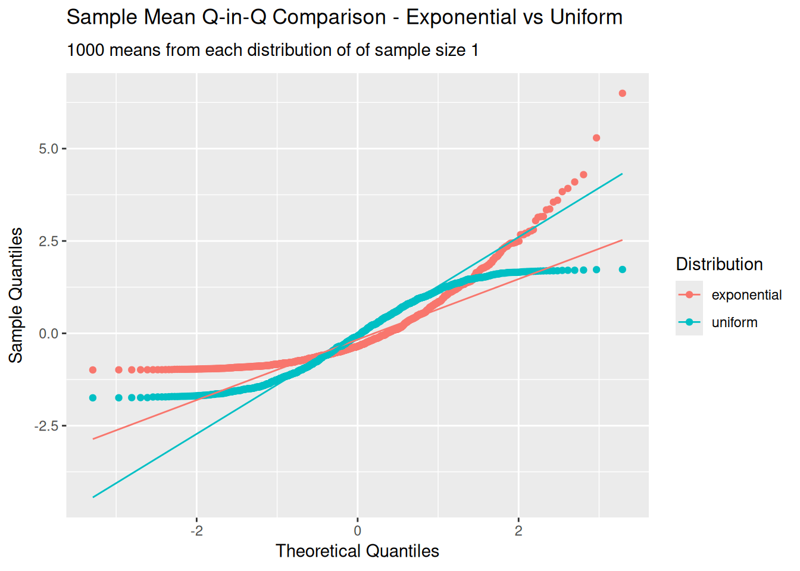

I did a lot of maths units at uni — PDEs, vector calculus, discrete maths, linear algebra — but I always eschewed statistics subjects. Perhaps it was a case of being young and not accepting uncertainty, because 20 years later, I find statistics, particularly Bayesian statistics, fascinating.

One problem with my self-directed journey is that there’s foundational knowledge has come to me in drips, and the most foundational is the *Central Limit Theorem*. In this post I don’t want delve into the theory of the CLT, proofs or extended descriptions. What I want to do is use simulation and visualisation to help understand how it works. Writing this article is predominantly a process to help me understand the CLT; you’re just here for the ride. Hopefully that ride can help you get where you need to go as well.

# A Brief Recap

I don’t this to be like an online recipe with pages of back story before you get to the meat and bones, but let’s quickly recap state what the CLT means:

> “If you take samples of size *n* from a distribution and calculate the sample mean for each, as *n* gets approaches infinity, the distribution of sample means approaches a normal distribution.”

For the classic CLT there’s a couple of assumptions about the source distribution:

- The sample is drawn independently (no autocorrelation like in a time series).
- All the data points are drawn from the same distribution (“independent and identically distributed”).
- The distribution has a finite mean and variance.

There are other versions of the CLT in which some of these assumptions are relaxed, but we’ll focus on the classic version in this post.

Putting it math terms:

``` math
 \frac{\bar{X}_n - \mu}{\sigma/\sqrt{n}}  \overset{d}\longrightarrow \mathcal{N}(0, 1)
```

# Simulating

Now we’re not the kind of people to just accept something because someone threw some fancy Greek symbols at us. We want to simulate this to give ourselves some confidence it works in practice.

Let’s create a tibble of ten-thousand random values from six different distributions, which we’ll call our ‘population’:

``` r
# 10,000 draws from six different distributions
population_data <- tibble(
    uniform = runif(10000, min = -20, max = 20),
    normal = rnorm(10000, mean = 0, sd = 4),
    binomial = rbinom(10000, size = 1, prob = .5),
    beta = rbeta(10000, shape1 = .9, shape2 = .5),
    exponential = rexp(10000, .4),
    chisquare = rchisq(10000, df = 2),
)
```

<div id="qskutphami" style="padding-left:0px;padding-right:0px;padding-top:10px;padding-bottom:10px;overflow-x:auto;overflow-y:auto;width:auto;height:auto;">
<style>#qskutphami table {
  font-family: system-ui, 'Segoe UI', Roboto, Helvetica, Arial, sans-serif, 'Apple Color Emoji', 'Segoe UI Emoji', 'Segoe UI Symbol', 'Noto Color Emoji';
  -webkit-font-smoothing: antialiased;
  -moz-osx-font-smoothing: grayscale;
}
&#10;#qskutphami thead, #qskutphami tbody, #qskutphami tfoot, #qskutphami tr, #qskutphami td, #qskutphami th {
  border-style: none;
}
&#10;#qskutphami p {
  margin: 0;
  padding: 0;
}
&#10;#qskutphami .gt_table {
  display: table;
  border-collapse: collapse;
  line-height: normal;
  margin-left: auto;
  margin-right: auto;
  color: #333333;
  font-size: 16px;
  font-weight: normal;
  font-style: normal;
  background-color: #FFFFFF;
  width: auto;
  border-top-style: solid;
  border-top-width: 2px;
  border-top-color: #A8A8A8;
  border-right-style: none;
  border-right-width: 2px;
  border-right-color: #D3D3D3;
  border-bottom-style: solid;
  border-bottom-width: 2px;
  border-bottom-color: #A8A8A8;
  border-left-style: none;
  border-left-width: 2px;
  border-left-color: #D3D3D3;
}
&#10;#qskutphami .gt_caption {
  padding-top: 4px;
  padding-bottom: 4px;
}
&#10;#qskutphami .gt_title {
  color: #333333;
  font-size: 125%;
  font-weight: initial;
  padding-top: 4px;
  padding-bottom: 4px;
  padding-left: 5px;
  padding-right: 5px;
  border-bottom-color: #FFFFFF;
  border-bottom-width: 0;
}
&#10;#qskutphami .gt_subtitle {
  color: #333333;
  font-size: 85%;
  font-weight: initial;
  padding-top: 3px;
  padding-bottom: 5px;
  padding-left: 5px;
  padding-right: 5px;
  border-top-color: #FFFFFF;
  border-top-width: 0;
}
&#10;#qskutphami .gt_heading {
  background-color: #FFFFFF;
  text-align: center;
  border-bottom-color: #FFFFFF;
  border-left-style: none;
  border-left-width: 1px;
  border-left-color: #D3D3D3;
  border-right-style: none;
  border-right-width: 1px;
  border-right-color: #D3D3D3;
}
&#10;#qskutphami .gt_bottom_border {
  border-bottom-style: solid;
  border-bottom-width: 2px;
  border-bottom-color: #D3D3D3;
}
&#10;#qskutphami .gt_col_headings {
  border-top-style: solid;
  border-top-width: 2px;
  border-top-color: #D3D3D3;
  border-bottom-style: solid;
  border-bottom-width: 2px;
  border-bottom-color: #D3D3D3;
  border-left-style: none;
  border-left-width: 1px;
  border-left-color: #D3D3D3;
  border-right-style: none;
  border-right-width: 1px;
  border-right-color: #D3D3D3;
}
&#10;#qskutphami .gt_col_heading {
  color: #333333;
  background-color: #FFFFFF;
  font-size: 100%;
  font-weight: normal;
  text-transform: inherit;
  border-left-style: none;
  border-left-width: 1px;
  border-left-color: #D3D3D3;
  border-right-style: none;
  border-right-width: 1px;
  border-right-color: #D3D3D3;
  vertical-align: bottom;
  padding-top: 5px;
  padding-bottom: 6px;
  padding-left: 5px;
  padding-right: 5px;
  overflow-x: hidden;
}
&#10;#qskutphami .gt_column_spanner_outer {
  color: #333333;
  background-color: #FFFFFF;
  font-size: 100%;
  font-weight: normal;
  text-transform: inherit;
  padding-top: 0;
  padding-bottom: 0;
  padding-left: 4px;
  padding-right: 4px;
}
&#10;#qskutphami .gt_column_spanner_outer:first-child {
  padding-left: 0;
}
&#10;#qskutphami .gt_column_spanner_outer:last-child {
  padding-right: 0;
}
&#10;#qskutphami .gt_column_spanner {
  border-bottom-style: solid;
  border-bottom-width: 2px;
  border-bottom-color: #D3D3D3;
  vertical-align: bottom;
  padding-top: 5px;
  padding-bottom: 5px;
  overflow-x: hidden;
  display: inline-block;
  width: 100%;
}
&#10;#qskutphami .gt_spanner_row {
  border-bottom-style: hidden;
}
&#10;#qskutphami .gt_group_heading {
  padding-top: 8px;
  padding-bottom: 8px;
  padding-left: 5px;
  padding-right: 5px;
  color: #333333;
  background-color: #FFFFFF;
  font-size: 100%;
  font-weight: initial;
  text-transform: inherit;
  border-top-style: solid;
  border-top-width: 2px;
  border-top-color: #D3D3D3;
  border-bottom-style: solid;
  border-bottom-width: 2px;
  border-bottom-color: #D3D3D3;
  border-left-style: none;
  border-left-width: 1px;
  border-left-color: #D3D3D3;
  border-right-style: none;
  border-right-width: 1px;
  border-right-color: #D3D3D3;
  vertical-align: middle;
  text-align: left;
}
&#10;#qskutphami .gt_empty_group_heading {
  padding: 0.5px;
  color: #333333;
  background-color: #FFFFFF;
  font-size: 100%;
  font-weight: initial;
  border-top-style: solid;
  border-top-width: 2px;
  border-top-color: #D3D3D3;
  border-bottom-style: solid;
  border-bottom-width: 2px;
  border-bottom-color: #D3D3D3;
  vertical-align: middle;
}
&#10;#qskutphami .gt_from_md > :first-child {
  margin-top: 0;
}
&#10;#qskutphami .gt_from_md > :last-child {
  margin-bottom: 0;
}
&#10;#qskutphami .gt_row {
  padding-top: 8px;
  padding-bottom: 8px;
  padding-left: 5px;
  padding-right: 5px;
  margin: 10px;
  border-top-style: solid;
  border-top-width: 1px;
  border-top-color: #D3D3D3;
  border-left-style: none;
  border-left-width: 1px;
  border-left-color: #D3D3D3;
  border-right-style: none;
  border-right-width: 1px;
  border-right-color: #D3D3D3;
  vertical-align: middle;
  overflow-x: hidden;
}
&#10;#qskutphami .gt_stub {
  color: #333333;
  background-color: #FFFFFF;
  font-size: 100%;
  font-weight: initial;
  text-transform: inherit;
  border-right-style: solid;
  border-right-width: 2px;
  border-right-color: #D3D3D3;
  padding-left: 5px;
  padding-right: 5px;
}
&#10;#qskutphami .gt_stub_row_group {
  color: #333333;
  background-color: #FFFFFF;
  font-size: 100%;
  font-weight: initial;
  text-transform: inherit;
  border-right-style: solid;
  border-right-width: 2px;
  border-right-color: #D3D3D3;
  padding-left: 5px;
  padding-right: 5px;
  vertical-align: top;
}
&#10;#qskutphami .gt_row_group_first td {
  border-top-width: 2px;
}
&#10;#qskutphami .gt_row_group_first th {
  border-top-width: 2px;
}
&#10;#qskutphami .gt_summary_row {
  color: #333333;
  background-color: #FFFFFF;
  text-transform: inherit;
  padding-top: 8px;
  padding-bottom: 8px;
  padding-left: 5px;
  padding-right: 5px;
}
&#10;#qskutphami .gt_first_summary_row {
  border-top-style: solid;
  border-top-color: #D3D3D3;
}
&#10;#qskutphami .gt_first_summary_row.thick {
  border-top-width: 2px;
}
&#10;#qskutphami .gt_last_summary_row {
  padding-top: 8px;
  padding-bottom: 8px;
  padding-left: 5px;
  padding-right: 5px;
  border-bottom-style: solid;
  border-bottom-width: 2px;
  border-bottom-color: #D3D3D3;
}
&#10;#qskutphami .gt_grand_summary_row {
  color: #333333;
  background-color: #FFFFFF;
  text-transform: inherit;
  padding-top: 8px;
  padding-bottom: 8px;
  padding-left: 5px;
  padding-right: 5px;
}
&#10;#qskutphami .gt_first_grand_summary_row {
  padding-top: 8px;
  padding-bottom: 8px;
  padding-left: 5px;
  padding-right: 5px;
  border-top-style: double;
  border-top-width: 6px;
  border-top-color: #D3D3D3;
}
&#10;#qskutphami .gt_last_grand_summary_row_top {
  padding-top: 8px;
  padding-bottom: 8px;
  padding-left: 5px;
  padding-right: 5px;
  border-bottom-style: double;
  border-bottom-width: 6px;
  border-bottom-color: #D3D3D3;
}
&#10;#qskutphami .gt_striped {
  background-color: rgba(128, 128, 128, 0.05);
}
&#10;#qskutphami .gt_table_body {
  border-top-style: solid;
  border-top-width: 2px;
  border-top-color: #D3D3D3;
  border-bottom-style: solid;
  border-bottom-width: 2px;
  border-bottom-color: #D3D3D3;
}
&#10;#qskutphami .gt_footnotes {
  color: #333333;
  background-color: #FFFFFF;
  border-bottom-style: none;
  border-bottom-width: 2px;
  border-bottom-color: #D3D3D3;
  border-left-style: none;
  border-left-width: 2px;
  border-left-color: #D3D3D3;
  border-right-style: none;
  border-right-width: 2px;
  border-right-color: #D3D3D3;
}
&#10;#qskutphami .gt_footnote {
  margin: 0px;
  font-size: 90%;
  padding-top: 4px;
  padding-bottom: 4px;
  padding-left: 5px;
  padding-right: 5px;
}
&#10;#qskutphami .gt_sourcenotes {
  color: #333333;
  background-color: #FFFFFF;
  border-bottom-style: none;
  border-bottom-width: 2px;
  border-bottom-color: #D3D3D3;
  border-left-style: none;
  border-left-width: 2px;
  border-left-color: #D3D3D3;
  border-right-style: none;
  border-right-width: 2px;
  border-right-color: #D3D3D3;
}
&#10;#qskutphami .gt_sourcenote {
  font-size: 90%;
  padding-top: 4px;
  padding-bottom: 4px;
  padding-left: 5px;
  padding-right: 5px;
}
&#10;#qskutphami .gt_left {
  text-align: left;
}
&#10;#qskutphami .gt_center {
  text-align: center;
}
&#10;#qskutphami .gt_right {
  text-align: right;
  font-variant-numeric: tabular-nums;
}
&#10;#qskutphami .gt_font_normal {
  font-weight: normal;
}
&#10;#qskutphami .gt_font_bold {
  font-weight: bold;
}
&#10;#qskutphami .gt_font_italic {
  font-style: italic;
}
&#10;#qskutphami .gt_super {
  font-size: 65%;
}
&#10;#qskutphami .gt_footnote_marks {
  font-size: 75%;
  vertical-align: 0.4em;
  position: initial;
}
&#10;#qskutphami .gt_asterisk {
  font-size: 100%;
  vertical-align: 0;
}
&#10;#qskutphami .gt_indent_1 {
  text-indent: 5px;
}
&#10;#qskutphami .gt_indent_2 {
  text-indent: 10px;
}
&#10;#qskutphami .gt_indent_3 {
  text-indent: 15px;
}
&#10;#qskutphami .gt_indent_4 {
  text-indent: 20px;
}
&#10;#qskutphami .gt_indent_5 {
  text-indent: 25px;
}
&#10;#qskutphami .katex-display {
  display: inline-flex !important;
  margin-bottom: 0.75em !important;
}
&#10;#qskutphami div.Reactable > div.rt-table > div.rt-thead > div.rt-tr.rt-tr-group-header > div.rt-th-group:after {
  height: 0px !important;
}
</style>
<table class="gt_table" data-quarto-disable-processing="false" data-quarto-bootstrap="false">
  <thead>
    <tr class="gt_heading">
      <td colspan="6" class="gt_heading gt_title gt_font_normal gt_bottom_border" style>Six Distributions - Ten-Thousand Values, First Five Rows</td>
    </tr>
    &#10;    <tr class="gt_col_headings">
      <th class="gt_col_heading gt_columns_bottom_border gt_right" rowspan="1" colspan="1" scope="col" id="uniform">uniform</th>
      <th class="gt_col_heading gt_columns_bottom_border gt_right" rowspan="1" colspan="1" scope="col" id="normal">normal</th>
      <th class="gt_col_heading gt_columns_bottom_border gt_right" rowspan="1" colspan="1" scope="col" id="binomial">binomial</th>
      <th class="gt_col_heading gt_columns_bottom_border gt_right" rowspan="1" colspan="1" scope="col" id="beta">beta</th>
      <th class="gt_col_heading gt_columns_bottom_border gt_right" rowspan="1" colspan="1" scope="col" id="exponential">exponential</th>
      <th class="gt_col_heading gt_columns_bottom_border gt_right" rowspan="1" colspan="1" scope="col" id="chisquare">chisquare</th>
    </tr>
  </thead>
  <tbody class="gt_table_body">
    <tr><td headers="uniform" class="gt_row gt_right">14.118945</td>
<td headers="normal" class="gt_row gt_right">3.2125586</td>
<td headers="binomial" class="gt_row gt_right">1</td>
<td headers="beta" class="gt_row gt_right">0.8723338</td>
<td headers="exponential" class="gt_row gt_right">2.096242</td>
<td headers="chisquare" class="gt_row gt_right">4.256605</td></tr>
    <tr><td headers="uniform" class="gt_row gt_right">-16.396927</td>
<td headers="normal" class="gt_row gt_right">0.1992476</td>
<td headers="binomial" class="gt_row gt_right">0</td>
<td headers="beta" class="gt_row gt_right">0.3698079</td>
<td headers="exponential" class="gt_row gt_right">3.333709</td>
<td headers="chisquare" class="gt_row gt_right">1.078980</td></tr>
    <tr><td headers="uniform" class="gt_row gt_right">11.989087</td>
<td headers="normal" class="gt_row gt_right">-2.0880846</td>
<td headers="binomial" class="gt_row gt_right">1</td>
<td headers="beta" class="gt_row gt_right">0.5882855</td>
<td headers="exponential" class="gt_row gt_right">1.700839</td>
<td headers="chisquare" class="gt_row gt_right">1.928478</td></tr>
    <tr><td headers="uniform" class="gt_row gt_right">-9.332363</td>
<td headers="normal" class="gt_row gt_right">-3.4929053</td>
<td headers="binomial" class="gt_row gt_right">0</td>
<td headers="beta" class="gt_row gt_right">0.6488793</td>
<td headers="exponential" class="gt_row gt_right">1.114343</td>
<td headers="chisquare" class="gt_row gt_right">2.305152</td></tr>
    <tr><td headers="uniform" class="gt_row gt_right">-15.171670</td>
<td headers="normal" class="gt_row gt_right">0.9564190</td>
<td headers="binomial" class="gt_row gt_right">1</td>
<td headers="beta" class="gt_row gt_right">0.9880481</td>
<td headers="exponential" class="gt_row gt_right">1.434957</td>
<td headers="chisquare" class="gt_row gt_right">1.738904</td></tr>
  </tbody>
  &#10;  
</table>
</div>

This ‘wide’ tibble is good for sampling from, but we’ll also transform it into a long version which will have other uses (note the ’\_l’ suffix).

``` r
# Long version of random data
population_data_l <-
    population_data |>
    pivot_longer(cols = everything(), names_to = 'distribution') 
```

<div id="smlhjrvxcq" style="padding-left:0px;padding-right:0px;padding-top:10px;padding-bottom:10px;overflow-x:auto;overflow-y:auto;width:auto;height:auto;">
<style>#smlhjrvxcq table {
  font-family: system-ui, 'Segoe UI', Roboto, Helvetica, Arial, sans-serif, 'Apple Color Emoji', 'Segoe UI Emoji', 'Segoe UI Symbol', 'Noto Color Emoji';
  -webkit-font-smoothing: antialiased;
  -moz-osx-font-smoothing: grayscale;
}
&#10;#smlhjrvxcq thead, #smlhjrvxcq tbody, #smlhjrvxcq tfoot, #smlhjrvxcq tr, #smlhjrvxcq td, #smlhjrvxcq th {
  border-style: none;
}
&#10;#smlhjrvxcq p {
  margin: 0;
  padding: 0;
}
&#10;#smlhjrvxcq .gt_table {
  display: table;
  border-collapse: collapse;
  line-height: normal;
  margin-left: auto;
  margin-right: auto;
  color: #333333;
  font-size: 16px;
  font-weight: normal;
  font-style: normal;
  background-color: #FFFFFF;
  width: auto;
  border-top-style: solid;
  border-top-width: 2px;
  border-top-color: #A8A8A8;
  border-right-style: none;
  border-right-width: 2px;
  border-right-color: #D3D3D3;
  border-bottom-style: solid;
  border-bottom-width: 2px;
  border-bottom-color: #A8A8A8;
  border-left-style: none;
  border-left-width: 2px;
  border-left-color: #D3D3D3;
}
&#10;#smlhjrvxcq .gt_caption {
  padding-top: 4px;
  padding-bottom: 4px;
}
&#10;#smlhjrvxcq .gt_title {
  color: #333333;
  font-size: 125%;
  font-weight: initial;
  padding-top: 4px;
  padding-bottom: 4px;
  padding-left: 5px;
  padding-right: 5px;
  border-bottom-color: #FFFFFF;
  border-bottom-width: 0;
}
&#10;#smlhjrvxcq .gt_subtitle {
  color: #333333;
  font-size: 85%;
  font-weight: initial;
  padding-top: 3px;
  padding-bottom: 5px;
  padding-left: 5px;
  padding-right: 5px;
  border-top-color: #FFFFFF;
  border-top-width: 0;
}
&#10;#smlhjrvxcq .gt_heading {
  background-color: #FFFFFF;
  text-align: center;
  border-bottom-color: #FFFFFF;
  border-left-style: none;
  border-left-width: 1px;
  border-left-color: #D3D3D3;
  border-right-style: none;
  border-right-width: 1px;
  border-right-color: #D3D3D3;
}
&#10;#smlhjrvxcq .gt_bottom_border {
  border-bottom-style: solid;
  border-bottom-width: 2px;
  border-bottom-color: #D3D3D3;
}
&#10;#smlhjrvxcq .gt_col_headings {
  border-top-style: solid;
  border-top-width: 2px;
  border-top-color: #D3D3D3;
  border-bottom-style: solid;
  border-bottom-width: 2px;
  border-bottom-color: #D3D3D3;
  border-left-style: none;
  border-left-width: 1px;
  border-left-color: #D3D3D3;
  border-right-style: none;
  border-right-width: 1px;
  border-right-color: #D3D3D3;
}
&#10;#smlhjrvxcq .gt_col_heading {
  color: #333333;
  background-color: #FFFFFF;
  font-size: 100%;
  font-weight: normal;
  text-transform: inherit;
  border-left-style: none;
  border-left-width: 1px;
  border-left-color: #D3D3D3;
  border-right-style: none;
  border-right-width: 1px;
  border-right-color: #D3D3D3;
  vertical-align: bottom;
  padding-top: 5px;
  padding-bottom: 6px;
  padding-left: 5px;
  padding-right: 5px;
  overflow-x: hidden;
}
&#10;#smlhjrvxcq .gt_column_spanner_outer {
  color: #333333;
  background-color: #FFFFFF;
  font-size: 100%;
  font-weight: normal;
  text-transform: inherit;
  padding-top: 0;
  padding-bottom: 0;
  padding-left: 4px;
  padding-right: 4px;
}
&#10;#smlhjrvxcq .gt_column_spanner_outer:first-child {
  padding-left: 0;
}
&#10;#smlhjrvxcq .gt_column_spanner_outer:last-child {
  padding-right: 0;
}
&#10;#smlhjrvxcq .gt_column_spanner {
  border-bottom-style: solid;
  border-bottom-width: 2px;
  border-bottom-color: #D3D3D3;
  vertical-align: bottom;
  padding-top: 5px;
  padding-bottom: 5px;
  overflow-x: hidden;
  display: inline-block;
  width: 100%;
}
&#10;#smlhjrvxcq .gt_spanner_row {
  border-bottom-style: hidden;
}
&#10;#smlhjrvxcq .gt_group_heading {
  padding-top: 8px;
  padding-bottom: 8px;
  padding-left: 5px;
  padding-right: 5px;
  color: #333333;
  background-color: #FFFFFF;
  font-size: 100%;
  font-weight: initial;
  text-transform: inherit;
  border-top-style: solid;
  border-top-width: 2px;
  border-top-color: #D3D3D3;
  border-bottom-style: solid;
  border-bottom-width: 2px;
  border-bottom-color: #D3D3D3;
  border-left-style: none;
  border-left-width: 1px;
  border-left-color: #D3D3D3;
  border-right-style: none;
  border-right-width: 1px;
  border-right-color: #D3D3D3;
  vertical-align: middle;
  text-align: left;
}
&#10;#smlhjrvxcq .gt_empty_group_heading {
  padding: 0.5px;
  color: #333333;
  background-color: #FFFFFF;
  font-size: 100%;
  font-weight: initial;
  border-top-style: solid;
  border-top-width: 2px;
  border-top-color: #D3D3D3;
  border-bottom-style: solid;
  border-bottom-width: 2px;
  border-bottom-color: #D3D3D3;
  vertical-align: middle;
}
&#10;#smlhjrvxcq .gt_from_md > :first-child {
  margin-top: 0;
}
&#10;#smlhjrvxcq .gt_from_md > :last-child {
  margin-bottom: 0;
}
&#10;#smlhjrvxcq .gt_row {
  padding-top: 8px;
  padding-bottom: 8px;
  padding-left: 5px;
  padding-right: 5px;
  margin: 10px;
  border-top-style: solid;
  border-top-width: 1px;
  border-top-color: #D3D3D3;
  border-left-style: none;
  border-left-width: 1px;
  border-left-color: #D3D3D3;
  border-right-style: none;
  border-right-width: 1px;
  border-right-color: #D3D3D3;
  vertical-align: middle;
  overflow-x: hidden;
}
&#10;#smlhjrvxcq .gt_stub {
  color: #333333;
  background-color: #FFFFFF;
  font-size: 100%;
  font-weight: initial;
  text-transform: inherit;
  border-right-style: solid;
  border-right-width: 2px;
  border-right-color: #D3D3D3;
  padding-left: 5px;
  padding-right: 5px;
}
&#10;#smlhjrvxcq .gt_stub_row_group {
  color: #333333;
  background-color: #FFFFFF;
  font-size: 100%;
  font-weight: initial;
  text-transform: inherit;
  border-right-style: solid;
  border-right-width: 2px;
  border-right-color: #D3D3D3;
  padding-left: 5px;
  padding-right: 5px;
  vertical-align: top;
}
&#10;#smlhjrvxcq .gt_row_group_first td {
  border-top-width: 2px;
}
&#10;#smlhjrvxcq .gt_row_group_first th {
  border-top-width: 2px;
}
&#10;#smlhjrvxcq .gt_summary_row {
  color: #333333;
  background-color: #FFFFFF;
  text-transform: inherit;
  padding-top: 8px;
  padding-bottom: 8px;
  padding-left: 5px;
  padding-right: 5px;
}
&#10;#smlhjrvxcq .gt_first_summary_row {
  border-top-style: solid;
  border-top-color: #D3D3D3;
}
&#10;#smlhjrvxcq .gt_first_summary_row.thick {
  border-top-width: 2px;
}
&#10;#smlhjrvxcq .gt_last_summary_row {
  padding-top: 8px;
  padding-bottom: 8px;
  padding-left: 5px;
  padding-right: 5px;
  border-bottom-style: solid;
  border-bottom-width: 2px;
  border-bottom-color: #D3D3D3;
}
&#10;#smlhjrvxcq .gt_grand_summary_row {
  color: #333333;
  background-color: #FFFFFF;
  text-transform: inherit;
  padding-top: 8px;
  padding-bottom: 8px;
  padding-left: 5px;
  padding-right: 5px;
}
&#10;#smlhjrvxcq .gt_first_grand_summary_row {
  padding-top: 8px;
  padding-bottom: 8px;
  padding-left: 5px;
  padding-right: 5px;
  border-top-style: double;
  border-top-width: 6px;
  border-top-color: #D3D3D3;
}
&#10;#smlhjrvxcq .gt_last_grand_summary_row_top {
  padding-top: 8px;
  padding-bottom: 8px;
  padding-left: 5px;
  padding-right: 5px;
  border-bottom-style: double;
  border-bottom-width: 6px;
  border-bottom-color: #D3D3D3;
}
&#10;#smlhjrvxcq .gt_striped {
  background-color: rgba(128, 128, 128, 0.05);
}
&#10;#smlhjrvxcq .gt_table_body {
  border-top-style: solid;
  border-top-width: 2px;
  border-top-color: #D3D3D3;
  border-bottom-style: solid;
  border-bottom-width: 2px;
  border-bottom-color: #D3D3D3;
}
&#10;#smlhjrvxcq .gt_footnotes {
  color: #333333;
  background-color: #FFFFFF;
  border-bottom-style: none;
  border-bottom-width: 2px;
  border-bottom-color: #D3D3D3;
  border-left-style: none;
  border-left-width: 2px;
  border-left-color: #D3D3D3;
  border-right-style: none;
  border-right-width: 2px;
  border-right-color: #D3D3D3;
}
&#10;#smlhjrvxcq .gt_footnote {
  margin: 0px;
  font-size: 90%;
  padding-top: 4px;
  padding-bottom: 4px;
  padding-left: 5px;
  padding-right: 5px;
}
&#10;#smlhjrvxcq .gt_sourcenotes {
  color: #333333;
  background-color: #FFFFFF;
  border-bottom-style: none;
  border-bottom-width: 2px;
  border-bottom-color: #D3D3D3;
  border-left-style: none;
  border-left-width: 2px;
  border-left-color: #D3D3D3;
  border-right-style: none;
  border-right-width: 2px;
  border-right-color: #D3D3D3;
}
&#10;#smlhjrvxcq .gt_sourcenote {
  font-size: 90%;
  padding-top: 4px;
  padding-bottom: 4px;
  padding-left: 5px;
  padding-right: 5px;
}
&#10;#smlhjrvxcq .gt_left {
  text-align: left;
}
&#10;#smlhjrvxcq .gt_center {
  text-align: center;
}
&#10;#smlhjrvxcq .gt_right {
  text-align: right;
  font-variant-numeric: tabular-nums;
}
&#10;#smlhjrvxcq .gt_font_normal {
  font-weight: normal;
}
&#10;#smlhjrvxcq .gt_font_bold {
  font-weight: bold;
}
&#10;#smlhjrvxcq .gt_font_italic {
  font-style: italic;
}
&#10;#smlhjrvxcq .gt_super {
  font-size: 65%;
}
&#10;#smlhjrvxcq .gt_footnote_marks {
  font-size: 75%;
  vertical-align: 0.4em;
  position: initial;
}
&#10;#smlhjrvxcq .gt_asterisk {
  font-size: 100%;
  vertical-align: 0;
}
&#10;#smlhjrvxcq .gt_indent_1 {
  text-indent: 5px;
}
&#10;#smlhjrvxcq .gt_indent_2 {
  text-indent: 10px;
}
&#10;#smlhjrvxcq .gt_indent_3 {
  text-indent: 15px;
}
&#10;#smlhjrvxcq .gt_indent_4 {
  text-indent: 20px;
}
&#10;#smlhjrvxcq .gt_indent_5 {
  text-indent: 25px;
}
&#10;#smlhjrvxcq .katex-display {
  display: inline-flex !important;
  margin-bottom: 0.75em !important;
}
&#10;#smlhjrvxcq div.Reactable > div.rt-table > div.rt-thead > div.rt-tr.rt-tr-group-header > div.rt-th-group:after {
  height: 0px !important;
}
</style>
<table class="gt_table" data-quarto-disable-processing="false" data-quarto-bootstrap="false">
  <thead>
    <tr class="gt_heading">
      <td colspan="2" class="gt_heading gt_title gt_font_normal gt_bottom_border" style>Six Distributions - Post 'pivot_longer() - First Value of Each</td>
    </tr>
    &#10;    <tr class="gt_col_headings">
      <th class="gt_col_heading gt_columns_bottom_border gt_left" rowspan="1" colspan="1" scope="col" id="distribution">distribution</th>
      <th class="gt_col_heading gt_columns_bottom_border gt_right" rowspan="1" colspan="1" scope="col" id="value">value</th>
    </tr>
  </thead>
  <tbody class="gt_table_body">
    <tr><td headers="distribution" class="gt_row gt_left">beta</td>
<td headers="value" class="gt_row gt_right">0.8723338</td></tr>
    <tr><td headers="distribution" class="gt_row gt_left">binomial</td>
<td headers="value" class="gt_row gt_right">1.0000000</td></tr>
    <tr><td headers="distribution" class="gt_row gt_left">chisquare</td>
<td headers="value" class="gt_row gt_right">4.2566046</td></tr>
    <tr><td headers="distribution" class="gt_row gt_left">exponential</td>
<td headers="value" class="gt_row gt_right">2.0962424</td></tr>
    <tr><td headers="distribution" class="gt_row gt_left">normal</td>
<td headers="value" class="gt_row gt_right">3.2125586</td></tr>
    <tr><td headers="distribution" class="gt_row gt_left">uniform</td>
<td headers="value" class="gt_row gt_right">14.1189448</td></tr>
  </tbody>
  &#10;  
</table>
</div>

Here’s a histogram of each of the population distributions:

}}index_files/figure-html/unnamed-chunk-6-1.png" width="672" />
Next we define a function `take_random_sample_mean()` which takes a sample from all of the population distributions and calculates the mean.

Using this function we take 20,000 sample means of size 60, bind it all together into a single data frame, and shape it into a long version.

``` r
# Define a function to take a random sample from our data
take_random_sample_mean <- function(data, sample_size) {
    slice_sample(.data = data, n = sample_size) |>
    summarise(across(everything(), list(sample_mean = mean, sample_sd = sd)))
}

sample_size <- 60

# Draw 20,000 means of size 60 from our random data
sample_means <- 
    map(1:20000, ~take_random_sample_mean(population_data, sample_size = sample_size)) |> 
    # Bind the sample means into a single tibble
    list_rbind() |> 
    # Move to a long version of the data
    pivot_longer(
        everything(),
        names_to = c('distribution', '.value'),
        names_pattern = '(\\w+)_(\\w+_\\w+)'
    ) 
```

Here’s the resulting histograms with only the x-axis free to change scale. The beta and binomial look pretty normal, and the others maybe do? But it’s a bit hard to tell.

}}index_files/figure-html/unnamed-chunk-8-1.png" width="672" />
If you recall the formula at the start, to get to a standard normal we also need to subtract the population mean and divide by the population standard deviation over the square-root of n. Using the long version of the population data we can calculate those statistics:

``` r
population_data_stats <-
    population_data_l |>
    group_by(distribution) |>
    summarise(
        population_mean = mean(value),
        population_sd = sd(value),
        n = n()
    )
```

<div id="xdnfqawnuw" style="padding-left:0px;padding-right:0px;padding-top:10px;padding-bottom:10px;overflow-x:auto;overflow-y:auto;width:auto;height:auto;">
<style>#xdnfqawnuw table {
  font-family: system-ui, 'Segoe UI', Roboto, Helvetica, Arial, sans-serif, 'Apple Color Emoji', 'Segoe UI Emoji', 'Segoe UI Symbol', 'Noto Color Emoji';
  -webkit-font-smoothing: antialiased;
  -moz-osx-font-smoothing: grayscale;
}
&#10;#xdnfqawnuw thead, #xdnfqawnuw tbody, #xdnfqawnuw tfoot, #xdnfqawnuw tr, #xdnfqawnuw td, #xdnfqawnuw th {
  border-style: none;
}
&#10;#xdnfqawnuw p {
  margin: 0;
  padding: 0;
}
&#10;#xdnfqawnuw .gt_table {
  display: table;
  border-collapse: collapse;
  line-height: normal;
  margin-left: auto;
  margin-right: auto;
  color: #333333;
  font-size: 16px;
  font-weight: normal;
  font-style: normal;
  background-color: #FFFFFF;
  width: auto;
  border-top-style: solid;
  border-top-width: 2px;
  border-top-color: #A8A8A8;
  border-right-style: none;
  border-right-width: 2px;
  border-right-color: #D3D3D3;
  border-bottom-style: solid;
  border-bottom-width: 2px;
  border-bottom-color: #A8A8A8;
  border-left-style: none;
  border-left-width: 2px;
  border-left-color: #D3D3D3;
}
&#10;#xdnfqawnuw .gt_caption {
  padding-top: 4px;
  padding-bottom: 4px;
}
&#10;#xdnfqawnuw .gt_title {
  color: #333333;
  font-size: 125%;
  font-weight: initial;
  padding-top: 4px;
  padding-bottom: 4px;
  padding-left: 5px;
  padding-right: 5px;
  border-bottom-color: #FFFFFF;
  border-bottom-width: 0;
}
&#10;#xdnfqawnuw .gt_subtitle {
  color: #333333;
  font-size: 85%;
  font-weight: initial;
  padding-top: 3px;
  padding-bottom: 5px;
  padding-left: 5px;
  padding-right: 5px;
  border-top-color: #FFFFFF;
  border-top-width: 0;
}
&#10;#xdnfqawnuw .gt_heading {
  background-color: #FFFFFF;
  text-align: center;
  border-bottom-color: #FFFFFF;
  border-left-style: none;
  border-left-width: 1px;
  border-left-color: #D3D3D3;
  border-right-style: none;
  border-right-width: 1px;
  border-right-color: #D3D3D3;
}
&#10;#xdnfqawnuw .gt_bottom_border {
  border-bottom-style: solid;
  border-bottom-width: 2px;
  border-bottom-color: #D3D3D3;
}
&#10;#xdnfqawnuw .gt_col_headings {
  border-top-style: solid;
  border-top-width: 2px;
  border-top-color: #D3D3D3;
  border-bottom-style: solid;
  border-bottom-width: 2px;
  border-bottom-color: #D3D3D3;
  border-left-style: none;
  border-left-width: 1px;
  border-left-color: #D3D3D3;
  border-right-style: none;
  border-right-width: 1px;
  border-right-color: #D3D3D3;
}
&#10;#xdnfqawnuw .gt_col_heading {
  color: #333333;
  background-color: #FFFFFF;
  font-size: 100%;
  font-weight: normal;
  text-transform: inherit;
  border-left-style: none;
  border-left-width: 1px;
  border-left-color: #D3D3D3;
  border-right-style: none;
  border-right-width: 1px;
  border-right-color: #D3D3D3;
  vertical-align: bottom;
  padding-top: 5px;
  padding-bottom: 6px;
  padding-left: 5px;
  padding-right: 5px;
  overflow-x: hidden;
}
&#10;#xdnfqawnuw .gt_column_spanner_outer {
  color: #333333;
  background-color: #FFFFFF;
  font-size: 100%;
  font-weight: normal;
  text-transform: inherit;
  padding-top: 0;
  padding-bottom: 0;
  padding-left: 4px;
  padding-right: 4px;
}
&#10;#xdnfqawnuw .gt_column_spanner_outer:first-child {
  padding-left: 0;
}
&#10;#xdnfqawnuw .gt_column_spanner_outer:last-child {
  padding-right: 0;
}
&#10;#xdnfqawnuw .gt_column_spanner {
  border-bottom-style: solid;
  border-bottom-width: 2px;
  border-bottom-color: #D3D3D3;
  vertical-align: bottom;
  padding-top: 5px;
  padding-bottom: 5px;
  overflow-x: hidden;
  display: inline-block;
  width: 100%;
}
&#10;#xdnfqawnuw .gt_spanner_row {
  border-bottom-style: hidden;
}
&#10;#xdnfqawnuw .gt_group_heading {
  padding-top: 8px;
  padding-bottom: 8px;
  padding-left: 5px;
  padding-right: 5px;
  color: #333333;
  background-color: #FFFFFF;
  font-size: 100%;
  font-weight: initial;
  text-transform: inherit;
  border-top-style: solid;
  border-top-width: 2px;
  border-top-color: #D3D3D3;
  border-bottom-style: solid;
  border-bottom-width: 2px;
  border-bottom-color: #D3D3D3;
  border-left-style: none;
  border-left-width: 1px;
  border-left-color: #D3D3D3;
  border-right-style: none;
  border-right-width: 1px;
  border-right-color: #D3D3D3;
  vertical-align: middle;
  text-align: left;
}
&#10;#xdnfqawnuw .gt_empty_group_heading {
  padding: 0.5px;
  color: #333333;
  background-color: #FFFFFF;
  font-size: 100%;
  font-weight: initial;
  border-top-style: solid;
  border-top-width: 2px;
  border-top-color: #D3D3D3;
  border-bottom-style: solid;
  border-bottom-width: 2px;
  border-bottom-color: #D3D3D3;
  vertical-align: middle;
}
&#10;#xdnfqawnuw .gt_from_md > :first-child {
  margin-top: 0;
}
&#10;#xdnfqawnuw .gt_from_md > :last-child {
  margin-bottom: 0;
}
&#10;#xdnfqawnuw .gt_row {
  padding-top: 8px;
  padding-bottom: 8px;
  padding-left: 5px;
  padding-right: 5px;
  margin: 10px;
  border-top-style: solid;
  border-top-width: 1px;
  border-top-color: #D3D3D3;
  border-left-style: none;
  border-left-width: 1px;
  border-left-color: #D3D3D3;
  border-right-style: none;
  border-right-width: 1px;
  border-right-color: #D3D3D3;
  vertical-align: middle;
  overflow-x: hidden;
}
&#10;#xdnfqawnuw .gt_stub {
  color: #333333;
  background-color: #FFFFFF;
  font-size: 100%;
  font-weight: initial;
  text-transform: inherit;
  border-right-style: solid;
  border-right-width: 2px;
  border-right-color: #D3D3D3;
  padding-left: 5px;
  padding-right: 5px;
}
&#10;#xdnfqawnuw .gt_stub_row_group {
  color: #333333;
  background-color: #FFFFFF;
  font-size: 100%;
  font-weight: initial;
  text-transform: inherit;
  border-right-style: solid;
  border-right-width: 2px;
  border-right-color: #D3D3D3;
  padding-left: 5px;
  padding-right: 5px;
  vertical-align: top;
}
&#10;#xdnfqawnuw .gt_row_group_first td {
  border-top-width: 2px;
}
&#10;#xdnfqawnuw .gt_row_group_first th {
  border-top-width: 2px;
}
&#10;#xdnfqawnuw .gt_summary_row {
  color: #333333;
  background-color: #FFFFFF;
  text-transform: inherit;
  padding-top: 8px;
  padding-bottom: 8px;
  padding-left: 5px;
  padding-right: 5px;
}
&#10;#xdnfqawnuw .gt_first_summary_row {
  border-top-style: solid;
  border-top-color: #D3D3D3;
}
&#10;#xdnfqawnuw .gt_first_summary_row.thick {
  border-top-width: 2px;
}
&#10;#xdnfqawnuw .gt_last_summary_row {
  padding-top: 8px;
  padding-bottom: 8px;
  padding-left: 5px;
  padding-right: 5px;
  border-bottom-style: solid;
  border-bottom-width: 2px;
  border-bottom-color: #D3D3D3;
}
&#10;#xdnfqawnuw .gt_grand_summary_row {
  color: #333333;
  background-color: #FFFFFF;
  text-transform: inherit;
  padding-top: 8px;
  padding-bottom: 8px;
  padding-left: 5px;
  padding-right: 5px;
}
&#10;#xdnfqawnuw .gt_first_grand_summary_row {
  padding-top: 8px;
  padding-bottom: 8px;
  padding-left: 5px;
  padding-right: 5px;
  border-top-style: double;
  border-top-width: 6px;
  border-top-color: #D3D3D3;
}
&#10;#xdnfqawnuw .gt_last_grand_summary_row_top {
  padding-top: 8px;
  padding-bottom: 8px;
  padding-left: 5px;
  padding-right: 5px;
  border-bottom-style: double;
  border-bottom-width: 6px;
  border-bottom-color: #D3D3D3;
}
&#10;#xdnfqawnuw .gt_striped {
  background-color: rgba(128, 128, 128, 0.05);
}
&#10;#xdnfqawnuw .gt_table_body {
  border-top-style: solid;
  border-top-width: 2px;
  border-top-color: #D3D3D3;
  border-bottom-style: solid;
  border-bottom-width: 2px;
  border-bottom-color: #D3D3D3;
}
&#10;#xdnfqawnuw .gt_footnotes {
  color: #333333;
  background-color: #FFFFFF;
  border-bottom-style: none;
  border-bottom-width: 2px;
  border-bottom-color: #D3D3D3;
  border-left-style: none;
  border-left-width: 2px;
  border-left-color: #D3D3D3;
  border-right-style: none;
  border-right-width: 2px;
  border-right-color: #D3D3D3;
}
&#10;#xdnfqawnuw .gt_footnote {
  margin: 0px;
  font-size: 90%;
  padding-top: 4px;
  padding-bottom: 4px;
  padding-left: 5px;
  padding-right: 5px;
}
&#10;#xdnfqawnuw .gt_sourcenotes {
  color: #333333;
  background-color: #FFFFFF;
  border-bottom-style: none;
  border-bottom-width: 2px;
  border-bottom-color: #D3D3D3;
  border-left-style: none;
  border-left-width: 2px;
  border-left-color: #D3D3D3;
  border-right-style: none;
  border-right-width: 2px;
  border-right-color: #D3D3D3;
}
&#10;#xdnfqawnuw .gt_sourcenote {
  font-size: 90%;
  padding-top: 4px;
  padding-bottom: 4px;
  padding-left: 5px;
  padding-right: 5px;
}
&#10;#xdnfqawnuw .gt_left {
  text-align: left;
}
&#10;#xdnfqawnuw .gt_center {
  text-align: center;
}
&#10;#xdnfqawnuw .gt_right {
  text-align: right;
  font-variant-numeric: tabular-nums;
}
&#10;#xdnfqawnuw .gt_font_normal {
  font-weight: normal;
}
&#10;#xdnfqawnuw .gt_font_bold {
  font-weight: bold;
}
&#10;#xdnfqawnuw .gt_font_italic {
  font-style: italic;
}
&#10;#xdnfqawnuw .gt_super {
  font-size: 65%;
}
&#10;#xdnfqawnuw .gt_footnote_marks {
  font-size: 75%;
  vertical-align: 0.4em;
  position: initial;
}
&#10;#xdnfqawnuw .gt_asterisk {
  font-size: 100%;
  vertical-align: 0;
}
&#10;#xdnfqawnuw .gt_indent_1 {
  text-indent: 5px;
}
&#10;#xdnfqawnuw .gt_indent_2 {
  text-indent: 10px;
}
&#10;#xdnfqawnuw .gt_indent_3 {
  text-indent: 15px;
}
&#10;#xdnfqawnuw .gt_indent_4 {
  text-indent: 20px;
}
&#10;#xdnfqawnuw .gt_indent_5 {
  text-indent: 25px;
}
&#10;#xdnfqawnuw .katex-display {
  display: inline-flex !important;
  margin-bottom: 0.75em !important;
}
&#10;#xdnfqawnuw div.Reactable > div.rt-table > div.rt-thead > div.rt-tr.rt-tr-group-header > div.rt-th-group:after {
  height: 0px !important;
}
</style>
<table class="gt_table" data-quarto-disable-processing="false" data-quarto-bootstrap="false">
  <thead>
    <tr class="gt_heading">
      <td colspan="4" class="gt_heading gt_title gt_font_normal gt_bottom_border" style>Random Means - Statistics</td>
    </tr>
    &#10;    <tr class="gt_col_headings">
      <th class="gt_col_heading gt_columns_bottom_border gt_left" rowspan="1" colspan="1" scope="col" id="distribution">distribution</th>
      <th class="gt_col_heading gt_columns_bottom_border gt_right" rowspan="1" colspan="1" scope="col" id="population_mean">population_mean</th>
      <th class="gt_col_heading gt_columns_bottom_border gt_right" rowspan="1" colspan="1" scope="col" id="population_sd">population_sd</th>
      <th class="gt_col_heading gt_columns_bottom_border gt_right" rowspan="1" colspan="1" scope="col" id="n">n</th>
    </tr>
  </thead>
  <tbody class="gt_table_body">
    <tr><td headers="distribution" class="gt_row gt_left">beta</td>
<td headers="population_mean" class="gt_row gt_right">0.63575319</td>
<td headers="population_sd" class="gt_row gt_right">0.3099569</td>
<td headers="n" class="gt_row gt_right">10000</td></tr>
    <tr><td headers="distribution" class="gt_row gt_left">binomial</td>
<td headers="population_mean" class="gt_row gt_right">0.49590000</td>
<td headers="population_sd" class="gt_row gt_right">0.5000082</td>
<td headers="n" class="gt_row gt_right">10000</td></tr>
    <tr><td headers="distribution" class="gt_row gt_left">chisquare</td>
<td headers="population_mean" class="gt_row gt_right">2.01345454</td>
<td headers="population_sd" class="gt_row gt_right">1.9793437</td>
<td headers="n" class="gt_row gt_right">10000</td></tr>
    <tr><td headers="distribution" class="gt_row gt_left">exponential</td>
<td headers="population_mean" class="gt_row gt_right">2.51261368</td>
<td headers="population_sd" class="gt_row gt_right">2.5343311</td>
<td headers="n" class="gt_row gt_right">10000</td></tr>
    <tr><td headers="distribution" class="gt_row gt_left">normal</td>
<td headers="population_mean" class="gt_row gt_right">0.08915628</td>
<td headers="population_sd" class="gt_row gt_right">4.0129819</td>
<td headers="n" class="gt_row gt_right">10000</td></tr>
    <tr><td headers="distribution" class="gt_row gt_left">uniform</td>
<td headers="population_mean" class="gt_row gt_right">0.09022484</td>
<td headers="population_sd" class="gt_row gt_right">11.5005982</td>
<td headers="n" class="gt_row gt_right">10000</td></tr>
  </tbody>
  &#10;  
</table>
</div>

Joining each of those statistics into the sample means by their distribution allows us to scale to the standard normal:

``` r
# CLT Calculation
clt <-
    sample_means |>
    # Join in the popultion mean, sd, and n
    left_join(population_data_stats, by = 'distribution') |>
    # Scale to the standard normal
    mutate(
        clt = (sample_mean - population_mean) / (population_sd / sqrt(sample_size) )
    )
```

}}index_files/figure-html/unnamed-chunk-12-1.png" width="672" />
That’s better: they now at least all look the same, except for the binomial which ends up having higher counts because of its integer values. While you can *kind of* guess that they’re normal from a histogram, we can get a better sense of normality by using a quantile-quantile plot. The standard normal quantiles are on the x-axis, and our sample mean quantiles are on the y-axis.

}}index_files/figure-html/unnamed-chunk-13-1.png" width="672" />
I think you’d agree that they all track pretty closely to a standard normal, though the chi-square and exponential do tend to diverge slightly at the ends. We’ll dive a bit deeper into that later in the post.

Let’s summarise: we took twenty-thousand sample means of size sixty from six wildly different distributions, and we were able to see that the distributions of these sample means approximately followed a normal distribution. This is the essence of the central limit theorem, which allows us to use statistical methods for normal distributions on problems that may involve wildly different population distributions.

# In Practice With Mistakes

That’s all well and good if you’ve got the population means and standard deviation, but in most cases you’re not going to have that. You’re also likely not going to have the resources to take twenty-thousand different samples.

So you interview six people about a fact (weight, voting intentions, doesn’t matter) and take the average: your sample mean. You want to find an interval around your sample mean that would give you the classic 95% confidence that the *true mean* of the population is somewhere in the interval.

So you use a bit of algebra and move some term around in the CLT formula to give you this:

``` math
 \bar{X} \pm z_.025 \cdot \ \frac{s}{\sqrt{n}}  
```
where `\(z_.025\)` is the critical value (aka `qnorm()` in R) and `\(s\)` is the sample standard deviation.

We’re in frequentist territory here, so we can’t say something like “there’s an 89% probability that the true mean is in the interval”. Why? Because in this frequentist realm, the true mean `\(\mu\)` is a fixed value: it’s either in the interval, or it’s not.

What we can say is that if we were to repeat this process many times, in the long run we should see the true mean within this confidence interval 89% of the time. So let’s see if that works.

We use a sample size of 6, taking the mean of these 6 samples from each of our population distributions 10,000 times.

``` r
small_sample_size <- 6 

# Ten-thousand random sample means of size six
repeated_samples <-
    map(1:10000, ~take_random_sample_mean(population_data, sample_size = small_sample_size)) |>
    list_rbind() |> 
    pivot_longer(
        everything(),
        names_to = c('distribution', '.value'),
        names_pattern = '(\\w+)_(\\w+_\\w+)'
    ) |>
    left_join(population_data_stats, by = 'distribution')
```

For each of these samples from each of the distributions we calculate the 89% confidence interval. Because we know the true population mean, we can determine whether it is or is not within the interval. Finally, we calculate the percentage that fall within.

``` r
conf_intervals <-
    repeated_samples |>
    # Calculate CIs and whether CI contains the true population mean
    mutate(
        upper_ci = sample_mean + qnorm(0.975) * sample_sd / sqrt(small_sample_size),
        lower_ci = sample_mean - qnorm(0.975) * sample_sd / sqrt(small_sample_size),
        within_ci = population_mean < upper_ci & population_mean > lower_ci
    ) |> 
    # Determine percentage of CI that contain the true mean
    group_by(distribution) |> 
    summarise(percent_within_ci = mean(within_ci))
```

<div id="qlsnxswvph" style="padding-left:0px;padding-right:0px;padding-top:10px;padding-bottom:10px;overflow-x:auto;overflow-y:auto;width:auto;height:auto;">
<style>#qlsnxswvph table {
  font-family: system-ui, 'Segoe UI', Roboto, Helvetica, Arial, sans-serif, 'Apple Color Emoji', 'Segoe UI Emoji', 'Segoe UI Symbol', 'Noto Color Emoji';
  -webkit-font-smoothing: antialiased;
  -moz-osx-font-smoothing: grayscale;
}
&#10;#qlsnxswvph thead, #qlsnxswvph tbody, #qlsnxswvph tfoot, #qlsnxswvph tr, #qlsnxswvph td, #qlsnxswvph th {
  border-style: none;
}
&#10;#qlsnxswvph p {
  margin: 0;
  padding: 0;
}
&#10;#qlsnxswvph .gt_table {
  display: table;
  border-collapse: collapse;
  line-height: normal;
  margin-left: auto;
  margin-right: auto;
  color: #333333;
  font-size: 16px;
  font-weight: normal;
  font-style: normal;
  background-color: #FFFFFF;
  width: auto;
  border-top-style: solid;
  border-top-width: 2px;
  border-top-color: #A8A8A8;
  border-right-style: none;
  border-right-width: 2px;
  border-right-color: #D3D3D3;
  border-bottom-style: solid;
  border-bottom-width: 2px;
  border-bottom-color: #A8A8A8;
  border-left-style: none;
  border-left-width: 2px;
  border-left-color: #D3D3D3;
}
&#10;#qlsnxswvph .gt_caption {
  padding-top: 4px;
  padding-bottom: 4px;
}
&#10;#qlsnxswvph .gt_title {
  color: #333333;
  font-size: 125%;
  font-weight: initial;
  padding-top: 4px;
  padding-bottom: 4px;
  padding-left: 5px;
  padding-right: 5px;
  border-bottom-color: #FFFFFF;
  border-bottom-width: 0;
}
&#10;#qlsnxswvph .gt_subtitle {
  color: #333333;
  font-size: 85%;
  font-weight: initial;
  padding-top: 3px;
  padding-bottom: 5px;
  padding-left: 5px;
  padding-right: 5px;
  border-top-color: #FFFFFF;
  border-top-width: 0;
}
&#10;#qlsnxswvph .gt_heading {
  background-color: #FFFFFF;
  text-align: center;
  border-bottom-color: #FFFFFF;
  border-left-style: none;
  border-left-width: 1px;
  border-left-color: #D3D3D3;
  border-right-style: none;
  border-right-width: 1px;
  border-right-color: #D3D3D3;
}
&#10;#qlsnxswvph .gt_bottom_border {
  border-bottom-style: solid;
  border-bottom-width: 2px;
  border-bottom-color: #D3D3D3;
}
&#10;#qlsnxswvph .gt_col_headings {
  border-top-style: solid;
  border-top-width: 2px;
  border-top-color: #D3D3D3;
  border-bottom-style: solid;
  border-bottom-width: 2px;
  border-bottom-color: #D3D3D3;
  border-left-style: none;
  border-left-width: 1px;
  border-left-color: #D3D3D3;
  border-right-style: none;
  border-right-width: 1px;
  border-right-color: #D3D3D3;
}
&#10;#qlsnxswvph .gt_col_heading {
  color: #333333;
  background-color: #FFFFFF;
  font-size: 100%;
  font-weight: normal;
  text-transform: inherit;
  border-left-style: none;
  border-left-width: 1px;
  border-left-color: #D3D3D3;
  border-right-style: none;
  border-right-width: 1px;
  border-right-color: #D3D3D3;
  vertical-align: bottom;
  padding-top: 5px;
  padding-bottom: 6px;
  padding-left: 5px;
  padding-right: 5px;
  overflow-x: hidden;
}
&#10;#qlsnxswvph .gt_column_spanner_outer {
  color: #333333;
  background-color: #FFFFFF;
  font-size: 100%;
  font-weight: normal;
  text-transform: inherit;
  padding-top: 0;
  padding-bottom: 0;
  padding-left: 4px;
  padding-right: 4px;
}
&#10;#qlsnxswvph .gt_column_spanner_outer:first-child {
  padding-left: 0;
}
&#10;#qlsnxswvph .gt_column_spanner_outer:last-child {
  padding-right: 0;
}
&#10;#qlsnxswvph .gt_column_spanner {
  border-bottom-style: solid;
  border-bottom-width: 2px;
  border-bottom-color: #D3D3D3;
  vertical-align: bottom;
  padding-top: 5px;
  padding-bottom: 5px;
  overflow-x: hidden;
  display: inline-block;
  width: 100%;
}
&#10;#qlsnxswvph .gt_spanner_row {
  border-bottom-style: hidden;
}
&#10;#qlsnxswvph .gt_group_heading {
  padding-top: 8px;
  padding-bottom: 8px;
  padding-left: 5px;
  padding-right: 5px;
  color: #333333;
  background-color: #FFFFFF;
  font-size: 100%;
  font-weight: initial;
  text-transform: inherit;
  border-top-style: solid;
  border-top-width: 2px;
  border-top-color: #D3D3D3;
  border-bottom-style: solid;
  border-bottom-width: 2px;
  border-bottom-color: #D3D3D3;
  border-left-style: none;
  border-left-width: 1px;
  border-left-color: #D3D3D3;
  border-right-style: none;
  border-right-width: 1px;
  border-right-color: #D3D3D3;
  vertical-align: middle;
  text-align: left;
}
&#10;#qlsnxswvph .gt_empty_group_heading {
  padding: 0.5px;
  color: #333333;
  background-color: #FFFFFF;
  font-size: 100%;
  font-weight: initial;
  border-top-style: solid;
  border-top-width: 2px;
  border-top-color: #D3D3D3;
  border-bottom-style: solid;
  border-bottom-width: 2px;
  border-bottom-color: #D3D3D3;
  vertical-align: middle;
}
&#10;#qlsnxswvph .gt_from_md > :first-child {
  margin-top: 0;
}
&#10;#qlsnxswvph .gt_from_md > :last-child {
  margin-bottom: 0;
}
&#10;#qlsnxswvph .gt_row {
  padding-top: 8px;
  padding-bottom: 8px;
  padding-left: 5px;
  padding-right: 5px;
  margin: 10px;
  border-top-style: solid;
  border-top-width: 1px;
  border-top-color: #D3D3D3;
  border-left-style: none;
  border-left-width: 1px;
  border-left-color: #D3D3D3;
  border-right-style: none;
  border-right-width: 1px;
  border-right-color: #D3D3D3;
  vertical-align: middle;
  overflow-x: hidden;
}
&#10;#qlsnxswvph .gt_stub {
  color: #333333;
  background-color: #FFFFFF;
  font-size: 100%;
  font-weight: initial;
  text-transform: inherit;
  border-right-style: solid;
  border-right-width: 2px;
  border-right-color: #D3D3D3;
  padding-left: 5px;
  padding-right: 5px;
}
&#10;#qlsnxswvph .gt_stub_row_group {
  color: #333333;
  background-color: #FFFFFF;
  font-size: 100%;
  font-weight: initial;
  text-transform: inherit;
  border-right-style: solid;
  border-right-width: 2px;
  border-right-color: #D3D3D3;
  padding-left: 5px;
  padding-right: 5px;
  vertical-align: top;
}
&#10;#qlsnxswvph .gt_row_group_first td {
  border-top-width: 2px;
}
&#10;#qlsnxswvph .gt_row_group_first th {
  border-top-width: 2px;
}
&#10;#qlsnxswvph .gt_summary_row {
  color: #333333;
  background-color: #FFFFFF;
  text-transform: inherit;
  padding-top: 8px;
  padding-bottom: 8px;
  padding-left: 5px;
  padding-right: 5px;
}
&#10;#qlsnxswvph .gt_first_summary_row {
  border-top-style: solid;
  border-top-color: #D3D3D3;
}
&#10;#qlsnxswvph .gt_first_summary_row.thick {
  border-top-width: 2px;
}
&#10;#qlsnxswvph .gt_last_summary_row {
  padding-top: 8px;
  padding-bottom: 8px;
  padding-left: 5px;
  padding-right: 5px;
  border-bottom-style: solid;
  border-bottom-width: 2px;
  border-bottom-color: #D3D3D3;
}
&#10;#qlsnxswvph .gt_grand_summary_row {
  color: #333333;
  background-color: #FFFFFF;
  text-transform: inherit;
  padding-top: 8px;
  padding-bottom: 8px;
  padding-left: 5px;
  padding-right: 5px;
}
&#10;#qlsnxswvph .gt_first_grand_summary_row {
  padding-top: 8px;
  padding-bottom: 8px;
  padding-left: 5px;
  padding-right: 5px;
  border-top-style: double;
  border-top-width: 6px;
  border-top-color: #D3D3D3;
}
&#10;#qlsnxswvph .gt_last_grand_summary_row_top {
  padding-top: 8px;
  padding-bottom: 8px;
  padding-left: 5px;
  padding-right: 5px;
  border-bottom-style: double;
  border-bottom-width: 6px;
  border-bottom-color: #D3D3D3;
}
&#10;#qlsnxswvph .gt_striped {
  background-color: rgba(128, 128, 128, 0.05);
}
&#10;#qlsnxswvph .gt_table_body {
  border-top-style: solid;
  border-top-width: 2px;
  border-top-color: #D3D3D3;
  border-bottom-style: solid;
  border-bottom-width: 2px;
  border-bottom-color: #D3D3D3;
}
&#10;#qlsnxswvph .gt_footnotes {
  color: #333333;
  background-color: #FFFFFF;
  border-bottom-style: none;
  border-bottom-width: 2px;
  border-bottom-color: #D3D3D3;
  border-left-style: none;
  border-left-width: 2px;
  border-left-color: #D3D3D3;
  border-right-style: none;
  border-right-width: 2px;
  border-right-color: #D3D3D3;
}
&#10;#qlsnxswvph .gt_footnote {
  margin: 0px;
  font-size: 90%;
  padding-top: 4px;
  padding-bottom: 4px;
  padding-left: 5px;
  padding-right: 5px;
}
&#10;#qlsnxswvph .gt_sourcenotes {
  color: #333333;
  background-color: #FFFFFF;
  border-bottom-style: none;
  border-bottom-width: 2px;
  border-bottom-color: #D3D3D3;
  border-left-style: none;
  border-left-width: 2px;
  border-left-color: #D3D3D3;
  border-right-style: none;
  border-right-width: 2px;
  border-right-color: #D3D3D3;
}
&#10;#qlsnxswvph .gt_sourcenote {
  font-size: 90%;
  padding-top: 4px;
  padding-bottom: 4px;
  padding-left: 5px;
  padding-right: 5px;
}
&#10;#qlsnxswvph .gt_left {
  text-align: left;
}
&#10;#qlsnxswvph .gt_center {
  text-align: center;
}
&#10;#qlsnxswvph .gt_right {
  text-align: right;
  font-variant-numeric: tabular-nums;
}
&#10;#qlsnxswvph .gt_font_normal {
  font-weight: normal;
}
&#10;#qlsnxswvph .gt_font_bold {
  font-weight: bold;
}
&#10;#qlsnxswvph .gt_font_italic {
  font-style: italic;
}
&#10;#qlsnxswvph .gt_super {
  font-size: 65%;
}
&#10;#qlsnxswvph .gt_footnote_marks {
  font-size: 75%;
  vertical-align: 0.4em;
  position: initial;
}
&#10;#qlsnxswvph .gt_asterisk {
  font-size: 100%;
  vertical-align: 0;
}
&#10;#qlsnxswvph .gt_indent_1 {
  text-indent: 5px;
}
&#10;#qlsnxswvph .gt_indent_2 {
  text-indent: 10px;
}
&#10;#qlsnxswvph .gt_indent_3 {
  text-indent: 15px;
}
&#10;#qlsnxswvph .gt_indent_4 {
  text-indent: 20px;
}
&#10;#qlsnxswvph .gt_indent_5 {
  text-indent: 25px;
}
&#10;#qlsnxswvph .katex-display {
  display: inline-flex !important;
  margin-bottom: 0.75em !important;
}
&#10;#qlsnxswvph div.Reactable > div.rt-table > div.rt-thead > div.rt-tr.rt-tr-group-header > div.rt-th-group:after {
  height: 0px !important;
}
</style>
<table class="gt_table" data-quarto-disable-processing="false" data-quarto-bootstrap="false">
  <thead>
    <tr class="gt_col_headings">
      <th class="gt_col_heading gt_columns_bottom_border gt_left" rowspan="1" colspan="1" scope="col" id="distribution">Distribution</th>
      <th class="gt_col_heading gt_columns_bottom_border gt_right" rowspan="1" colspan="1" scope="col" id="percent_within_ci">% Within CI</th>
    </tr>
  </thead>
  <tbody class="gt_table_body">
    <tr><td headers="distribution" class="gt_row gt_left">normal</td>
<td headers="percent_within_ci" class="gt_row gt_right">88.87%</td></tr>
    <tr><td headers="distribution" class="gt_row gt_left">uniform</td>
<td headers="percent_within_ci" class="gt_row gt_right">88.46%</td></tr>
    <tr><td headers="distribution" class="gt_row gt_left">beta</td>
<td headers="percent_within_ci" class="gt_row gt_right">87.15%</td></tr>
    <tr><td headers="distribution" class="gt_row gt_left">chisquare</td>
<td headers="percent_within_ci" class="gt_row gt_right">82.79%</td></tr>
    <tr><td headers="distribution" class="gt_row gt_left">exponential</td>
<td headers="percent_within_ci" class="gt_row gt_right">82.52%</td></tr>
    <tr><td headers="distribution" class="gt_row gt_left">binomial</td>
<td headers="percent_within_ci" class="gt_row gt_right">78.20%</td></tr>
  </tbody>
  &#10;  
</table>
</div>

Uh oh! We’re way off our 95% here, what happened?

The issue here is that we’ve estimated the population standard deviation using our sample standard deviation, which increases the uncertainty. So in this scenario the CLT approximates a t-distribution with n-1 degrees of freedom. If this feels a bit like I’ve plucked it out of the sky, you’d be right: I’m still trying to solidify the ‘why’ of this. But let’s leave that tot he side and continue.

We’ll re-run our confidence intervals, but this time we use `qt()`, the t-distribution quantile function.

``` r
conf_intervals <-
    repeated_samples |> 
    mutate(
        upper_ci = sample_mean + qt(p = 0.975, df = small_sample_size - 1) * (sample_sd / sqrt(small_sample_size)),
        lower_ci = sample_mean - qt(p = 0.975, df = small_sample_size - 1) * (sample_sd / sqrt(small_sample_size)),
        within_ci = population_mean < upper_ci & population_mean > lower_ci
    ) |> 
    group_by(distribution) |> 
    summarise(percent_within_ci = mean(within_ci))
```

<div id="meyxfyjdll" style="padding-left:0px;padding-right:0px;padding-top:10px;padding-bottom:10px;overflow-x:auto;overflow-y:auto;width:auto;height:auto;">
<style>#meyxfyjdll table {
  font-family: system-ui, 'Segoe UI', Roboto, Helvetica, Arial, sans-serif, 'Apple Color Emoji', 'Segoe UI Emoji', 'Segoe UI Symbol', 'Noto Color Emoji';
  -webkit-font-smoothing: antialiased;
  -moz-osx-font-smoothing: grayscale;
}
&#10;#meyxfyjdll thead, #meyxfyjdll tbody, #meyxfyjdll tfoot, #meyxfyjdll tr, #meyxfyjdll td, #meyxfyjdll th {
  border-style: none;
}
&#10;#meyxfyjdll p {
  margin: 0;
  padding: 0;
}
&#10;#meyxfyjdll .gt_table {
  display: table;
  border-collapse: collapse;
  line-height: normal;
  margin-left: auto;
  margin-right: auto;
  color: #333333;
  font-size: 16px;
  font-weight: normal;
  font-style: normal;
  background-color: #FFFFFF;
  width: auto;
  border-top-style: solid;
  border-top-width: 2px;
  border-top-color: #A8A8A8;
  border-right-style: none;
  border-right-width: 2px;
  border-right-color: #D3D3D3;
  border-bottom-style: solid;
  border-bottom-width: 2px;
  border-bottom-color: #A8A8A8;
  border-left-style: none;
  border-left-width: 2px;
  border-left-color: #D3D3D3;
}
&#10;#meyxfyjdll .gt_caption {
  padding-top: 4px;
  padding-bottom: 4px;
}
&#10;#meyxfyjdll .gt_title {
  color: #333333;
  font-size: 125%;
  font-weight: initial;
  padding-top: 4px;
  padding-bottom: 4px;
  padding-left: 5px;
  padding-right: 5px;
  border-bottom-color: #FFFFFF;
  border-bottom-width: 0;
}
&#10;#meyxfyjdll .gt_subtitle {
  color: #333333;
  font-size: 85%;
  font-weight: initial;
  padding-top: 3px;
  padding-bottom: 5px;
  padding-left: 5px;
  padding-right: 5px;
  border-top-color: #FFFFFF;
  border-top-width: 0;
}
&#10;#meyxfyjdll .gt_heading {
  background-color: #FFFFFF;
  text-align: center;
  border-bottom-color: #FFFFFF;
  border-left-style: none;
  border-left-width: 1px;
  border-left-color: #D3D3D3;
  border-right-style: none;
  border-right-width: 1px;
  border-right-color: #D3D3D3;
}
&#10;#meyxfyjdll .gt_bottom_border {
  border-bottom-style: solid;
  border-bottom-width: 2px;
  border-bottom-color: #D3D3D3;
}
&#10;#meyxfyjdll .gt_col_headings {
  border-top-style: solid;
  border-top-width: 2px;
  border-top-color: #D3D3D3;
  border-bottom-style: solid;
  border-bottom-width: 2px;
  border-bottom-color: #D3D3D3;
  border-left-style: none;
  border-left-width: 1px;
  border-left-color: #D3D3D3;
  border-right-style: none;
  border-right-width: 1px;
  border-right-color: #D3D3D3;
}
&#10;#meyxfyjdll .gt_col_heading {
  color: #333333;
  background-color: #FFFFFF;
  font-size: 100%;
  font-weight: normal;
  text-transform: inherit;
  border-left-style: none;
  border-left-width: 1px;
  border-left-color: #D3D3D3;
  border-right-style: none;
  border-right-width: 1px;
  border-right-color: #D3D3D3;
  vertical-align: bottom;
  padding-top: 5px;
  padding-bottom: 6px;
  padding-left: 5px;
  padding-right: 5px;
  overflow-x: hidden;
}
&#10;#meyxfyjdll .gt_column_spanner_outer {
  color: #333333;
  background-color: #FFFFFF;
  font-size: 100%;
  font-weight: normal;
  text-transform: inherit;
  padding-top: 0;
  padding-bottom: 0;
  padding-left: 4px;
  padding-right: 4px;
}
&#10;#meyxfyjdll .gt_column_spanner_outer:first-child {
  padding-left: 0;
}
&#10;#meyxfyjdll .gt_column_spanner_outer:last-child {
  padding-right: 0;
}
&#10;#meyxfyjdll .gt_column_spanner {
  border-bottom-style: solid;
  border-bottom-width: 2px;
  border-bottom-color: #D3D3D3;
  vertical-align: bottom;
  padding-top: 5px;
  padding-bottom: 5px;
  overflow-x: hidden;
  display: inline-block;
  width: 100%;
}
&#10;#meyxfyjdll .gt_spanner_row {
  border-bottom-style: hidden;
}
&#10;#meyxfyjdll .gt_group_heading {
  padding-top: 8px;
  padding-bottom: 8px;
  padding-left: 5px;
  padding-right: 5px;
  color: #333333;
  background-color: #FFFFFF;
  font-size: 100%;
  font-weight: initial;
  text-transform: inherit;
  border-top-style: solid;
  border-top-width: 2px;
  border-top-color: #D3D3D3;
  border-bottom-style: solid;
  border-bottom-width: 2px;
  border-bottom-color: #D3D3D3;
  border-left-style: none;
  border-left-width: 1px;
  border-left-color: #D3D3D3;
  border-right-style: none;
  border-right-width: 1px;
  border-right-color: #D3D3D3;
  vertical-align: middle;
  text-align: left;
}
&#10;#meyxfyjdll .gt_empty_group_heading {
  padding: 0.5px;
  color: #333333;
  background-color: #FFFFFF;
  font-size: 100%;
  font-weight: initial;
  border-top-style: solid;
  border-top-width: 2px;
  border-top-color: #D3D3D3;
  border-bottom-style: solid;
  border-bottom-width: 2px;
  border-bottom-color: #D3D3D3;
  vertical-align: middle;
}
&#10;#meyxfyjdll .gt_from_md > :first-child {
  margin-top: 0;
}
&#10;#meyxfyjdll .gt_from_md > :last-child {
  margin-bottom: 0;
}
&#10;#meyxfyjdll .gt_row {
  padding-top: 8px;
  padding-bottom: 8px;
  padding-left: 5px;
  padding-right: 5px;
  margin: 10px;
  border-top-style: solid;
  border-top-width: 1px;
  border-top-color: #D3D3D3;
  border-left-style: none;
  border-left-width: 1px;
  border-left-color: #D3D3D3;
  border-right-style: none;
  border-right-width: 1px;
  border-right-color: #D3D3D3;
  vertical-align: middle;
  overflow-x: hidden;
}
&#10;#meyxfyjdll .gt_stub {
  color: #333333;
  background-color: #FFFFFF;
  font-size: 100%;
  font-weight: initial;
  text-transform: inherit;
  border-right-style: solid;
  border-right-width: 2px;
  border-right-color: #D3D3D3;
  padding-left: 5px;
  padding-right: 5px;
}
&#10;#meyxfyjdll .gt_stub_row_group {
  color: #333333;
  background-color: #FFFFFF;
  font-size: 100%;
  font-weight: initial;
  text-transform: inherit;
  border-right-style: solid;
  border-right-width: 2px;
  border-right-color: #D3D3D3;
  padding-left: 5px;
  padding-right: 5px;
  vertical-align: top;
}
&#10;#meyxfyjdll .gt_row_group_first td {
  border-top-width: 2px;
}
&#10;#meyxfyjdll .gt_row_group_first th {
  border-top-width: 2px;
}
&#10;#meyxfyjdll .gt_summary_row {
  color: #333333;
  background-color: #FFFFFF;
  text-transform: inherit;
  padding-top: 8px;
  padding-bottom: 8px;
  padding-left: 5px;
  padding-right: 5px;
}
&#10;#meyxfyjdll .gt_first_summary_row {
  border-top-style: solid;
  border-top-color: #D3D3D3;
}
&#10;#meyxfyjdll .gt_first_summary_row.thick {
  border-top-width: 2px;
}
&#10;#meyxfyjdll .gt_last_summary_row {
  padding-top: 8px;
  padding-bottom: 8px;
  padding-left: 5px;
  padding-right: 5px;
  border-bottom-style: solid;
  border-bottom-width: 2px;
  border-bottom-color: #D3D3D3;
}
&#10;#meyxfyjdll .gt_grand_summary_row {
  color: #333333;
  background-color: #FFFFFF;
  text-transform: inherit;
  padding-top: 8px;
  padding-bottom: 8px;
  padding-left: 5px;
  padding-right: 5px;
}
&#10;#meyxfyjdll .gt_first_grand_summary_row {
  padding-top: 8px;
  padding-bottom: 8px;
  padding-left: 5px;
  padding-right: 5px;
  border-top-style: double;
  border-top-width: 6px;
  border-top-color: #D3D3D3;
}
&#10;#meyxfyjdll .gt_last_grand_summary_row_top {
  padding-top: 8px;
  padding-bottom: 8px;
  padding-left: 5px;
  padding-right: 5px;
  border-bottom-style: double;
  border-bottom-width: 6px;
  border-bottom-color: #D3D3D3;
}
&#10;#meyxfyjdll .gt_striped {
  background-color: rgba(128, 128, 128, 0.05);
}
&#10;#meyxfyjdll .gt_table_body {
  border-top-style: solid;
  border-top-width: 2px;
  border-top-color: #D3D3D3;
  border-bottom-style: solid;
  border-bottom-width: 2px;
  border-bottom-color: #D3D3D3;
}
&#10;#meyxfyjdll .gt_footnotes {
  color: #333333;
  background-color: #FFFFFF;
  border-bottom-style: none;
  border-bottom-width: 2px;
  border-bottom-color: #D3D3D3;
  border-left-style: none;
  border-left-width: 2px;
  border-left-color: #D3D3D3;
  border-right-style: none;
  border-right-width: 2px;
  border-right-color: #D3D3D3;
}
&#10;#meyxfyjdll .gt_footnote {
  margin: 0px;
  font-size: 90%;
  padding-top: 4px;
  padding-bottom: 4px;
  padding-left: 5px;
  padding-right: 5px;
}
&#10;#meyxfyjdll .gt_sourcenotes {
  color: #333333;
  background-color: #FFFFFF;
  border-bottom-style: none;
  border-bottom-width: 2px;
  border-bottom-color: #D3D3D3;
  border-left-style: none;
  border-left-width: 2px;
  border-left-color: #D3D3D3;
  border-right-style: none;
  border-right-width: 2px;
  border-right-color: #D3D3D3;
}
&#10;#meyxfyjdll .gt_sourcenote {
  font-size: 90%;
  padding-top: 4px;
  padding-bottom: 4px;
  padding-left: 5px;
  padding-right: 5px;
}
&#10;#meyxfyjdll .gt_left {
  text-align: left;
}
&#10;#meyxfyjdll .gt_center {
  text-align: center;
}
&#10;#meyxfyjdll .gt_right {
  text-align: right;
  font-variant-numeric: tabular-nums;
}
&#10;#meyxfyjdll .gt_font_normal {
  font-weight: normal;
}
&#10;#meyxfyjdll .gt_font_bold {
  font-weight: bold;
}
&#10;#meyxfyjdll .gt_font_italic {
  font-style: italic;
}
&#10;#meyxfyjdll .gt_super {
  font-size: 65%;
}
&#10;#meyxfyjdll .gt_footnote_marks {
  font-size: 75%;
  vertical-align: 0.4em;
  position: initial;
}
&#10;#meyxfyjdll .gt_asterisk {
  font-size: 100%;
  vertical-align: 0;
}
&#10;#meyxfyjdll .gt_indent_1 {
  text-indent: 5px;
}
&#10;#meyxfyjdll .gt_indent_2 {
  text-indent: 10px;
}
&#10;#meyxfyjdll .gt_indent_3 {
  text-indent: 15px;
}
&#10;#meyxfyjdll .gt_indent_4 {
  text-indent: 20px;
}
&#10;#meyxfyjdll .gt_indent_5 {
  text-indent: 25px;
}
&#10;#meyxfyjdll .katex-display {
  display: inline-flex !important;
  margin-bottom: 0.75em !important;
}
&#10;#meyxfyjdll div.Reactable > div.rt-table > div.rt-thead > div.rt-tr.rt-tr-group-header > div.rt-th-group:after {
  height: 0px !important;
}
</style>
<table class="gt_table" data-quarto-disable-processing="false" data-quarto-bootstrap="false">
  <thead>
    <tr class="gt_col_headings">
      <th class="gt_col_heading gt_columns_bottom_border gt_left" rowspan="1" colspan="1" scope="col" id="distribution">Distribution</th>
      <th class="gt_col_heading gt_columns_bottom_border gt_right" rowspan="1" colspan="1" scope="col" id="percent_within_ci">% Within CI</th>
    </tr>
  </thead>
  <tbody class="gt_table_body">
    <tr><td headers="distribution" class="gt_row gt_left">binomial</td>
<td headers="percent_within_ci" class="gt_row gt_right">96.68%</td></tr>
    <tr><td headers="distribution" class="gt_row gt_left">normal</td>
<td headers="percent_within_ci" class="gt_row gt_right">94.68%</td></tr>
    <tr><td headers="distribution" class="gt_row gt_left">uniform</td>
<td headers="percent_within_ci" class="gt_row gt_right">94.18%</td></tr>
    <tr><td headers="distribution" class="gt_row gt_left">beta</td>
<td headers="percent_within_ci" class="gt_row gt_right">92.40%</td></tr>
    <tr><td headers="distribution" class="gt_row gt_left">chisquare</td>
<td headers="percent_within_ci" class="gt_row gt_right">88.87%</td></tr>
    <tr><td headers="distribution" class="gt_row gt_left">exponential</td>
<td headers="percent_within_ci" class="gt_row gt_right">88.48%</td></tr>
  </tbody>
  &#10;  
</table>
</div>

That looks a bit better! The binomial, normal and uniform distributions are close to our 95% value, but our heavily skewed beta, exponential a chi-square still aren’t up to scratch. They’re going to need more samples. Helpfully with more samples, our t-distribution is going to appraoch a normal distribution. We’ll go back and use our original sample mean data set, which if you recall used a sample size of 60.

``` r
conf_intervals <-
    sample_means |> 
    left_join(population_data_stats, by = 'distribution') |>
    mutate(
        upper_ci = sample_mean + qnorm(0.975) * (sample_sd / sqrt(sample_size)),
        lower_ci = sample_mean - qnorm(0.975) * (sample_sd / sqrt(sample_size)),
        within_ci = population_mean < upper_ci & population_mean > lower_ci
    ) |> 
    group_by(distribution) |> 
    summarise(percent_within_ci = mean(within_ci))
```

<div id="kvczqgnzqc" style="padding-left:0px;padding-right:0px;padding-top:10px;padding-bottom:10px;overflow-x:auto;overflow-y:auto;width:auto;height:auto;">
<style>#kvczqgnzqc table {
  font-family: system-ui, 'Segoe UI', Roboto, Helvetica, Arial, sans-serif, 'Apple Color Emoji', 'Segoe UI Emoji', 'Segoe UI Symbol', 'Noto Color Emoji';
  -webkit-font-smoothing: antialiased;
  -moz-osx-font-smoothing: grayscale;
}
&#10;#kvczqgnzqc thead, #kvczqgnzqc tbody, #kvczqgnzqc tfoot, #kvczqgnzqc tr, #kvczqgnzqc td, #kvczqgnzqc th {
  border-style: none;
}
&#10;#kvczqgnzqc p {
  margin: 0;
  padding: 0;
}
&#10;#kvczqgnzqc .gt_table {
  display: table;
  border-collapse: collapse;
  line-height: normal;
  margin-left: auto;
  margin-right: auto;
  color: #333333;
  font-size: 16px;
  font-weight: normal;
  font-style: normal;
  background-color: #FFFFFF;
  width: auto;
  border-top-style: solid;
  border-top-width: 2px;
  border-top-color: #A8A8A8;
  border-right-style: none;
  border-right-width: 2px;
  border-right-color: #D3D3D3;
  border-bottom-style: solid;
  border-bottom-width: 2px;
  border-bottom-color: #A8A8A8;
  border-left-style: none;
  border-left-width: 2px;
  border-left-color: #D3D3D3;
}
&#10;#kvczqgnzqc .gt_caption {
  padding-top: 4px;
  padding-bottom: 4px;
}
&#10;#kvczqgnzqc .gt_title {
  color: #333333;
  font-size: 125%;
  font-weight: initial;
  padding-top: 4px;
  padding-bottom: 4px;
  padding-left: 5px;
  padding-right: 5px;
  border-bottom-color: #FFFFFF;
  border-bottom-width: 0;
}
&#10;#kvczqgnzqc .gt_subtitle {
  color: #333333;
  font-size: 85%;
  font-weight: initial;
  padding-top: 3px;
  padding-bottom: 5px;
  padding-left: 5px;
  padding-right: 5px;
  border-top-color: #FFFFFF;
  border-top-width: 0;
}
&#10;#kvczqgnzqc .gt_heading {
  background-color: #FFFFFF;
  text-align: center;
  border-bottom-color: #FFFFFF;
  border-left-style: none;
  border-left-width: 1px;
  border-left-color: #D3D3D3;
  border-right-style: none;
  border-right-width: 1px;
  border-right-color: #D3D3D3;
}
&#10;#kvczqgnzqc .gt_bottom_border {
  border-bottom-style: solid;
  border-bottom-width: 2px;
  border-bottom-color: #D3D3D3;
}
&#10;#kvczqgnzqc .gt_col_headings {
  border-top-style: solid;
  border-top-width: 2px;
  border-top-color: #D3D3D3;
  border-bottom-style: solid;
  border-bottom-width: 2px;
  border-bottom-color: #D3D3D3;
  border-left-style: none;
  border-left-width: 1px;
  border-left-color: #D3D3D3;
  border-right-style: none;
  border-right-width: 1px;
  border-right-color: #D3D3D3;
}
&#10;#kvczqgnzqc .gt_col_heading {
  color: #333333;
  background-color: #FFFFFF;
  font-size: 100%;
  font-weight: normal;
  text-transform: inherit;
  border-left-style: none;
  border-left-width: 1px;
  border-left-color: #D3D3D3;
  border-right-style: none;
  border-right-width: 1px;
  border-right-color: #D3D3D3;
  vertical-align: bottom;
  padding-top: 5px;
  padding-bottom: 6px;
  padding-left: 5px;
  padding-right: 5px;
  overflow-x: hidden;
}
&#10;#kvczqgnzqc .gt_column_spanner_outer {
  color: #333333;
  background-color: #FFFFFF;
  font-size: 100%;
  font-weight: normal;
  text-transform: inherit;
  padding-top: 0;
  padding-bottom: 0;
  padding-left: 4px;
  padding-right: 4px;
}
&#10;#kvczqgnzqc .gt_column_spanner_outer:first-child {
  padding-left: 0;
}
&#10;#kvczqgnzqc .gt_column_spanner_outer:last-child {
  padding-right: 0;
}
&#10;#kvczqgnzqc .gt_column_spanner {
  border-bottom-style: solid;
  border-bottom-width: 2px;
  border-bottom-color: #D3D3D3;
  vertical-align: bottom;
  padding-top: 5px;
  padding-bottom: 5px;
  overflow-x: hidden;
  display: inline-block;
  width: 100%;
}
&#10;#kvczqgnzqc .gt_spanner_row {
  border-bottom-style: hidden;
}
&#10;#kvczqgnzqc .gt_group_heading {
  padding-top: 8px;
  padding-bottom: 8px;
  padding-left: 5px;
  padding-right: 5px;
  color: #333333;
  background-color: #FFFFFF;
  font-size: 100%;
  font-weight: initial;
  text-transform: inherit;
  border-top-style: solid;
  border-top-width: 2px;
  border-top-color: #D3D3D3;
  border-bottom-style: solid;
  border-bottom-width: 2px;
  border-bottom-color: #D3D3D3;
  border-left-style: none;
  border-left-width: 1px;
  border-left-color: #D3D3D3;
  border-right-style: none;
  border-right-width: 1px;
  border-right-color: #D3D3D3;
  vertical-align: middle;
  text-align: left;
}
&#10;#kvczqgnzqc .gt_empty_group_heading {
  padding: 0.5px;
  color: #333333;
  background-color: #FFFFFF;
  font-size: 100%;
  font-weight: initial;
  border-top-style: solid;
  border-top-width: 2px;
  border-top-color: #D3D3D3;
  border-bottom-style: solid;
  border-bottom-width: 2px;
  border-bottom-color: #D3D3D3;
  vertical-align: middle;
}
&#10;#kvczqgnzqc .gt_from_md > :first-child {
  margin-top: 0;
}
&#10;#kvczqgnzqc .gt_from_md > :last-child {
  margin-bottom: 0;
}
&#10;#kvczqgnzqc .gt_row {
  padding-top: 8px;
  padding-bottom: 8px;
  padding-left: 5px;
  padding-right: 5px;
  margin: 10px;
  border-top-style: solid;
  border-top-width: 1px;
  border-top-color: #D3D3D3;
  border-left-style: none;
  border-left-width: 1px;
  border-left-color: #D3D3D3;
  border-right-style: none;
  border-right-width: 1px;
  border-right-color: #D3D3D3;
  vertical-align: middle;
  overflow-x: hidden;
}
&#10;#kvczqgnzqc .gt_stub {
  color: #333333;
  background-color: #FFFFFF;
  font-size: 100%;
  font-weight: initial;
  text-transform: inherit;
  border-right-style: solid;
  border-right-width: 2px;
  border-right-color: #D3D3D3;
  padding-left: 5px;
  padding-right: 5px;
}
&#10;#kvczqgnzqc .gt_stub_row_group {
  color: #333333;
  background-color: #FFFFFF;
  font-size: 100%;
  font-weight: initial;
  text-transform: inherit;
  border-right-style: solid;
  border-right-width: 2px;
  border-right-color: #D3D3D3;
  padding-left: 5px;
  padding-right: 5px;
  vertical-align: top;
}
&#10;#kvczqgnzqc .gt_row_group_first td {
  border-top-width: 2px;
}
&#10;#kvczqgnzqc .gt_row_group_first th {
  border-top-width: 2px;
}
&#10;#kvczqgnzqc .gt_summary_row {
  color: #333333;
  background-color: #FFFFFF;
  text-transform: inherit;
  padding-top: 8px;
  padding-bottom: 8px;
  padding-left: 5px;
  padding-right: 5px;
}
&#10;#kvczqgnzqc .gt_first_summary_row {
  border-top-style: solid;
  border-top-color: #D3D3D3;
}
&#10;#kvczqgnzqc .gt_first_summary_row.thick {
  border-top-width: 2px;
}
&#10;#kvczqgnzqc .gt_last_summary_row {
  padding-top: 8px;
  padding-bottom: 8px;
  padding-left: 5px;
  padding-right: 5px;
  border-bottom-style: solid;
  border-bottom-width: 2px;
  border-bottom-color: #D3D3D3;
}
&#10;#kvczqgnzqc .gt_grand_summary_row {
  color: #333333;
  background-color: #FFFFFF;
  text-transform: inherit;
  padding-top: 8px;
  padding-bottom: 8px;
  padding-left: 5px;
  padding-right: 5px;
}
&#10;#kvczqgnzqc .gt_first_grand_summary_row {
  padding-top: 8px;
  padding-bottom: 8px;
  padding-left: 5px;
  padding-right: 5px;
  border-top-style: double;
  border-top-width: 6px;
  border-top-color: #D3D3D3;
}
&#10;#kvczqgnzqc .gt_last_grand_summary_row_top {
  padding-top: 8px;
  padding-bottom: 8px;
  padding-left: 5px;
  padding-right: 5px;
  border-bottom-style: double;
  border-bottom-width: 6px;
  border-bottom-color: #D3D3D3;
}
&#10;#kvczqgnzqc .gt_striped {
  background-color: rgba(128, 128, 128, 0.05);
}
&#10;#kvczqgnzqc .gt_table_body {
  border-top-style: solid;
  border-top-width: 2px;
  border-top-color: #D3D3D3;
  border-bottom-style: solid;
  border-bottom-width: 2px;
  border-bottom-color: #D3D3D3;
}
&#10;#kvczqgnzqc .gt_footnotes {
  color: #333333;
  background-color: #FFFFFF;
  border-bottom-style: none;
  border-bottom-width: 2px;
  border-bottom-color: #D3D3D3;
  border-left-style: none;
  border-left-width: 2px;
  border-left-color: #D3D3D3;
  border-right-style: none;
  border-right-width: 2px;
  border-right-color: #D3D3D3;
}
&#10;#kvczqgnzqc .gt_footnote {
  margin: 0px;
  font-size: 90%;
  padding-top: 4px;
  padding-bottom: 4px;
  padding-left: 5px;
  padding-right: 5px;
}
&#10;#kvczqgnzqc .gt_sourcenotes {
  color: #333333;
  background-color: #FFFFFF;
  border-bottom-style: none;
  border-bottom-width: 2px;
  border-bottom-color: #D3D3D3;
  border-left-style: none;
  border-left-width: 2px;
  border-left-color: #D3D3D3;
  border-right-style: none;
  border-right-width: 2px;
  border-right-color: #D3D3D3;
}
&#10;#kvczqgnzqc .gt_sourcenote {
  font-size: 90%;
  padding-top: 4px;
  padding-bottom: 4px;
  padding-left: 5px;
  padding-right: 5px;
}
&#10;#kvczqgnzqc .gt_left {
  text-align: left;
}
&#10;#kvczqgnzqc .gt_center {
  text-align: center;
}
&#10;#kvczqgnzqc .gt_right {
  text-align: right;
  font-variant-numeric: tabular-nums;
}
&#10;#kvczqgnzqc .gt_font_normal {
  font-weight: normal;
}
&#10;#kvczqgnzqc .gt_font_bold {
  font-weight: bold;
}
&#10;#kvczqgnzqc .gt_font_italic {
  font-style: italic;
}
&#10;#kvczqgnzqc .gt_super {
  font-size: 65%;
}
&#10;#kvczqgnzqc .gt_footnote_marks {
  font-size: 75%;
  vertical-align: 0.4em;
  position: initial;
}
&#10;#kvczqgnzqc .gt_asterisk {
  font-size: 100%;
  vertical-align: 0;
}
&#10;#kvczqgnzqc .gt_indent_1 {
  text-indent: 5px;
}
&#10;#kvczqgnzqc .gt_indent_2 {
  text-indent: 10px;
}
&#10;#kvczqgnzqc .gt_indent_3 {
  text-indent: 15px;
}
&#10;#kvczqgnzqc .gt_indent_4 {
  text-indent: 20px;
}
&#10;#kvczqgnzqc .gt_indent_5 {
  text-indent: 25px;
}
&#10;#kvczqgnzqc .katex-display {
  display: inline-flex !important;
  margin-bottom: 0.75em !important;
}
&#10;#kvczqgnzqc div.Reactable > div.rt-table > div.rt-thead > div.rt-tr.rt-tr-group-header > div.rt-th-group:after {
  height: 0px !important;
}
</style>
<table class="gt_table" data-quarto-disable-processing="false" data-quarto-bootstrap="false">
  <thead>
    <tr class="gt_col_headings">
      <th class="gt_col_heading gt_columns_bottom_border gt_left" rowspan="1" colspan="1" scope="col" id="distribution">Distribution</th>
      <th class="gt_col_heading gt_columns_bottom_border gt_right" rowspan="1" colspan="1" scope="col" id="percent_within_ci">% Within CI</th>
    </tr>
  </thead>
  <tbody class="gt_table_body">
    <tr><td headers="distribution" class="gt_row gt_left">binomial</td>
<td headers="percent_within_ci" class="gt_row gt_right">94.76%</td></tr>
    <tr><td headers="distribution" class="gt_row gt_left">normal</td>
<td headers="percent_within_ci" class="gt_row gt_right">94.72%</td></tr>
    <tr><td headers="distribution" class="gt_row gt_left">uniform</td>
<td headers="percent_within_ci" class="gt_row gt_right">94.63%</td></tr>
    <tr><td headers="distribution" class="gt_row gt_left">beta</td>
<td headers="percent_within_ci" class="gt_row gt_right">94.55%</td></tr>
    <tr><td headers="distribution" class="gt_row gt_left">chisquare</td>
<td headers="percent_within_ci" class="gt_row gt_right">93.52%</td></tr>
    <tr><td headers="distribution" class="gt_row gt_left">exponential</td>
<td headers="percent_within_ci" class="gt_row gt_right">93.36%</td></tr>
  </tbody>
  &#10;  
</table>
</div>

Looking even better, but even with a sample size of 60, the skewed distirbutions are still slightly under the mark.

What I’m now interested to see is how these skewed distributions behave as the sample size increased. We’ll use the same process as above, but we wrap another loop around it which increasesd the sample size each time, going up in powers of two. So we end up with 1000 sample means of size 1, 1000 of size 2, etc, all the way up to a sample size of 1024.

``` r
increasing_sample_size <-
    # Sample sizes increasing in powers of 2 (1, 2, 4, 8, ...)
    map(
        2^(0:10),
        # Anonymous function
        \(y) {
            # 1000 sample means
            map(1:1000, ~take_random_sample_mean(population_data, sample_size = y)) |>
            # Bind them all together
            list_rbind() |> 
            # Wide to long per distribution
            pivot_longer(
                everything(),
                names_to = c('distribution', '.value'),
                names_pattern = '(\\w+)_(\\w+_\\w+)'
            ) |>
            # Add in our population means and SDs
            left_join(population_data_stats, by = 'distribution') |>
            # Add sample size as a column
            mutate(sample_size = y) |> 
            # Normalise to -> N(0,1)
            mutate(clt = (sample_mean - population_mean) / (population_sd / sqrt(sample_size) )) 
        }
    ) |>
    list_rbind() 
```

With this data we can create an animation of a Q-Q plot for the uniform versus exponential distributions, showing how the distribution of sample means changes as the sample size increases. You’ll see the distribution approaching the standard normal distribution.

<!-- -->
You’ll see the distribution of sample means from the uniform distribution approaches a normal much faster than the expontential. To my eye it’s looking pretty good at a sample size of 8. The exponential however takes much longer to converge, somewhere between 64 and 128 samples.

# Summary
