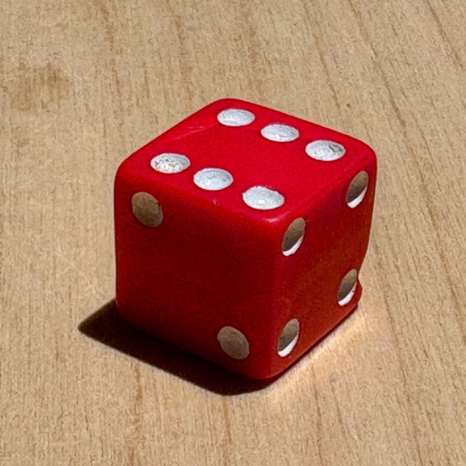

One of the first posts I wrote on this blog was about simulating ‘Snakes and Ladders’. Simple games of chance like this are great to think about modelling as the scope is bounded. In recent times I’ve gotten a little ahead of myself, trying to model complicated things such as TCP connections, the classic run before walking scenario.

The question that I asked myself while playing a game with my son the other day is “if this die were biased toward one face, could this I detect it? Could I put a number to my confidence?”. So one day I sat down and rolled the die one-thousand times. What I’ll take you through in this post is applying Bayesian models to and trying to determine if we can detect any bias and what our uncertainty is around this. Along the way I learn about my fallibility in interpreting probabiltiy and confidence intervals.

# LLM Disclosure

All commentary and code in this post was written by myself, with the exception of the Stan model which was generated by an LLM given the problem statement. I do put explanatory comments in the R code to make it easier to follow, which can make it appear LLM generated; I assure you it’s not.

A significant amount of LLM time was used asking questions, clarifying, and trying to educate myself on the model and other supporting statistical aspects. This is my preferred method of interacting with a model: treating it as a tutor, not as a servant.[^1]. I don’t want to give the impression that I am an expect in this field. This post is first and foremost a learning exercise, using the fundamental principle that explaining something is the best way to learn.

# Rolling as Meditation

<figure>

<figcaption aria-hidden="true">The Die in Question</figcaption>
</figure>

Rolling a die one-thousand times didn’t take as long as I previously thought, only about 30 minutes. For what it’s worth, I swapped back and forth between my left and right hands to reduce the predictability my my rolls, and put a decent amount of momentum into each roll. It was actually quite meditiative[^2]. Here’s the first 10 rolls, which I show primarily because of the ominous run of five fives. This had me concerned about my rolling technique, so I swapped my rolling hand regularly, and tried to impart as much momentum as possible.

``` r
die_rolls <-
    read_file('die_rolls.txt') |>
    str_split(pattern = '', simplify = FALSE) |>
    pluck(1) |>
    as.integer() |>
    as_tibble() |>
    rename(roll = value) |> 
    mutate(roll_id = 1:n()) |>
    select(roll_id, roll) |> 
    # Remove the newline (last value) which converted to NA
    slice_head(n = -1)
```

<div id="oodpbbngko" style="padding-left:0px;padding-right:0px;padding-top:10px;padding-bottom:10px;overflow-x:auto;overflow-y:auto;width:auto;height:auto;">
<style>#oodpbbngko table {
  font-family: system-ui, 'Segoe UI', Roboto, Helvetica, Arial, sans-serif, 'Apple Color Emoji', 'Segoe UI Emoji', 'Segoe UI Symbol', 'Noto Color Emoji';
  -webkit-font-smoothing: antialiased;
  -moz-osx-font-smoothing: grayscale;
}
&#10;#oodpbbngko thead, #oodpbbngko tbody, #oodpbbngko tfoot, #oodpbbngko tr, #oodpbbngko td, #oodpbbngko th {
  border-style: none;
}
&#10;#oodpbbngko p {
  margin: 0;
  padding: 0;
}
&#10;#oodpbbngko .gt_table {
  display: table;
  border-collapse: collapse;
  line-height: normal;
  margin-left: auto;
  margin-right: auto;
  color: #333333;
  font-size: 16px;
  font-weight: normal;
  font-style: normal;
  background-color: #FFFFFF;
  width: auto;
  border-top-style: solid;
  border-top-width: 2px;
  border-top-color: #A8A8A8;
  border-right-style: none;
  border-right-width: 2px;
  border-right-color: #D3D3D3;
  border-bottom-style: solid;
  border-bottom-width: 2px;
  border-bottom-color: #A8A8A8;
  border-left-style: none;
  border-left-width: 2px;
  border-left-color: #D3D3D3;
}
&#10;#oodpbbngko .gt_caption {
  padding-top: 4px;
  padding-bottom: 4px;
}
&#10;#oodpbbngko .gt_title {
  color: #333333;
  font-size: 125%;
  font-weight: initial;
  padding-top: 4px;
  padding-bottom: 4px;
  padding-left: 5px;
  padding-right: 5px;
  border-bottom-color: #FFFFFF;
  border-bottom-width: 0;
}
&#10;#oodpbbngko .gt_subtitle {
  color: #333333;
  font-size: 85%;
  font-weight: initial;
  padding-top: 3px;
  padding-bottom: 5px;
  padding-left: 5px;
  padding-right: 5px;
  border-top-color: #FFFFFF;
  border-top-width: 0;
}
&#10;#oodpbbngko .gt_heading {
  background-color: #FFFFFF;
  text-align: center;
  border-bottom-color: #FFFFFF;
  border-left-style: none;
  border-left-width: 1px;
  border-left-color: #D3D3D3;
  border-right-style: none;
  border-right-width: 1px;
  border-right-color: #D3D3D3;
}
&#10;#oodpbbngko .gt_bottom_border {
  border-bottom-style: solid;
  border-bottom-width: 2px;
  border-bottom-color: #D3D3D3;
}
&#10;#oodpbbngko .gt_col_headings {
  border-top-style: solid;
  border-top-width: 2px;
  border-top-color: #D3D3D3;
  border-bottom-style: solid;
  border-bottom-width: 2px;
  border-bottom-color: #D3D3D3;
  border-left-style: none;
  border-left-width: 1px;
  border-left-color: #D3D3D3;
  border-right-style: none;
  border-right-width: 1px;
  border-right-color: #D3D3D3;
}
&#10;#oodpbbngko .gt_col_heading {
  color: #333333;
  background-color: #FFFFFF;
  font-size: 100%;
  font-weight: normal;
  text-transform: inherit;
  border-left-style: none;
  border-left-width: 1px;
  border-left-color: #D3D3D3;
  border-right-style: none;
  border-right-width: 1px;
  border-right-color: #D3D3D3;
  vertical-align: bottom;
  padding-top: 5px;
  padding-bottom: 6px;
  padding-left: 5px;
  padding-right: 5px;
  overflow-x: hidden;
}
&#10;#oodpbbngko .gt_column_spanner_outer {
  color: #333333;
  background-color: #FFFFFF;
  font-size: 100%;
  font-weight: normal;
  text-transform: inherit;
  padding-top: 0;
  padding-bottom: 0;
  padding-left: 4px;
  padding-right: 4px;
}
&#10;#oodpbbngko .gt_column_spanner_outer:first-child {
  padding-left: 0;
}
&#10;#oodpbbngko .gt_column_spanner_outer:last-child {
  padding-right: 0;
}
&#10;#oodpbbngko .gt_column_spanner {
  border-bottom-style: solid;
  border-bottom-width: 2px;
  border-bottom-color: #D3D3D3;
  vertical-align: bottom;
  padding-top: 5px;
  padding-bottom: 5px;
  overflow-x: hidden;
  display: inline-block;
  width: 100%;
}
&#10;#oodpbbngko .gt_spanner_row {
  border-bottom-style: hidden;
}
&#10;#oodpbbngko .gt_group_heading {
  padding-top: 8px;
  padding-bottom: 8px;
  padding-left: 5px;
  padding-right: 5px;
  color: #333333;
  background-color: #FFFFFF;
  font-size: 100%;
  font-weight: initial;
  text-transform: inherit;
  border-top-style: solid;
  border-top-width: 2px;
  border-top-color: #D3D3D3;
  border-bottom-style: solid;
  border-bottom-width: 2px;
  border-bottom-color: #D3D3D3;
  border-left-style: none;
  border-left-width: 1px;
  border-left-color: #D3D3D3;
  border-right-style: none;
  border-right-width: 1px;
  border-right-color: #D3D3D3;
  vertical-align: middle;
  text-align: left;
}
&#10;#oodpbbngko .gt_empty_group_heading {
  padding: 0.5px;
  color: #333333;
  background-color: #FFFFFF;
  font-size: 100%;
  font-weight: initial;
  border-top-style: solid;
  border-top-width: 2px;
  border-top-color: #D3D3D3;
  border-bottom-style: solid;
  border-bottom-width: 2px;
  border-bottom-color: #D3D3D3;
  vertical-align: middle;
}
&#10;#oodpbbngko .gt_from_md > :first-child {
  margin-top: 0;
}
&#10;#oodpbbngko .gt_from_md > :last-child {
  margin-bottom: 0;
}
&#10;#oodpbbngko .gt_row {
  padding-top: 8px;
  padding-bottom: 8px;
  padding-left: 5px;
  padding-right: 5px;
  margin: 10px;
  border-top-style: solid;
  border-top-width: 1px;
  border-top-color: #D3D3D3;
  border-left-style: none;
  border-left-width: 1px;
  border-left-color: #D3D3D3;
  border-right-style: none;
  border-right-width: 1px;
  border-right-color: #D3D3D3;
  vertical-align: middle;
  overflow-x: hidden;
}
&#10;#oodpbbngko .gt_stub {
  color: #333333;
  background-color: #FFFFFF;
  font-size: 100%;
  font-weight: initial;
  text-transform: inherit;
  border-right-style: solid;
  border-right-width: 2px;
  border-right-color: #D3D3D3;
  padding-left: 5px;
  padding-right: 5px;
}
&#10;#oodpbbngko .gt_stub_row_group {
  color: #333333;
  background-color: #FFFFFF;
  font-size: 100%;
  font-weight: initial;
  text-transform: inherit;
  border-right-style: solid;
  border-right-width: 2px;
  border-right-color: #D3D3D3;
  padding-left: 5px;
  padding-right: 5px;
  vertical-align: top;
}
&#10;#oodpbbngko .gt_row_group_first td {
  border-top-width: 2px;
}
&#10;#oodpbbngko .gt_row_group_first th {
  border-top-width: 2px;
}
&#10;#oodpbbngko .gt_summary_row {
  color: #333333;
  background-color: #FFFFFF;
  text-transform: inherit;
  padding-top: 8px;
  padding-bottom: 8px;
  padding-left: 5px;
  padding-right: 5px;
}
&#10;#oodpbbngko .gt_first_summary_row {
  border-top-style: solid;
  border-top-color: #D3D3D3;
}
&#10;#oodpbbngko .gt_first_summary_row.thick {
  border-top-width: 2px;
}
&#10;#oodpbbngko .gt_last_summary_row {
  padding-top: 8px;
  padding-bottom: 8px;
  padding-left: 5px;
  padding-right: 5px;
  border-bottom-style: solid;
  border-bottom-width: 2px;
  border-bottom-color: #D3D3D3;
}
&#10;#oodpbbngko .gt_grand_summary_row {
  color: #333333;
  background-color: #FFFFFF;
  text-transform: inherit;
  padding-top: 8px;
  padding-bottom: 8px;
  padding-left: 5px;
  padding-right: 5px;
}
&#10;#oodpbbngko .gt_first_grand_summary_row {
  padding-top: 8px;
  padding-bottom: 8px;
  padding-left: 5px;
  padding-right: 5px;
  border-top-style: double;
  border-top-width: 6px;
  border-top-color: #D3D3D3;
}
&#10;#oodpbbngko .gt_last_grand_summary_row_top {
  padding-top: 8px;
  padding-bottom: 8px;
  padding-left: 5px;
  padding-right: 5px;
  border-bottom-style: double;
  border-bottom-width: 6px;
  border-bottom-color: #D3D3D3;
}
&#10;#oodpbbngko .gt_striped {
  background-color: rgba(128, 128, 128, 0.05);
}
&#10;#oodpbbngko .gt_table_body {
  border-top-style: solid;
  border-top-width: 2px;
  border-top-color: #D3D3D3;
  border-bottom-style: solid;
  border-bottom-width: 2px;
  border-bottom-color: #D3D3D3;
}
&#10;#oodpbbngko .gt_footnotes {
  color: #333333;
  background-color: #FFFFFF;
  border-bottom-style: none;
  border-bottom-width: 2px;
  border-bottom-color: #D3D3D3;
  border-left-style: none;
  border-left-width: 2px;
  border-left-color: #D3D3D3;
  border-right-style: none;
  border-right-width: 2px;
  border-right-color: #D3D3D3;
}
&#10;#oodpbbngko .gt_footnote {
  margin: 0px;
  font-size: 90%;
  padding-top: 4px;
  padding-bottom: 4px;
  padding-left: 5px;
  padding-right: 5px;
}
&#10;#oodpbbngko .gt_sourcenotes {
  color: #333333;
  background-color: #FFFFFF;
  border-bottom-style: none;
  border-bottom-width: 2px;
  border-bottom-color: #D3D3D3;
  border-left-style: none;
  border-left-width: 2px;
  border-left-color: #D3D3D3;
  border-right-style: none;
  border-right-width: 2px;
  border-right-color: #D3D3D3;
}
&#10;#oodpbbngko .gt_sourcenote {
  font-size: 90%;
  padding-top: 4px;
  padding-bottom: 4px;
  padding-left: 5px;
  padding-right: 5px;
}
&#10;#oodpbbngko .gt_left {
  text-align: left;
}
&#10;#oodpbbngko .gt_center {
  text-align: center;
}
&#10;#oodpbbngko .gt_right {
  text-align: right;
  font-variant-numeric: tabular-nums;
}
&#10;#oodpbbngko .gt_font_normal {
  font-weight: normal;
}
&#10;#oodpbbngko .gt_font_bold {
  font-weight: bold;
}
&#10;#oodpbbngko .gt_font_italic {
  font-style: italic;
}
&#10;#oodpbbngko .gt_super {
  font-size: 65%;
}
&#10;#oodpbbngko .gt_footnote_marks {
  font-size: 75%;
  vertical-align: 0.4em;
  position: initial;
}
&#10;#oodpbbngko .gt_asterisk {
  font-size: 100%;
  vertical-align: 0;
}
&#10;#oodpbbngko .gt_indent_1 {
  text-indent: 5px;
}
&#10;#oodpbbngko .gt_indent_2 {
  text-indent: 10px;
}
&#10;#oodpbbngko .gt_indent_3 {
  text-indent: 15px;
}
&#10;#oodpbbngko .gt_indent_4 {
  text-indent: 20px;
}
&#10;#oodpbbngko .gt_indent_5 {
  text-indent: 25px;
}
&#10;#oodpbbngko .katex-display {
  display: inline-flex !important;
  margin-bottom: 0.75em !important;
}
&#10;#oodpbbngko div.Reactable > div.rt-table > div.rt-thead > div.rt-tr.rt-tr-group-header > div.rt-th-group:after {
  height: 0px !important;
}
</style>
<table class="gt_table" data-quarto-disable-processing="false" data-quarto-bootstrap="false">
  <thead>
    <tr class="gt_col_headings">
      <th class="gt_col_heading gt_columns_bottom_border gt_right" rowspan="1" colspan="1" scope="col" id="roll_id">roll_id</th>
      <th class="gt_col_heading gt_columns_bottom_border gt_right" rowspan="1" colspan="1" scope="col" id="roll">roll</th>
    </tr>
  </thead>
  <tbody class="gt_table_body">
    <tr><td headers="roll_id" class="gt_row gt_right">1</td>
<td headers="roll" class="gt_row gt_right">1</td></tr>
    <tr><td headers="roll_id" class="gt_row gt_right">2</td>
<td headers="roll" class="gt_row gt_right">3</td></tr>
    <tr><td headers="roll_id" class="gt_row gt_right">3</td>
<td headers="roll" class="gt_row gt_right">4</td></tr>
    <tr><td headers="roll_id" class="gt_row gt_right">4</td>
<td headers="roll" class="gt_row gt_right">3</td></tr>
    <tr><td headers="roll_id" class="gt_row gt_right">5</td>
<td headers="roll" class="gt_row gt_right">5</td></tr>
    <tr><td headers="roll_id" class="gt_row gt_right">6</td>
<td headers="roll" class="gt_row gt_right">5</td></tr>
    <tr><td headers="roll_id" class="gt_row gt_right">7</td>
<td headers="roll" class="gt_row gt_right">5</td></tr>
    <tr><td headers="roll_id" class="gt_row gt_right">8</td>
<td headers="roll" class="gt_row gt_right">5</td></tr>
    <tr><td headers="roll_id" class="gt_row gt_right">9</td>
<td headers="roll" class="gt_row gt_right">5</td></tr>
    <tr><td headers="roll_id" class="gt_row gt_right">10</td>
<td headers="roll" class="gt_row gt_right">6</td></tr>
  </tbody>
  &#10;</table>
</div>

After one thousand rolls, here’s the distribution of dice rolls:

}}index_files/figure-html/unnamed-chunk-4-1.png" alt="" width="672" />
With apologies to Alexander Pope, “to pattern match is to be human”. I’m immediately drawn to the six face that’s peeking its head above all the others. Is this indicative of a biased die? How certain can we be?

# A Trip to Monte Carlo

The next step is to use Bayesian inference to help us model the potential bias of the die. Here’s the first model we’ll try, written in the Stan language:

``` stan
data {
  int<lower=1> n;
  array[n] int<lower=1, upper=6> roll;
  real alpha;
}

parameters {
  simplex[6] theta;
}

model {
  theta ~ dirichlet( rep_vector(alpha, 6) );
  roll  ~ categorical(theta); 
}
```

The Stan model takes the die roll data as an array of **rolls** of length **n**. We draw these rolls from a **categorical** distribution with with a simplex (a non-negative vector that sums to 1) parameter **theta**. The posterior distribution of **theta** we get by running our Stan sampler is the probability distribution over the six die face probabilities. This represents our uncertainty about the probability given our rolls data.

We’re using a non-informative **dirichlet** prior on theta, with all of the *alpha* values equal to one. By chosing this prior I’m saying that prior to seeing any data, I expect that all combinations of face probabilities have an equal probability density. So rolling one-thousand sixes and no other faces is equally as probabile as having an even spread. I’m holding the die in my hand, and I know that’s not reasonable, but I’m going to leave it as I think it’s instructive.

After compiling the Stan program, we feed it the data and sample from the posterior distributions of each of the **theta** parameters. Here’s a dotplot visualisation of these posteriors, with a 90% credible interval and a vertical line at 1/6.

}}index_files/figure-html/unnamed-chunk-6-1.png" alt="" width="672" />
How much of the posterior mass of fave 6 is sitting above 1/6?

``` r
die_roll_draws |>
    filter(face == 6) |>
    summarise(mean(theta > 1/6))
```

    ## # A tibble: 1 × 2
    ##    face `mean(theta > 1/6)`
    ##   <int>               <dbl>
    ## 1     6               0.950

So 94.6% of the posterior mass of theta for face 6 sits above 1/6, the probability of a fair die we’d consider to be ‘fair’. Surely this is very firm evidence that theta (the face 6 marginal probabiltiy) is greater that 1/6, and thus the die is biased?

# Enter the Texan Sharpshooter

This is why I - a statistical dabbler - am very nervous asserting anything about probability in public. Around every corner seems to be a wrong assumption or human foible that catches me out. In this instance, I’ve been shot by a [Texan Sharpshooter](https://en.wikipedia.org/wiki/Texas_sharpshooter_fallacy).

If I had said “I think the six is biased”, then then I had seen these posterior distributions, then my previous assertion would have been correct. But I choose the six after I’d seen the data, not before. I drew the bullseye around face 6 after I’d ‘shot’.

To get a better intuiution about this fallacy, we can move to a simulation. We simulate 100,000 instances of my 1,000 rolls, and for each instance we look at the number of rol

1.  Imitate the fallacy and do what I did: pick the face that had the maximum number of rolls out of the thousand.
2.  Chose a face beforehand and look at how may rolls it had.

We use `rmultinom()` to generate 100,000 simulations of 1,000 dice rolls. These come out in matrix format, so we do a bit of wrangling to turn it into a tibble:

``` r
simulations <- 100000
rolls <- 1000

die_roll_sims <-
    rmultinom(simulations, rolls, rep(1/6, 6)) |>
    as_tibble(.name_repair = 'unique_quiet') |> 
    mutate(face = 1:n()) |>
    pivot_longer(cols = starts_with('..'), names_to = 'sim', names_pattern = '..(\\d+)', values_to = 'count') 
```

For each of those 100,000 simulations, we’ll visualise the distribution of counts for each of the scenarios. We’ll also add lines for the face counts from the original, manually rolled data.

``` r
die_roll_sims |> 
    group_by(sim) |> 
    summarise(
        # Chosing the die with the max rolls (i.e. our face 6)
        chosen_after = max(count),
        # Chosing the face before we've seen the data
        chosen_before = count[face == 6]
    ) |>
    pivot_longer(cols = c(chosen_before, chosen_after), values_to = 'count') |>
    ggplot() +
    geom_histogram(aes(count, fill = name), binwidth = 1, alpha = .7, position = 'identity') +
    geom_vline(data = die_rolls |> count(roll), aes(xintercept = n, colour = as_factor(roll)), linetype = 5, size = 1) +
    labs(
        title = '',
        fill = 'Face Choice',
        colour = 'Original Counts'
    )
```

    ## Warning: Using `size` aesthetic for lines was deprecated in ggplot2 3.4.0.
    ## ℹ Please use `linewidth` instead.
    ## This warning is displayed once per session.
    ## Call `lifecycle::last_lifecycle_warnings()` to see where this warning was generated.

}}index_files/figure-html/unnamed-chunk-9-1.png" alt="" width="672" />

Now we can see the sharpshooter fallacy come to life. Looking at face 6, we can see that it sits near the centre of the distribution of counts when chose the maximum face after we’ve rolled. It’s not that remarkable or surprising that our face six had as many rolls as it did.

But if we had chosen face 6 beforehand, it would be a surprising result. It sits quite far right on the distribution.

# Refining the Model

In simulating the outcome, we’ve taken on a bit more of a frequentist rather than Bayesian approach, looking at data over the long term. That’s not a problem per se, but it was made easy by the fact that we’re dealing with a toy problem . But what if we can’t simulate? How can we change our model and use the data at hand to avoid the sharpshooter fallacy?

The answer is to use . You’ll recall in the first model that I used a non-informative Dirichlet prior which claimed that all the ways the die could be biased were equally as likely, which was silly given I could see the die looked reasonable. I could have switches the prior to represent a fair die, but then the question is what parameters should I choose?

With a hierarchical model,

Here’s the model:

``` stan
data {
  int<lower=1> n;
  array[n] int<lower=1, upper=6> roll;
}

parameters {
  real<lower=0> sigma;
  vector[6] eta;
}

transformed parameters {
  simplex[6] theta = softmax(eta);
}

model {
  sigma ~ normal(0, 0.5);
  eta   ~ normal(0, sigma);
  
  roll  ~ categorical(theta);
}
```

On the final line you’ll still see we’re still assuming our rolls are drawn from a categorical distribution with parameters **theta**. But **theta** isn’t a direct parameter. Instead it’s a simplex transformed using softmax from the parameter **eta**, which is an unbounded real vector that can be considered a ‘score’ for how biased a side is. If **eta** is all zeros, softmax transforms that into a simplex of 6 x 1/6 probabilities.

Where we differ from our first model is that this **eta** score has a prior drawn from a normal distribution with mean zero. This is us telling we’re telling the model the scores are clustered around zero, so the die is probably fair. But the spread of these scores is a single parameter itself, shared amongst the six scores. It has its own prior, and gets its own posterior.

How do we think about sigma?

}}index_files/figure-html/unnamed-chunk-11-1.png" alt="" width="672" />

``` r
die_roll_hierarchical_draws |>
    ggplot() +
    stat_dotsinterval(aes(x = sigma), .width = .90) +
    labs(
        title = 'Die Rolls - Hierarchical Model - Sigma Posterior Distribution',
        subtitle = '90% Credible Interval',
        x = 'Sigma',
        y = 'Density'
    )
```

}}index_files/figure-html/unnamed-chunk-12-1.png" alt="" width="672" />

}}index_files/figure-html/unnamed-chunk-13-1.png" alt="" width="672" />

# Testing a Loaded Die

``` r
shift = 0.050
probs <- c(1/6 - shift, 1/6, 1/6, 1/6, 1/6, 1/6 + shift)

loaded_die_rolls <- 
    tibble(
        roll_id = 1:1000,
        roll = sample(1:6, 1000, replace = TRUE, prob = probs)
    )
loaded_die_rolls |>
    ggplot() +
    geom_bar(aes(roll), fill = 'lightgreen') +
    labs(
        title = "Distribution of One-Thousand Die Rolls",
        x = "Die Face",
        y = "Count of Rolls"
    ) +
    scale_x_continuous(breaks = 1:6)
```

}}index_files/figure-html/unnamed-chunk-14-1.png" alt="" width="672" />

}}index_files/figure-html/unnamed-chunk-16-1.png" alt="" width="672" />

[^1]: I’ve made public the two key conversations [here](https://claude.ai/share/d7479b46-d067-4e5a-8452-cdda2825a177) and [here](https://claude.ai/share/803b18f1-7b5f-4458-8089-fbc50c2b82fd)

[^2]: You can view the raw data [here](dice_rolls.txt)
