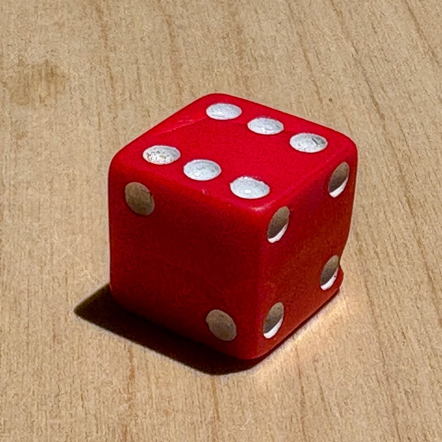

One of the first posts I wrote on this blog was about simulating ‘Snakes and Ladders’. Simple games of chance like this are great to think about modelling as the scope is bounded. In recent times I’ve gotten a little ahead of myself, trying to model complicated things such as TCP connections, the classic run before walking scenario.

The question that I asked myself while playing a game with my son the other day is “if this die were biased toward one face, could this I detect it? Could I put a number to my confidence?”. So one day I sat down and rolled the die one-thousand times. What I’ll take you through in this post is applying Bayesian models to and trying to determine if we can detect any bias and what our uncertainty is around this. Along the way I learn about my fallibility in interpreting probabiltiy and confidence intervals.

# LLM Disclosure

All commentary and code in this post was written by myself. An LLM was used to help me generate the Stan models for each of the scenarios. Please consider this post in part an exercise in learning by explaining the models that the LLM created given problem statements. I’m certainly not a Stan expert who is able to craft these models off the top of my head.

As a result, a significant amount of LLM time was used asking questions, clarifying, and trying to educate myself on the model and other supporting statistical aspects. This is my preferred method of interacting with a model: treating it as a tutor, not as a servant.[^1].

# Rolling as Meditation

<figure>

<figcaption aria-hidden="true">The Die in Question</figcaption>
</figure>

Rolling a die one-thousand times didn’t take as long as I previously thought, only about 30 minutes. For what it’s worth, I swapped back and forth between my left and right hands to reduce the predictability my my rolls, and put a decent amount of momentum into each roll. It was actually quite meditiative[^2]. Here’s the first 10 rolls, which I show primarily because of the ominous run of five fives. This had me concerned about my rolling technique, so I swapped my rolling hand regularly, and tried to impart as much momentum as possible.

``` r
die_rolls <-
    read_file('die_rolls.txt') |>
    str_split(pattern = '', simplify = FALSE) |>
    pluck(1) |>
    as.integer() |>
    as_tibble() |>
    rename(roll = value) |> 
    mutate(roll_id = 1:n()) |>
    select(roll_id, roll) |> 
    # Remove the newline (last value) which converted to NA
    slice_head(n = -1)
```

<div id="jbdvpxqtfl" style="padding-left:0px;padding-right:0px;padding-top:10px;padding-bottom:10px;overflow-x:auto;overflow-y:auto;width:auto;height:auto;">
<style>#jbdvpxqtfl table {
  font-family: system-ui, 'Segoe UI', Roboto, Helvetica, Arial, sans-serif, 'Apple Color Emoji', 'Segoe UI Emoji', 'Segoe UI Symbol', 'Noto Color Emoji';
  -webkit-font-smoothing: antialiased;
  -moz-osx-font-smoothing: grayscale;
}
&#10;#jbdvpxqtfl thead, #jbdvpxqtfl tbody, #jbdvpxqtfl tfoot, #jbdvpxqtfl tr, #jbdvpxqtfl td, #jbdvpxqtfl th {
  border-style: none;
}
&#10;#jbdvpxqtfl p {
  margin: 0;
  padding: 0;
}
&#10;#jbdvpxqtfl .gt_table {
  display: table;
  border-collapse: collapse;
  line-height: normal;
  margin-left: auto;
  margin-right: auto;
  color: #333333;
  font-size: 16px;
  font-weight: normal;
  font-style: normal;
  background-color: #FFFFFF;
  width: auto;
  border-top-style: solid;
  border-top-width: 2px;
  border-top-color: #A8A8A8;
  border-right-style: none;
  border-right-width: 2px;
  border-right-color: #D3D3D3;
  border-bottom-style: solid;
  border-bottom-width: 2px;
  border-bottom-color: #A8A8A8;
  border-left-style: none;
  border-left-width: 2px;
  border-left-color: #D3D3D3;
}
&#10;#jbdvpxqtfl .gt_caption {
  padding-top: 4px;
  padding-bottom: 4px;
}
&#10;#jbdvpxqtfl .gt_title {
  color: #333333;
  font-size: 125%;
  font-weight: initial;
  padding-top: 4px;
  padding-bottom: 4px;
  padding-left: 5px;
  padding-right: 5px;
  border-bottom-color: #FFFFFF;
  border-bottom-width: 0;
}
&#10;#jbdvpxqtfl .gt_subtitle {
  color: #333333;
  font-size: 85%;
  font-weight: initial;
  padding-top: 3px;
  padding-bottom: 5px;
  padding-left: 5px;
  padding-right: 5px;
  border-top-color: #FFFFFF;
  border-top-width: 0;
}
&#10;#jbdvpxqtfl .gt_heading {
  background-color: #FFFFFF;
  text-align: center;
  border-bottom-color: #FFFFFF;
  border-left-style: none;
  border-left-width: 1px;
  border-left-color: #D3D3D3;
  border-right-style: none;
  border-right-width: 1px;
  border-right-color: #D3D3D3;
}
&#10;#jbdvpxqtfl .gt_bottom_border {
  border-bottom-style: solid;
  border-bottom-width: 2px;
  border-bottom-color: #D3D3D3;
}
&#10;#jbdvpxqtfl .gt_col_headings {
  border-top-style: solid;
  border-top-width: 2px;
  border-top-color: #D3D3D3;
  border-bottom-style: solid;
  border-bottom-width: 2px;
  border-bottom-color: #D3D3D3;
  border-left-style: none;
  border-left-width: 1px;
  border-left-color: #D3D3D3;
  border-right-style: none;
  border-right-width: 1px;
  border-right-color: #D3D3D3;
}
&#10;#jbdvpxqtfl .gt_col_heading {
  color: #333333;
  background-color: #FFFFFF;
  font-size: 100%;
  font-weight: normal;
  text-transform: inherit;
  border-left-style: none;
  border-left-width: 1px;
  border-left-color: #D3D3D3;
  border-right-style: none;
  border-right-width: 1px;
  border-right-color: #D3D3D3;
  vertical-align: bottom;
  padding-top: 5px;
  padding-bottom: 6px;
  padding-left: 5px;
  padding-right: 5px;
  overflow-x: hidden;
}
&#10;#jbdvpxqtfl .gt_column_spanner_outer {
  color: #333333;
  background-color: #FFFFFF;
  font-size: 100%;
  font-weight: normal;
  text-transform: inherit;
  padding-top: 0;
  padding-bottom: 0;
  padding-left: 4px;
  padding-right: 4px;
}
&#10;#jbdvpxqtfl .gt_column_spanner_outer:first-child {
  padding-left: 0;
}
&#10;#jbdvpxqtfl .gt_column_spanner_outer:last-child {
  padding-right: 0;
}
&#10;#jbdvpxqtfl .gt_column_spanner {
  border-bottom-style: solid;
  border-bottom-width: 2px;
  border-bottom-color: #D3D3D3;
  vertical-align: bottom;
  padding-top: 5px;
  padding-bottom: 5px;
  overflow-x: hidden;
  display: inline-block;
  width: 100%;
}
&#10;#jbdvpxqtfl .gt_spanner_row {
  border-bottom-style: hidden;
}
&#10;#jbdvpxqtfl .gt_group_heading {
  padding-top: 8px;
  padding-bottom: 8px;
  padding-left: 5px;
  padding-right: 5px;
  color: #333333;
  background-color: #FFFFFF;
  font-size: 100%;
  font-weight: initial;
  text-transform: inherit;
  border-top-style: solid;
  border-top-width: 2px;
  border-top-color: #D3D3D3;
  border-bottom-style: solid;
  border-bottom-width: 2px;
  border-bottom-color: #D3D3D3;
  border-left-style: none;
  border-left-width: 1px;
  border-left-color: #D3D3D3;
  border-right-style: none;
  border-right-width: 1px;
  border-right-color: #D3D3D3;
  vertical-align: middle;
  text-align: left;
}
&#10;#jbdvpxqtfl .gt_empty_group_heading {
  padding: 0.5px;
  color: #333333;
  background-color: #FFFFFF;
  font-size: 100%;
  font-weight: initial;
  border-top-style: solid;
  border-top-width: 2px;
  border-top-color: #D3D3D3;
  border-bottom-style: solid;
  border-bottom-width: 2px;
  border-bottom-color: #D3D3D3;
  vertical-align: middle;
}
&#10;#jbdvpxqtfl .gt_from_md > :first-child {
  margin-top: 0;
}
&#10;#jbdvpxqtfl .gt_from_md > :last-child {
  margin-bottom: 0;
}
&#10;#jbdvpxqtfl .gt_row {
  padding-top: 8px;
  padding-bottom: 8px;
  padding-left: 5px;
  padding-right: 5px;
  margin: 10px;
  border-top-style: solid;
  border-top-width: 1px;
  border-top-color: #D3D3D3;
  border-left-style: none;
  border-left-width: 1px;
  border-left-color: #D3D3D3;
  border-right-style: none;
  border-right-width: 1px;
  border-right-color: #D3D3D3;
  vertical-align: middle;
  overflow-x: hidden;
}
&#10;#jbdvpxqtfl .gt_stub {
  color: #333333;
  background-color: #FFFFFF;
  font-size: 100%;
  font-weight: initial;
  text-transform: inherit;
  border-right-style: solid;
  border-right-width: 2px;
  border-right-color: #D3D3D3;
  padding-left: 5px;
  padding-right: 5px;
}
&#10;#jbdvpxqtfl .gt_stub_row_group {
  color: #333333;
  background-color: #FFFFFF;
  font-size: 100%;
  font-weight: initial;
  text-transform: inherit;
  border-right-style: solid;
  border-right-width: 2px;
  border-right-color: #D3D3D3;
  padding-left: 5px;
  padding-right: 5px;
  vertical-align: top;
}
&#10;#jbdvpxqtfl .gt_row_group_first td {
  border-top-width: 2px;
}
&#10;#jbdvpxqtfl .gt_row_group_first th {
  border-top-width: 2px;
}
&#10;#jbdvpxqtfl .gt_summary_row {
  color: #333333;
  background-color: #FFFFFF;
  text-transform: inherit;
  padding-top: 8px;
  padding-bottom: 8px;
  padding-left: 5px;
  padding-right: 5px;
}
&#10;#jbdvpxqtfl .gt_first_summary_row {
  border-top-style: solid;
  border-top-color: #D3D3D3;
}
&#10;#jbdvpxqtfl .gt_first_summary_row.thick {
  border-top-width: 2px;
}
&#10;#jbdvpxqtfl .gt_last_summary_row {
  padding-top: 8px;
  padding-bottom: 8px;
  padding-left: 5px;
  padding-right: 5px;
  border-bottom-style: solid;
  border-bottom-width: 2px;
  border-bottom-color: #D3D3D3;
}
&#10;#jbdvpxqtfl .gt_grand_summary_row {
  color: #333333;
  background-color: #FFFFFF;
  text-transform: inherit;
  padding-top: 8px;
  padding-bottom: 8px;
  padding-left: 5px;
  padding-right: 5px;
}
&#10;#jbdvpxqtfl .gt_first_grand_summary_row {
  padding-top: 8px;
  padding-bottom: 8px;
  padding-left: 5px;
  padding-right: 5px;
  border-top-style: double;
  border-top-width: 6px;
  border-top-color: #D3D3D3;
}
&#10;#jbdvpxqtfl .gt_last_grand_summary_row_top {
  padding-top: 8px;
  padding-bottom: 8px;
  padding-left: 5px;
  padding-right: 5px;
  border-bottom-style: double;
  border-bottom-width: 6px;
  border-bottom-color: #D3D3D3;
}
&#10;#jbdvpxqtfl .gt_striped {
  background-color: rgba(128, 128, 128, 0.05);
}
&#10;#jbdvpxqtfl .gt_table_body {
  border-top-style: solid;
  border-top-width: 2px;
  border-top-color: #D3D3D3;
  border-bottom-style: solid;
  border-bottom-width: 2px;
  border-bottom-color: #D3D3D3;
}
&#10;#jbdvpxqtfl .gt_footnotes {
  color: #333333;
  background-color: #FFFFFF;
  border-bottom-style: none;
  border-bottom-width: 2px;
  border-bottom-color: #D3D3D3;
  border-left-style: none;
  border-left-width: 2px;
  border-left-color: #D3D3D3;
  border-right-style: none;
  border-right-width: 2px;
  border-right-color: #D3D3D3;
}
&#10;#jbdvpxqtfl .gt_footnote {
  margin: 0px;
  font-size: 90%;
  padding-top: 4px;
  padding-bottom: 4px;
  padding-left: 5px;
  padding-right: 5px;
}
&#10;#jbdvpxqtfl .gt_sourcenotes {
  color: #333333;
  background-color: #FFFFFF;
  border-bottom-style: none;
  border-bottom-width: 2px;
  border-bottom-color: #D3D3D3;
  border-left-style: none;
  border-left-width: 2px;
  border-left-color: #D3D3D3;
  border-right-style: none;
  border-right-width: 2px;
  border-right-color: #D3D3D3;
}
&#10;#jbdvpxqtfl .gt_sourcenote {
  font-size: 90%;
  padding-top: 4px;
  padding-bottom: 4px;
  padding-left: 5px;
  padding-right: 5px;
}
&#10;#jbdvpxqtfl .gt_left {
  text-align: left;
}
&#10;#jbdvpxqtfl .gt_center {
  text-align: center;
}
&#10;#jbdvpxqtfl .gt_right {
  text-align: right;
  font-variant-numeric: tabular-nums;
}
&#10;#jbdvpxqtfl .gt_font_normal {
  font-weight: normal;
}
&#10;#jbdvpxqtfl .gt_font_bold {
  font-weight: bold;
}
&#10;#jbdvpxqtfl .gt_font_italic {
  font-style: italic;
}
&#10;#jbdvpxqtfl .gt_super {
  font-size: 65%;
}
&#10;#jbdvpxqtfl .gt_footnote_marks {
  font-size: 75%;
  vertical-align: 0.4em;
  position: initial;
}
&#10;#jbdvpxqtfl .gt_asterisk {
  font-size: 100%;
  vertical-align: 0;
}
&#10;#jbdvpxqtfl .gt_indent_1 {
  text-indent: 5px;
}
&#10;#jbdvpxqtfl .gt_indent_2 {
  text-indent: 10px;
}
&#10;#jbdvpxqtfl .gt_indent_3 {
  text-indent: 15px;
}
&#10;#jbdvpxqtfl .gt_indent_4 {
  text-indent: 20px;
}
&#10;#jbdvpxqtfl .gt_indent_5 {
  text-indent: 25px;
}
&#10;#jbdvpxqtfl .katex-display {
  display: inline-flex !important;
  margin-bottom: 0.75em !important;
}
&#10;#jbdvpxqtfl div.Reactable > div.rt-table > div.rt-thead > div.rt-tr.rt-tr-group-header > div.rt-th-group:after {
  height: 0px !important;
}
</style>
<table class="gt_table" data-quarto-disable-processing="false" data-quarto-bootstrap="false">
  <thead>
    <tr class="gt_heading">
      <td colspan="11" class="gt_heading gt_title gt_font_normal gt_bottom_border" style>Die Rolls - First 10 of 1,000</td>
    </tr>
    &#10;  </thead>
  <tbody class="gt_table_body">
    <tr><th id="stub_1_1" scope="row" class="gt_row gt_left gt_stub" style="font-weight: bold;">roll_id</th>
<td headers="stub_1_1 1" class="gt_row gt_right">1</td>
<td headers="stub_1_1 2" class="gt_row gt_right">2</td>
<td headers="stub_1_1 3" class="gt_row gt_right">3</td>
<td headers="stub_1_1 4" class="gt_row gt_right">4</td>
<td headers="stub_1_1 5" class="gt_row gt_right">5</td>
<td headers="stub_1_1 6" class="gt_row gt_right">6</td>
<td headers="stub_1_1 7" class="gt_row gt_right">7</td>
<td headers="stub_1_1 8" class="gt_row gt_right">8</td>
<td headers="stub_1_1 9" class="gt_row gt_right">9</td>
<td headers="stub_1_1 10" class="gt_row gt_right">10</td></tr>
    <tr><th id="stub_1_2" scope="row" class="gt_row gt_left gt_stub" style="font-weight: bold;">roll</th>
<td headers="stub_1_2 1" class="gt_row gt_right">1</td>
<td headers="stub_1_2 2" class="gt_row gt_right">3</td>
<td headers="stub_1_2 3" class="gt_row gt_right">4</td>
<td headers="stub_1_2 4" class="gt_row gt_right">3</td>
<td headers="stub_1_2 5" class="gt_row gt_right">5</td>
<td headers="stub_1_2 6" class="gt_row gt_right">5</td>
<td headers="stub_1_2 7" class="gt_row gt_right">5</td>
<td headers="stub_1_2 8" class="gt_row gt_right">5</td>
<td headers="stub_1_2 9" class="gt_row gt_right">5</td>
<td headers="stub_1_2 10" class="gt_row gt_right">6</td></tr>
  </tbody>
  &#10;</table>
</div>

After one thousand rolls, here’s the distribution of dice rolls:

}}index_files/figure-html/unnamed-chunk-4-1.png" alt="" width="672" />
With apologies to Alexander Pope, “to pattern match is to be human”. I’m immediately drawn to the six face that’s peeking its head above all the others. Is this indicative of a biased die? How certain can we be?

# A Trip to Monte Carlo

The next step is to use Bayesian inference to help us model the potential bias of the die. Here’s the first model we’ll try, written in Stan:

``` stan
data {
  int<lower=1> n;
  array[n] int<lower=1, upper=6> roll;
  real alpha;
}

parameters {
  simplex[6] theta;
}

model {
  theta ~ dirichlet( rep_vector(alpha, 6) );
  roll  ~ categorical(theta); 
}
```

The Stan model takes the die roll data as an array of **rolls** of length **n**. We draw these rolls from a **categorical** distribution with with a simplex (a non-negative vector that sums to 1) parameters **theta**. The posterior distribution of **theta** we get by running our Stan sampler is the probability distribution over the six die face probabilities. This represents our uncertainty about the probability given our rolls data.

We’re using a non-informative **dirichlet** prior on theta, with all of the *alpha* values equal to one. By choosing this prior I’m saying that prior to seeing any data, I expect that all combinations of face probabilities have an equal probability density. So rolling one-thousand sixes and no other faces is equally as probabile as having an even spread. I’m holding the die in my hand, and I know that’s not reasonable, but I’m going to leave it as I think it’s instructive.

After compiling the Stan program, we feed it the data and sample from the posterior distributions of each of the **theta** parameters. Here’s a dotplot visualisation of these posterior draws, with a 90% credible interval and a vertical line at 1/6 (the probability of a side of a fair die).

}}index_files/figure-html/unnamed-chunk-6-1.png" alt="" width="672" />
How much of the posterior mass of fave 6 is sitting above 1/6?

    ## # A tibble: 1 × 2
    ##    face `mean(theta > 1/6)`
    ##   <int>               <dbl>
    ## 1     6               0.937

So 93.72% of the posterior mass of theta for face 6 sits above 1/6, the probability of a fair die we’d consider to be ‘fair’. Surely this is very firm evidence that theta (the face 6 marginal probabiltiy) is greater that 1/6, and thus the die is biased?

# Enter the Texan Sharpshooter

This is why I - a statistical dabbler - am very nervous asserting anything about probability in public. Around every corner seems to be a wrong assumption or human foible that catches me out. In this instance, I’ve been shot by a [Texan Sharpshooter](https://en.wikipedia.org/wiki/Texas_sharpshooter_fallacy).

If I had said “I think the six is biased”, then then I had seen these posterior distributions, then my previous assertion would have been correct. But I choose the six after I’d seen the data, not before. I drew the bullseye around face 6 after I’d ‘shot’. This si

To get a better intuiution about this fallacy, we can move to a simulation. We simulate 100,000 instances of my 1,000 rolls:

We use `rmultinom()` to generate 100,000 simulations of 1,000 dice rolls. These come out in matrix format, so we do a bit of wrangling to turn it into a tibble:

``` r
simulations <- 100000
rolls <- 1000

die_roll_sims <-
    rmultinom(simulations, rolls, rep(1/6, 6)) |>
    as_tibble(.name_repair = 'unique_quiet') |> 
    mutate(face = 1:n()) |>
    pivot_longer(cols = starts_with('..'), names_to = 'sim', names_pattern = '..(\\d+)', values_to = 'count') 
```

For each of those 100,000 simulations we, we take consider the two scenarios and return the count of rolls out one-thousand for each:

1.  Imitate the fallacy: pick the face that had the maximum number of rolls out of the thousand.
2.  Chose a face beforehand (I’ve selected face 6).

``` r
die_roll_sim_summary_choices <-
    die_roll_sims |> 
    group_by(sim) |> 
    summarise(
        # Chosing the die with the max rolls (i.e. our face 6)
        chosen_after = max(count),
        # Chosing the face before we've seen the data
        chosen_before = count[face == 6]
    ) |>
    pivot_longer(cols = c(chosen_before, chosen_after), values_to = 'count')
```

Now we can visualise the distribution of counts for each of the scenarios, overlaying the counts for each of the die faces from or original data:

    ## Warning: Using `size` aesthetic for lines was deprecated in ggplot2 3.4.0.
    ## ℹ Please use `linewidth` instead.
    ## This warning is displayed once per session.
    ## Call `lifecycle::last_lifecycle_warnings()` to see where this warning was generated.

}}index_files/figure-html/unnamed-chunk-11-1.png" alt="" width="672" />
Now we can see the sharpshooter fallacy come to life. Looking at the count of face six from our original data, we can see it sits near the centre of the distribution of counts when chose the maximum face after we’ve rolled. It’s not that remarkable or surprising that our face six had as many rolls as it did.

But if we look at where the counts sit in the distribution when the face was chosen beforehand, we see it sits quite fair right in the distribution. It would have been remarkable and indicative that the die was biased.

# Refining the Model

In simulating the outcome, we’ve taken on a bit more of a frequentist rather than Bayesian approach, looking at data over the long term. That’s not a problem per se, but it was made easy by the fact that we’re dealing with a toy problem . But what if we can’t simulate? How can we change our model and use the data at hand to avoid the sharpshooter fallacy?

The answer is to use You’ll recall in the first model that I used a non-informative Dirichlet prior which claimed that all the ways the die could be biased were equally as likely, which was silly given I could see the die looked reasonable. I could have switches the prior to represent a fair die, but then the question is what parameters should I choose?

Here’s the model:

``` stan
data {
  int<lower=1> n;
  array[n] int<lower=1, upper=6> roll;
}
parameters {
  real<lower=0> sigma;
  vector[6] eta_raw;
}
transformed parameters {
  vector[6] eta = sigma * eta_raw;
  simplex[6] theta = softmax(eta);
}
model {
  sigma   ~ normal(0, 0.5);
  eta_raw ~ std_normal();
  roll    ~ categorical(theta);
}
```

The model still takes the same data `\(roll\)` of length `\(n\)`, but now we have two parameters: `\(sigma\)` and `\(eta_raw\)`. The `\(eta_raw\)` is a vector of six, one per face of the die, living on the real number line. You can consider its units to be how many standard deviations above or below average the face is. The `\(sigma\)` parameter is a single number describing how “spread out” (in log-odds) the faces of the die are.

In the transformed parameter section, the `\(eta\)` parameter is `\(sigma\)` multiplied by each `\(eta_raw\)`, giving us the real per-face log-odds effects. This is then run through `\(softmax()\)` to give us a vector of six probabilities.

Finally in the model, our prior on `\(sigma\)` tells the model that we expect the die to be fair (mean of 0), but the .5 allows **TODO**. The `\(eta_raw\)` prior is the standard normal, which combined with the *transformed paramters* effectively means that `\(eta ~ normal(0, sigma)\)`. Finally, our `\(theta\)` is the likelihood of the probabilities given our roll data.

We compile the model and sample from the joint distribution:

``` r
# Compile model
die_roll_hierarchical_mdl <- cmdstan_model('dice_rolls_hierarchical.stan')
    

die_roll_hierarchical_fit <- die_roll_hierarchical_mdl$sample(
        data = compose_data(
        die_rolls
    )
)
```

    ## Running MCMC with 4 sequential chains...
    ## 
    ## Chain 1 Iteration:    1 / 2000 [  0%]  (Warmup) 
    ## Chain 1 Iteration:  100 / 2000 [  5%]  (Warmup) 
    ## Chain 1 Iteration:  200 / 2000 [ 10%]  (Warmup) 
    ## Chain 1 Iteration:  300 / 2000 [ 15%]  (Warmup) 
    ## Chain 1 Iteration:  400 / 2000 [ 20%]  (Warmup) 
    ## Chain 1 Iteration:  500 / 2000 [ 25%]  (Warmup) 
    ## Chain 1 Iteration:  600 / 2000 [ 30%]  (Warmup) 
    ## Chain 1 Iteration:  700 / 2000 [ 35%]  (Warmup) 
    ## Chain 1 Iteration:  800 / 2000 [ 40%]  (Warmup) 
    ## Chain 1 Iteration:  900 / 2000 [ 45%]  (Warmup) 
    ## Chain 1 Iteration: 1000 / 2000 [ 50%]  (Warmup) 
    ## Chain 1 Iteration: 1001 / 2000 [ 50%]  (Sampling) 
    ## Chain 1 Iteration: 1100 / 2000 [ 55%]  (Sampling) 
    ## Chain 1 Iteration: 1200 / 2000 [ 60%]  (Sampling) 
    ## Chain 1 Iteration: 1300 / 2000 [ 65%]  (Sampling) 
    ## Chain 1 Iteration: 1400 / 2000 [ 70%]  (Sampling) 
    ## Chain 1 Iteration: 1500 / 2000 [ 75%]  (Sampling) 
    ## Chain 1 Iteration: 1600 / 2000 [ 80%]  (Sampling) 
    ## Chain 1 Iteration: 1700 / 2000 [ 85%]  (Sampling) 
    ## Chain 1 Iteration: 1800 / 2000 [ 90%]  (Sampling) 
    ## Chain 1 Iteration: 1900 / 2000 [ 95%]  (Sampling) 
    ## Chain 1 Iteration: 2000 / 2000 [100%]  (Sampling) 
    ## Chain 1 finished in 0.1 seconds.
    ## Chain 2 Iteration:    1 / 2000 [  0%]  (Warmup) 
    ## Chain 2 Iteration:  100 / 2000 [  5%]  (Warmup) 
    ## Chain 2 Iteration:  200 / 2000 [ 10%]  (Warmup) 
    ## Chain 2 Iteration:  300 / 2000 [ 15%]  (Warmup) 
    ## Chain 2 Iteration:  400 / 2000 [ 20%]  (Warmup) 
    ## Chain 2 Iteration:  500 / 2000 [ 25%]  (Warmup) 
    ## Chain 2 Iteration:  600 / 2000 [ 30%]  (Warmup) 
    ## Chain 2 Iteration:  700 / 2000 [ 35%]  (Warmup) 
    ## Chain 2 Iteration:  800 / 2000 [ 40%]  (Warmup) 
    ## Chain 2 Iteration:  900 / 2000 [ 45%]  (Warmup) 
    ## Chain 2 Iteration: 1000 / 2000 [ 50%]  (Warmup) 
    ## Chain 2 Iteration: 1001 / 2000 [ 50%]  (Sampling) 
    ## Chain 2 Iteration: 1100 / 2000 [ 55%]  (Sampling) 
    ## Chain 2 Iteration: 1200 / 2000 [ 60%]  (Sampling) 
    ## Chain 2 Iteration: 1300 / 2000 [ 65%]  (Sampling) 
    ## Chain 2 Iteration: 1400 / 2000 [ 70%]  (Sampling) 
    ## Chain 2 Iteration: 1500 / 2000 [ 75%]  (Sampling) 
    ## Chain 2 Iteration: 1600 / 2000 [ 80%]  (Sampling) 
    ## Chain 2 Iteration: 1700 / 2000 [ 85%]  (Sampling) 
    ## Chain 2 Iteration: 1800 / 2000 [ 90%]  (Sampling) 
    ## Chain 2 Iteration: 1900 / 2000 [ 95%]  (Sampling) 
    ## Chain 2 Iteration: 2000 / 2000 [100%]  (Sampling) 
    ## Chain 2 finished in 0.1 seconds.
    ## Chain 3 Iteration:    1 / 2000 [  0%]  (Warmup) 
    ## Chain 3 Iteration:  100 / 2000 [  5%]  (Warmup) 
    ## Chain 3 Iteration:  200 / 2000 [ 10%]  (Warmup) 
    ## Chain 3 Iteration:  300 / 2000 [ 15%]  (Warmup) 
    ## Chain 3 Iteration:  400 / 2000 [ 20%]  (Warmup) 
    ## Chain 3 Iteration:  500 / 2000 [ 25%]  (Warmup) 
    ## Chain 3 Iteration:  600 / 2000 [ 30%]  (Warmup) 
    ## Chain 3 Iteration:  700 / 2000 [ 35%]  (Warmup) 
    ## Chain 3 Iteration:  800 / 2000 [ 40%]  (Warmup) 
    ## Chain 3 Iteration:  900 / 2000 [ 45%]  (Warmup) 
    ## Chain 3 Iteration: 1000 / 2000 [ 50%]  (Warmup) 
    ## Chain 3 Iteration: 1001 / 2000 [ 50%]  (Sampling) 
    ## Chain 3 Iteration: 1100 / 2000 [ 55%]  (Sampling) 
    ## Chain 3 Iteration: 1200 / 2000 [ 60%]  (Sampling) 
    ## Chain 3 Iteration: 1300 / 2000 [ 65%]  (Sampling) 
    ## Chain 3 Iteration: 1400 / 2000 [ 70%]  (Sampling) 
    ## Chain 3 Iteration: 1500 / 2000 [ 75%]  (Sampling) 
    ## Chain 3 Iteration: 1600 / 2000 [ 80%]  (Sampling) 
    ## Chain 3 Iteration: 1700 / 2000 [ 85%]  (Sampling) 
    ## Chain 3 Iteration: 1800 / 2000 [ 90%]  (Sampling) 
    ## Chain 3 Iteration: 1900 / 2000 [ 95%]  (Sampling) 
    ## Chain 3 Iteration: 2000 / 2000 [100%]  (Sampling) 
    ## Chain 3 finished in 0.1 seconds.
    ## Chain 4 Iteration:    1 / 2000 [  0%]  (Warmup) 
    ## Chain 4 Iteration:  100 / 2000 [  5%]  (Warmup) 
    ## Chain 4 Iteration:  200 / 2000 [ 10%]  (Warmup) 
    ## Chain 4 Iteration:  300 / 2000 [ 15%]  (Warmup) 
    ## Chain 4 Iteration:  400 / 2000 [ 20%]  (Warmup) 
    ## Chain 4 Iteration:  500 / 2000 [ 25%]  (Warmup) 
    ## Chain 4 Iteration:  600 / 2000 [ 30%]  (Warmup) 
    ## Chain 4 Iteration:  700 / 2000 [ 35%]  (Warmup) 
    ## Chain 4 Iteration:  800 / 2000 [ 40%]  (Warmup) 
    ## Chain 4 Iteration:  900 / 2000 [ 45%]  (Warmup) 
    ## Chain 4 Iteration: 1000 / 2000 [ 50%]  (Warmup) 
    ## Chain 4 Iteration: 1001 / 2000 [ 50%]  (Sampling) 
    ## Chain 4 Iteration: 1100 / 2000 [ 55%]  (Sampling) 
    ## Chain 4 Iteration: 1200 / 2000 [ 60%]  (Sampling) 
    ## Chain 4 Iteration: 1300 / 2000 [ 65%]  (Sampling) 
    ## Chain 4 Iteration: 1400 / 2000 [ 70%]  (Sampling) 
    ## Chain 4 Iteration: 1500 / 2000 [ 75%]  (Sampling) 
    ## Chain 4 Iteration: 1600 / 2000 [ 80%]  (Sampling) 
    ## Chain 4 Iteration: 1700 / 2000 [ 85%]  (Sampling) 
    ## Chain 4 Iteration: 1800 / 2000 [ 90%]  (Sampling) 
    ## Chain 4 Iteration: 1900 / 2000 [ 95%]  (Sampling) 
    ## Chain 4 Iteration: 2000 / 2000 [100%]  (Sampling) 
    ## Chain 4 finished in 0.1 seconds.
    ## 
    ## All 4 chains finished successfully.
    ## Mean chain execution time: 0.1 seconds.
    ## Total execution time: 0.5 seconds.

    ## Warning: 1 of 4000 (0.0%) transitions ended with a divergence.
    ## See https://mc-stan.org/misc/warnings for details.

``` r
die_roll_hierarchical_draws <-
die_roll_hierarchical_fit |>
    spread_draws(theta[face], sigma)
```

Let’s take a look at the posterior distributions for the `\(theta\)` parameter:

}}index_files/figure-html/unnamed-chunk-14-1.png" alt="" width="672" />
We can see that the posterior distribution for face six has been pulled back, or ‘regularised’ towards 1/6. Why? Because the model has found that when lookingat the joint postioror probaility most of the mass of *sigma* is near zero. Recall that sigma is how ‘spread out’ *raw_eta* is.

``` r
die_roll_hierarchical_draws |>
    ggplot() +
    geom_histogram(aes(sigma), binwidth = .005, fill = 'lightgreen')
```

}}index_files/figure-html/unnamed-chunk-15-1.png" alt="" width="672" />
given the prior and data, sigma, .back towards , whilst it still has a longer tail that the others, the majority of face six’s posterior mass has been pulled shifted back towards 1/6.

To get a better look at the contrast, let’s render only face six’s posterior distributions from our first model, and the hierarchical model:

}}index_files/figure-html/unnamed-chunk-16-1.png" alt="" width="672" />
\# Testing a Loaded Die

The next obvious step is to see how this model performs when we give it data from a die that is actually biased? I don’t have a weighted die at hand, so I turn to a simulation. I’ve shifted the probability of rolling a six up by 0.05, and also reduced the opposing face (face one) by the same amount

``` r
set.seed(3455357)
shift = 0.050
probs <- c(1/6 - shift, 1/6, 1/6, 1/6, 1/6, 1/6 + shift)

loaded_die_rolls <- 
    tibble(
        roll_id = 1:1000,
        roll = sample(1:6, 1000, replace = TRUE, prob = probs)
    )
```

Here’s the distribution of dice rolls for the simulation:

``` r
loaded_die_rolls |>
    ggplot() +
    geom_bar(aes(roll), fill = 'lightgreen') +
    labs(
        title = "Biased Die Simulation - Distribution of One-Thousand Die Rolls",
        subtitle = "Faces 6 & 1 +/- (1/6) - 0.050",
        x = "Die Face",
        y = "Count of Rolls"
    ) +
    scale_x_continuous(breaks = 1:6)
```

}}index_files/figure-html/unnamed-chunk-18-1.png" alt="" width="672" />
Now we take that data and run it through the same regularising model and take draws to get a view of the posterior for each face’s theta:

}}index_files/figure-html/unnamed-chunk-20-1.png" alt="" width="672" />
We see that the posteriors are not regularised at all, with faces one and six’s distributions sitting out to the left and right respectively, and the 90% credible intervals overlapping with the actual theta values that were shifted down and up from the fair 1/6. Remember: this is the same model, only the data has changed. Yet the model itself has been able to help us avoid the Sharpshooter Problem by pulling posterior likelihoods of a fair die back towards fair thetas, and conversely leaving in place posterior likelyhoods of a known biased die.

For clarity, here’s a view of theta\[6\] and sigma for both my manual die rolls, and the simulated biased die:

``` r
die_roll_draws_unified <-
bind_rows(
    loaded_die_roll_hierarchical_draws,
    die_roll_hierarchical_draws,
    .id = 'die_type'
) |>
    ungroup() |> 
    mutate(
        die_type = die_type |> recode_values( 
            "1" ~ "Biased Sim.",
            "2" ~ "Real"
        )
    )
```

``` r
die_roll_draws_unified |>
    filter(face == 6) |>
    rename(`theta[6]` = theta) |> 
    pivot_longer(c(sigma, `theta[6]`), names_to = 'parameter') |> 
    ggplot() +
    stat_dotsinterval(aes(x = value, y = die_type), .width = .9) +
    facet_grid(~parameter, scales = 'free') +
    theme(axis.text.y = element_text(angle = 90, hjust = .5)) +
    labs(
        title = "Posterior Distribution Comparison - Fair vs Loaded Die Rolls",
        x = "Parameter Posterior Density",
        y = "Die Type"
    )
```

}}index_files/figure-html/unnamed-chunk-22-1.png" alt="" width="672" />

This more clearly shows how the posterior distribution of the biased simulation has been pulled to the right.

# Summary

So where have we ended up? We started off with the simple task of rolling a die one-thousand times and using a Stan model to model these rolls. We then saw how human intuition can lead us to the wrong results, and created a simulation to show this. Finally, we used a regularising model that better takes into account potential bias in the die, and hekping to avoid the human bias that can come into play.

[^1]: I’ve made public the two key conversations [here](https://claude.ai/share/d7479b46-d067-4e5a-8452-cdda2825a177) and [here](https://claude.ai/share/803b18f1-7b5f-4458-8089-fbc50c2b82fd)

[^2]: You can view the raw data [here](dice_rolls.txt)
